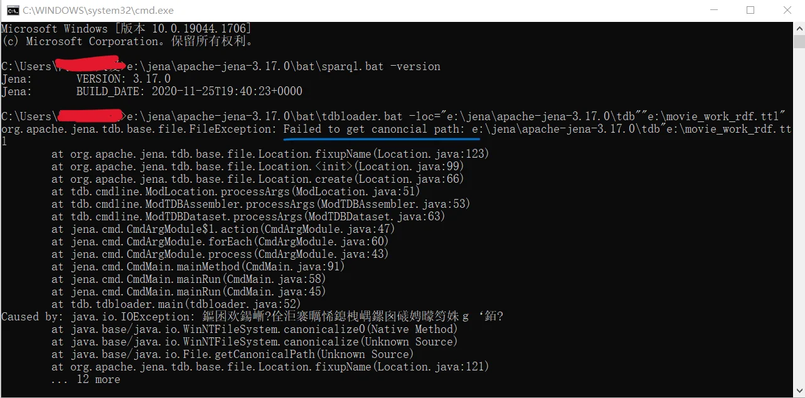
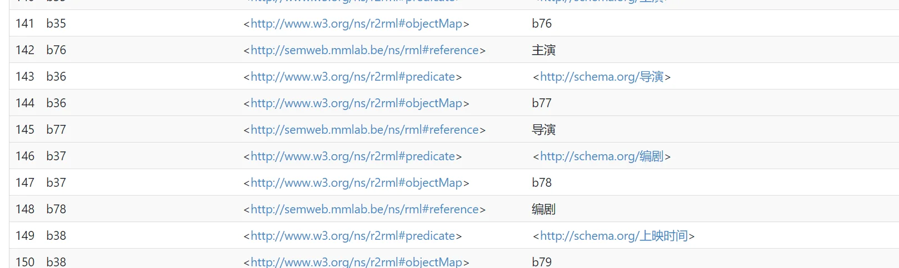
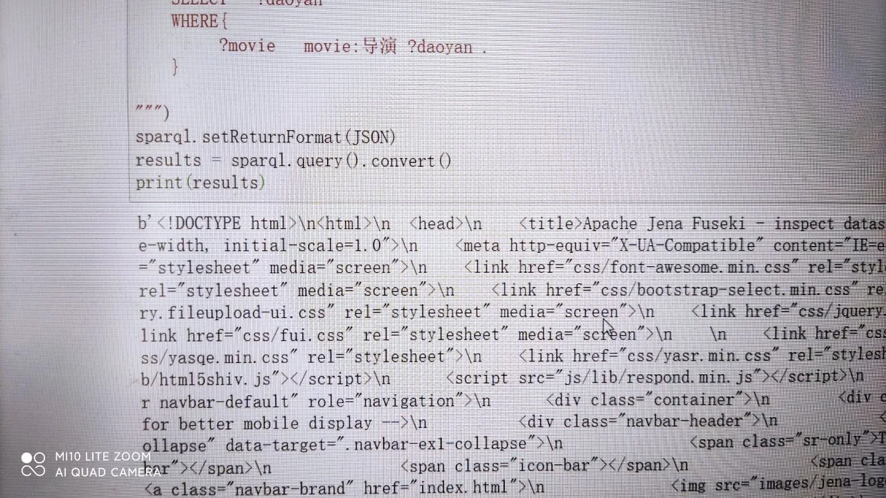
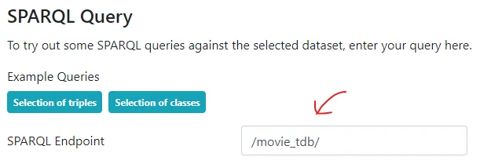
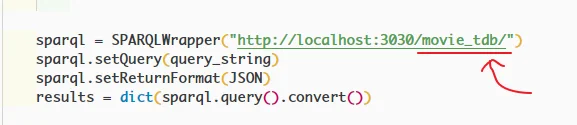

# Apache Jena 查询配置 FAQs

> 本文章是站长自己，应知识图谱老师的要求编写的。感谢老师的信任与支持。
>
> 关于 Apache Jena 详细的配置方法，我也写过另一篇文章，参见：[Apache jena 配置和使用](/posts/apache-jena/) （文章中 Jena 版本是 4.5.0，貌似 3.x 版本按这个方法有一些问题）
>
> 本文主要列举一些常见的问题，供大家快速查阅。
>
> 有什么建议、想法，或解决问题的经验，可以在评论区留言，任何留言会立即同步到我的邮箱，因此我一定会及时回复。欢迎大家分享新的 Q&A，我会加在这篇文章中，同时注明你的名字。

---

#### 这里提供目录，供大家快速查找：（点击跳转）

1、学会自己分析报错
- [Q：为什么这么多报错啊，救命，我又不会弄了！ qwq](#h2-1-h4-1)

2、配置、查询常见错误
- [Q：运行 `SPARQL.bat` 提示找不到或无法加载主类。](#h2-2-h4-1)
- [Q：配置任一环节，出现 `because it is already locked by the process with PID xxx.`](#h2-2-h4-2)
- [Q：运行 `fuseki-server.bat` 报错，提示 `Expected xxx`](#h2-2-h4-3)
- [Q：运行 `fuseki-server.bat` 报错，提示 `Expected xxx ... found a At ':TriplesMap a' `](#h2-2-h4-4)
- [Q：运行 `fuseki-server.bat` ，发生含有 `matches no grammar rules of URIs/IRIs`，或 `Bad URIs` 的的警告](#h2-2-h4-5)
- [Q：运行 `fuseki-server.bat` ，提示含有与 `path` 相关的错误](#h2-2-h4-6)
- [Q：为什么查询，查到的都是一些和数据无关的东西？](#h2-2-h4-7)
- [Q：为什么我完全查询不到任何东西？](#h2-2-h4-8)
- [Q：为什么数据原有内容可以查询，规则推理的新规则查不到？](#h2-2-h4-9)

3、使用 Python 包装查询常见错误
- [Q：报错 `No module named 'SPARQLWrapper'` 或 `name 'SPARQLWrapper' is not defined`](#h2-3-h4-1)
- [Q：报错 `ConnectionRefusedError`](#h2-3-h4-2)
- [Q：先是报错 `HTTPError: HTTP Error 400: Bad Request`，又有报错 `QueryBadFormed`](#h2-3-h4-3)
- [Q：查询得到的结果是一堆乱麻麻的东西（HTML 字符串）](#h2-3-h4-4)

---

<h2>1、学会自己分析报错</h2>

<h4>Q：为什么这么多报错啊，救命，我又不会弄了！ qwq</h4>

很多报错并不可怕，只要稍微阅读报错信息即可解决。如在 Jena 配置及查询配置时，我们大概率会遇到类似下面的报错情况：（点击图片放大）

初看确实很吓人。这里的报错是会显示运行时所有错误的，所以看起来就很多。**这是 Java 的异常抛出栈，错误发生的次序是从下到上的**。大多数时候，我们只需要看最开始的报错即可，因此定位到报错的最上层。（这里注意一点：**如果是 python 的报错，反而要从最下层看起**。因为最下面打印的，才是最先发生错误的地方）

最上层的关键提示是：`Failed to get canoncial path`。那一看，大家应该可以很容易发现这是一个路径报错。那回到我们这行命令的执行处：一检查，哦，原来是两个路径字符串没有空格，连在一起了。之后一改掉这个错，就好了。

所以，在整个 FAQ 中，我把分析报错这一环节放在最前面。**就是希望大家能够主动地去分析报错，并尝试解决。无论是在现在还是在未来，这都是一种极其重要的能力**。当你冷静下来排错时，很多问题并没有那么可怕，是可以很快解决的。即使是遇到了稍微难解决的问题，也应该多自己尝试解决，一味地逃避是不可取的。

当然如果真的遇到了特别难、无法解决的问题，也就不用浪费时间，向他人求助就行。

---

<h2>2、配置、查询常见错误</h2>

<h4>Q：运行 SPARQL.bat 提示找不到或无法加载主类。</h4>

> 尝试更换 jdk。如从 openjdk11 更换到 jdk11。同时特别注意：如果你使用的 Apahce Jena 版本为 4.5，Java 版本需要 >= 11。

<h4>Q：配置任一环节，出现 because it is already locked by the process with PID xxx.</h4>

> 发生进程资源占用了，不要同时开多个 Jena 或 fuseki 的程序，一次只开一个。

<h4>Q：运行 fuseki-server.bat 报错，提示 Expected xxx：</h4>

> 根据报错提供的文件名、行号、列号信息去检查对应的文件是否有语法错误。

<h4>Q：运行 fuseki-server.bat 报错，提示 Expected xxx ... found a At ':TriplesMap a'  ：</h4>

> 看到这个 `:TriplesMap`，我就知道你肯定把第二次作业用来生成 rdf 数据的那个规则 ttl 拿去用了。所以你理解有误，我们用 ttl 生成 tdb 数据，用的是第二次作业生成出来的那个 rdf 数据。（它是 rdf 数据，但后缀应该为 ttl）

<h4>Q：运行 fuseki-server.bat ，发生含有 matches no grammar rules of URIs/IRIs，或 Bad URIs 的的警告：</h4>

> 这种警告，有时会影响正常工作，有时候又不会。如果 fuseki 正常可以查询，那就不用管。（**一大法则：可以正常运行就不要动**）我个人的初步判断是，你配置文件的写法和你这个版本的 Jena 不匹配。具体是什么地方有问题，这个不好判断。建议按以下博客文章重新写一下配置文件：
> - 3.x.x 版本：https://zhuanlan.zhihu.com/p/460129220
> - [4.x.x 版本](/posts/apache-jena/)

<h4>Q：运行 fuseki-server.bat ，提示含有与 path 相关的错误：</h4>

> 检查一下配置文件中的数据源路径、规则推理或 OWL 本体文件路径。

<h4>Q：为什么查询，查到的都是一些和数据无关的东西，像下面这样：</h4>

> 你肯定把第二次作业用来生成 rdf 数据的那个规则 ttl 拿去用了。所以你理解有误，我们用 ttl 生成 tdb 数据，用的是第二次作业生成出来的那个 rdf 数据。（它是 rdf 数据，但后缀应该为 ttl）

<h4>Q：为什么我完全查询不到任何东西？</h4>

> 首先返回你的 `fuseki-server.bat` 窗口，仔细检查是否有报错的情况，有则对应具体情况，查看其它 Q&A 项进行处理。若没有，请看看你是不是以下几类情况：
>
> - 是不是把第二次作业用来生成 rdf 数据的那个规则 ttl 拿去生成 tdb 数据了？
>
> > 如果用的 tdb 数据是那个，自然也查不到和演员、电影名这些内容。你理解有误，我们用 ttl 生成 tdb 数据，用的是第二次作业生成出来的那个 rdf 数据。（它是 rdf 数据，但后缀应该为 ttl）
>
> - 是不是粗心没有写查询用到的前缀，或写错前缀了？
>
> > 如果是这样，那程序自然不认识前缀，也就查不到任何东西。

<h4>Q：为什么数据原有内容可以查询，规则推理的新规则查不到？</h4>

> 首先返回你的 `fuseki-server.bat` 窗口，仔细检查是否有报错的情况，有则对应具体情况，查看其它 Q&A 项进行处理。若没有，请先检查是不是规则 ttl 的语法问题，有则改正。如果还不能解决问题，大概率是你配置文件的写法和你这个版本的 Jena 不匹配。具体是什么地方有问题，这个不好判断。建议按以下博客文章重新写一下配置文件：
> - 3.x.x 版本：https://zhuanlan.zhihu.com/p/460129220
> - [4.x.x 版本](/posts/apache-jena/)

---

<h2>3、使用 Python 包装查询常见错误</h2>

<h4>Q：报错 No module named 'SPARQLWrapper' 或 name 'SPARQLWrapper' is not defined</h4>

> 这个问题其实不用回答了吧......，可以问问自己：pip 安装这个模块了吗？import 这个模块了吗？

<h4>Q：报错 ConnectionRefusedError</h4>

> 检查自己的 fuseki 服务有没有正常运行。

<h4>Q：先是报错 HTTPError: HTTP Error 400: Bad Request，又有报错 QueryBadFormed</h4>

> 查询字符串语法有问题，检查一下。

<h4>Q：查询得到的结果是一堆乱麻麻的东西（HTML 字符串）：</h4>

> SPARQLWrapper 实例化的时候，传的 url 要和 endpoint 匹配，不用带 /query 这些路径。如下图：
> 
> 
