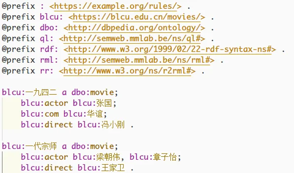
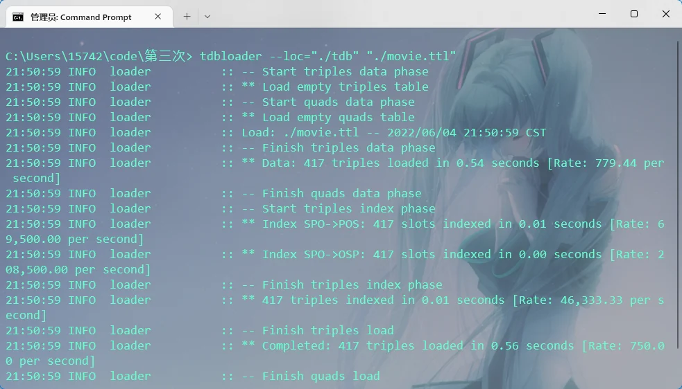
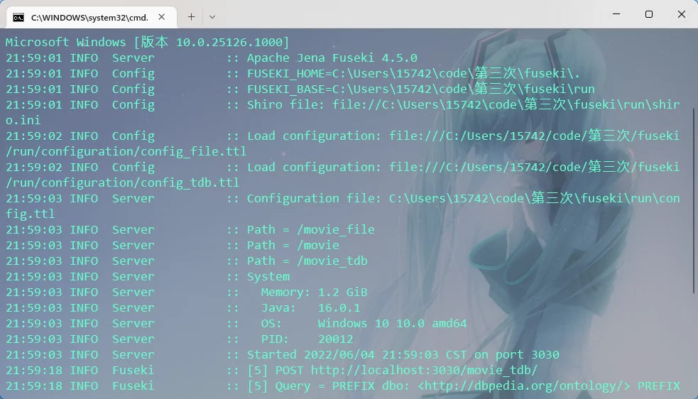
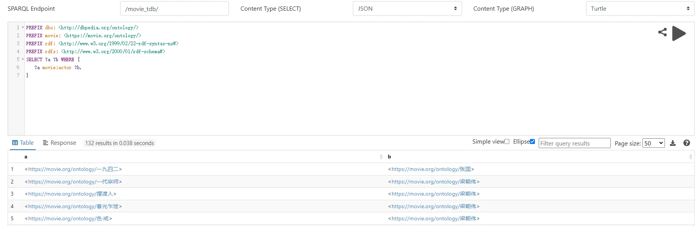
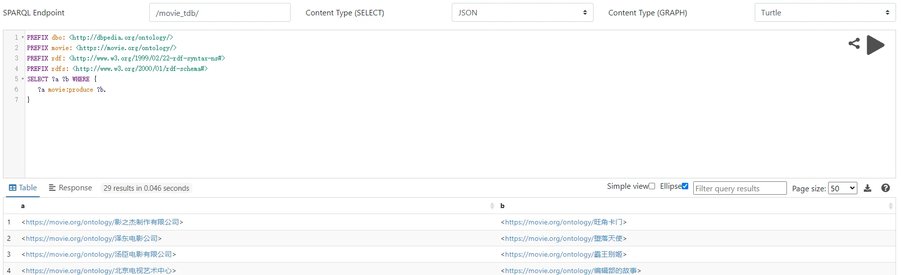

# Apache jena 配置和使用

​	使用 Apache jena 可以较为方便的构建知识图谱的查询服务。


## 1、查询数据准备

​	首先要保证你的数据 ttl 是没有问题的。
​	示例：



​	一般来说，为不影响后面查询和规则的配置，你的数据 ttl 要满足以下条件：

- 不存在空值
- object 指定了前缀或 URI


## 2、下载、配置 apache jena

​	下载 apache jena 和对应环境变量的配置方法，此处不再赘述。请参照其他博客文章配置。

> *注：本文章演示使用的 apache jena 版本是 4.5.0。其他版本按照本文章方法配置可能会出现问题！*

​	安装完成后，需要先启动一次 fuseki server。

​	进入 `/fuseki` 目录，双击 `fuseki-server.bat` 或在 cmd 运行：

```bash
fuseki-server.bat
```

​	初次运行结束后，会在该目录生成 `run` 目录。


## 3、将 ttl 数据转化为 tdb 形式数据

​	cmd 运行：

```bash
tdbloader --loc="生成 tdb 的存放路径" "数据 ttl 路径位置"
```

​	注：ttl、tdb 数据存放位置没有特别要求。




## 4、查询配置

​	配置查询需要我们编辑 `/fuseki/run` 下的 `config.ttl` 。（这里的配置可以理解为查询服务的主配置）

​	也可以直接在 `/fuseki/run/configuration` 新建配置的 ttl 文件。（注意，这里写配置的话，配置文件名可以随意命名。）（这里的配置可以理解为查询服务的额外配置，该文件目录下可以写多个配置。）

​	我们可以在不同的配置文件中写不同的规则，实行多个并列的查询服务的部署。

​	**一般而言，我们只配置一个查询服务，只需要修改 `/fuseki/run/config.ttl` 即可。**

​	配置文件的参考写法：（在 config.ttl）

```turtle
@prefix :      <http://base/#> .
@prefix tdb:   <http://jena.hpl.hp.com/2008/tdb#> .
@prefix rdf:   <http://www.w3.org/1999/02/22-rdf-syntax-ns#> .
@prefix ja:    <http://jena.hpl.hp.com/2005/11/Assembler#> .
@prefix rdfs:  <http://www.w3.org/2000/01/rdf-schema#> .
@prefix fuseki: <http://jena.apache.org/fuseki#> .

# 配置一些基本信息，如查询服务的接口等
:service1        a                fuseki:Service ;
fuseki:dataset                    <#dataset> ;
fuseki:name                       "movie" ; 		   # 查询 endpoint，可以自定义
fuseki:serviceQuery               "query" , "sparql" ;
fuseki:serviceReadGraphStore      "get" ;
fuseki:serviceReadWriteGraphStore "data" ;
fuseki:serviceUpdate              "update" ;
fuseki:serviceUpload              "upload" .


<#dataset> rdf:type ja:RDFDataset ;
    ja:defaultGraph <#model_inf> ; .

<#model_inf> a ja:InfModel ;
    ja:baseModel <#tdbGraph> ; .

<#tdbGraph> rdf:type tdb:GraphTDB ;
    tdb:dataset <#tdbDataset> ; .

<#tdbDataset> rdf:type tdb:DatasetTDB ;
	# 下面对应刚才生成的 tdb 数据的那个路径
    tdb:location "C:/Users/15742/code/第三次/fuseki/run/datasets/tdb" ; .
```

>  *注：该配置文件在 jena 4.5.0 版本测试有效，其他版本尚且未知是否有兼容性问题。*


​	运行 `fuseki-server.bat` ，再打开 `localhost:3030` 进入查询：



​	注：我这里写了三个配置 ttl 文件，所以会有三个查询服务路径。大家一般只需要写一个即可。


​	现在应该可以正常查询：（点击图片放大）




## 5、推理规则配置

​	首先我们需要把推理规则写在一个 ttl 里，ttl 路径位置自定。

​	这里我命名为 `rules.ttl` ，如下：

```turtle
@prefix : <https://movie.org/ontology/> .
@prefix movie: <https://movie.org/ontology/> .

[rule: (?m movie:com ?c) -> (?c movie:produce ?m)]
```

​	特别注意：**这里的关系和前缀是和你的数据 ttl 对应的。同时，你可以尝试创造其他的推理规则。**


​	配置好推理规则后，重写一下配置文件：

```turtle
@prefix :      <http://base/#> .
@prefix tdb:   <http://jena.hpl.hp.com/2008/tdb#> .
@prefix rdf:   <http://www.w3.org/1999/02/22-rdf-syntax-ns#> .
@prefix ja:    <http://jena.hpl.hp.com/2005/11/Assembler#> .
@prefix rdfs:  <http://www.w3.org/2000/01/rdf-schema#> .
@prefix fuseki: <http://jena.apache.org/fuseki#> .

:service1        a                fuseki:Service ;
fuseki:dataset                    <#dataset> ;
fuseki:name                       "movie" ;
fuseki:serviceQuery               "query" , "sparql" ;
fuseki:serviceReadGraphStore      "get" ;
fuseki:serviceReadWriteGraphStore "data" ;
fuseki:serviceUpdate              "update" ;
fuseki:serviceUpload              "upload" .


<#dataset> rdf:type ja:RDFDataset ;
    ja:defaultGraph <#model_inf> ; .

<#model_inf> a ja:InfModel ;
    ja:baseModel <#tdbGraph> ;
	#开启规则推理机
    ja:reasoner [
        ja:reasonerURL <http://jena.hpl.hp.com/2003/GenericRuleReasoner> ; 
        # 对应你规则 ttl 的路径位置
        ja:rulesFrom <file:///C:/Users/15742/code/第三次/fuseki/run/datasets/rules.ttl> ; ] .

<#tdbGraph> rdf:type tdb:GraphTDB ;
    tdb:dataset <#tdbDataset> ; .

<#tdbDataset> rdf:type tdb:DatasetTDB ;
    tdb:location "C:/Users/15742/code/第三次/fuseki/run/datasets/tdb" ; .
```

​	重启 `fuseki-server.bat` ，验证推理规则的查询，此时推理规则查询应该已经成功：（点击图片放大）




## 6、使用 python 包装查询

​	如果我们的应用程序想要发起 SPARQL 查询，那应该怎么做？

​	这里以 python 为例，要想在 python 运行 SPARQL 查询，需要 pip 这个模块：

```bash
pip install SPARQLWrapper
```

​	如何在 python 运行查询并获得结果，可以参考下面的示例代码：

```python
# SPARQL 查询串，将会通过查询接口发给 fuseki 服务器
query_string = """
PREFIX dbo: <http://dbpedia.org/ontology/>
PREFIX movie: <https://movie.org/ontology/>
PREFIX rdf: <http://www.w3.org/1999/02/22-rdf-syntax-ns#>
PREFIX rdfs: <http://www.w3.org/2000/01/rdf-schema#>
SELECT ?com ?movie WHERE {
    ?com movie:produce ?movie.
}
"""

# 查询接口指定，注意路径要对应你之前写的 endpoint！
sparql = SPARQLWrapper("http://localhost:3030/movie/")
sparql.setQuery(query_string)
sparql.setReturnFormat(JSON)
# dict 函数转化一下，这样得到的结果就是字典变量（便于操作）
results = dict(sparql.query().convert())
```