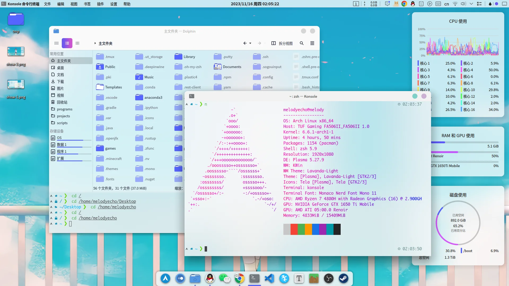
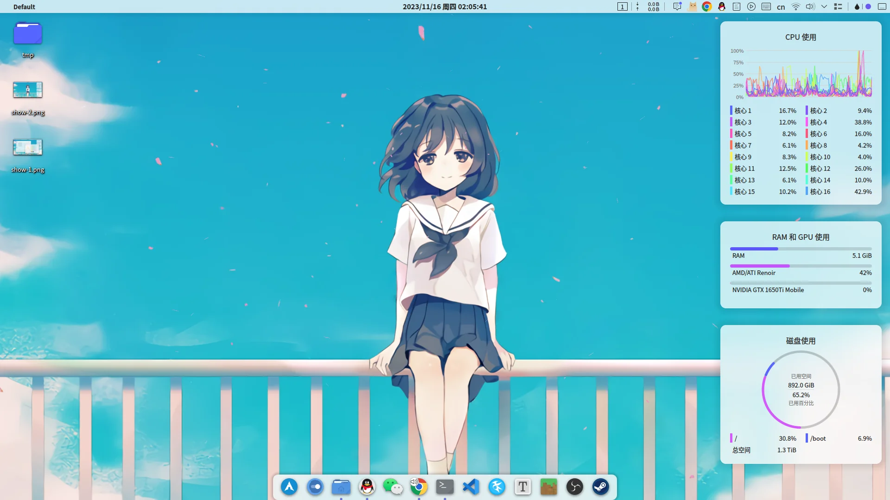
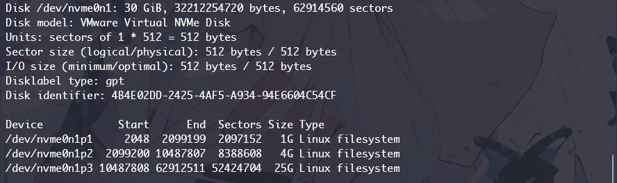
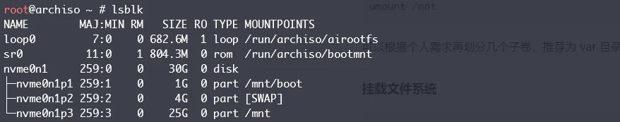
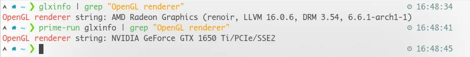
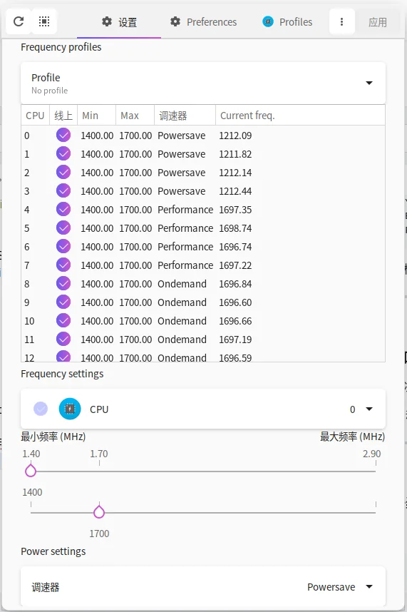

# ArchLinux 折腾指南&记录

谨以此篇文章记录最近一个半月，折腾 ArchLinux 的一些流程，以及记录一些常见问题和自己的解决方案。

:::tip
2023.12.13 备注：本文介绍的桌面环境配置部分，适用于使用 X 协议的 KDE5。但 Linux 社区正逐步放弃对 X 协议的支持，并过渡到 Wayland。因此<strong>未来安装桌面环境时，本文的桌面配置方案未必再有参考价值</strong>。如即将发布的 KDE6 和 GTK5，即将默认启用 Wayland 而不是 X 协议。
:::

**最终效果**:



## 〇、准备工作

arch install iso 链接：[Arch Linux - Downloads](https://archlinux.org/download/)

安装盘烧录和安装盘加载，这里不赘述。记得主板启用 UEFI 引导 + 关闭安全启动（Secure Boot）。

## 一、连接网络和时区配置

真正的第一步是设置字体，个人比较喜欢这一款：

```bash
setfont /usr/share/kbd/consolefonts/LatGrkCyr-12x22
```

使用 iwctl 连接 wifi：

```bash
iwctl
device list
station <device> scan
station <device> get-networks
station <device> connect <ssid>
exit
dhcpcd &
```

当然如果是有线连接，一般来说是会自动配置的。

也可以通过 systemd-networkd 的配置来自定义，这里做一个固定 IP 分配：

```ini
# 移除所有默认网络配置 rm -rf /etc/systemd/network/*
# nano /etc/systemd/network/<网络设备代号>.network
# 网络设备代号代号通过 ip link 查看
[Match]
Name=ens33
 
[Network]
DHCP=no
Address=192.168.1.2/24
DNS=8.8.8.8
 
[Route]
Gateway=192.168.1.1
```

重启网络服务并检查：

```bash
systemctl restart systemd-networkd
ping baidu.com
curl https://www.baidu.com
```

使用 ssh 在其他电脑上远程操作安装。出了问题好复制查询：

```bash
# 其他计算机上
ssh root@192.168.1.2
```

设置时区和时间同步：

```bash
timedatectl set-timezone Asia/Shanghai
timedatectl set-ntp true
timedatectl
```

## 二、分区、格式化和挂载

个人习惯用 fdisk 分为三个基础分区：
- `/boot` fat32 分区
  - /boot 单独分区是 archwiki 推荐的分法之一
  - 推荐至少 >1G
- `swap` linux swap 分区
  - 和物理内存一样大，或为物理内存 2 倍
- `/` ext4 分区
  - 如果没有其他分区，那剩下所有分给它

当然你还可以单独把 /home 分出来，方便备份和数据迁移。不过后面的步骤里要记得挂载。也可以用 btrfs 或其他文件系统，然后开子卷和其他一些高级特性。

分区主要流程：

- 新建 GPT 分区表（如果是空盘）
- 删除/新建分区
- 打印检查
- 保存写入、退出

示例分区结果：(按顺序分别为 /boot、swap 和 /）


格式化：

```bash
mkfs.fat -F32 /dev/nvme0n1p1
mkswap /dev/nvme0n1p2
mkfs.ext4 /dev/nvme0n1p3
```

挂载并检查：

```bash
# 一定记得先挂载 / 到 /mnt，然后才执行其他操作！
# 否则可能会发生覆盖 mount
mount /dev/nvme0n1p3 /mnt
mkdir /mnt/boot
mount /dev/nvme0n1p1 /mnt/boot
swapon /dev/nvme0n1p2
lsblk
```

示例 lsblk 结果：


## 三、安装系统

安装内核和基础软件包。同时根据需求装一些进系统后实用的软件。

intel 和 amd 的处理器，分别选择安装一种微码支持：`intel-ucode`、`amd-ucode`

```bash
pacman -Sy
pacstrap /mnt base base-devel amd-ucode linux linux-firmware linux-headers vi vim nano git wget tmux openssh networkmanager htop neofetch ntfs-3g yay
```

装完后可以检查一下：（应该基本目录结构和引导文件都生成了）


补全一下 fstab 的自动挂载：

```bash
genfstab -U /mnt >> /mnt/etc/fstab
```

change root 到安装的系统里：

```bash
arch-chroot /mnt
```

进去后可以再使用 lsblk 检查一下挂载正不正确。

## 四、系统基本配置

设置时区和同步硬件时钟：

```bash
ln -sf /usr/share/zoneinfo/Asia/Shanghai /etc/localtime
hwclock --systohc
```

生成本地化标识，一般英文和中文都生成一个：

```bash
echo -e "en_US.UTF-8 UTF-8\nzh_CN.UTF-8 UTF-8" > /etc/locale.gen
locale-gen
# 先这样设置，防止 tty 乱码。安装桌面环境后再改回来
echo 'LANG=en_US.UTF-8' > /etc/locale.conf
```

生成 hostname 和 hosts：

```bash
echo 'melorenae' > /etc/hostname
# nano /etc/hosts
127.0.0.1	localhost
::1		localhost
127.0.1.1	melorenae.localdomain	melorenae
```

root 密码设置：

```bash
passwd
```

添加普通用户，并加入 wheel 权限组：

```bash
useradd -m -G wheel melodyecho
passwd melodyecho
# 编辑 sudoers，实现 su 权限执行所有命令和 sudo 免密码
EDITOR=nano visudo
# 取消以下两行的注释即可：
```


启用 networkmanager 和 sshd 服务：

```bash
systemctl enable NetworkManager
systemctl enable sshd
```

安装 grub 引导：

```bash
pacman -Sy
pacman -S grub efibootmgr os-prober
grub-install --target=x86_64-efi --efi-directory=/boot --bootloader-id=archlinux
```

启用 os-prober：

```bash
# nano /etc/default/grub
# 取消这一行注释
GRUB_DISABLE_OS_PROBER=false
```

生成 grub 配置：

```bash
grub-mkconfig -o /boot/grub/grub.cfg
```

退出、递归取消挂载、重启，准备进入新系统：

```bash
exit
umount -R /mnt
reboot
```

## 五、桌面环境安装

登录进入新系统。因为没有桌面环境，所以初始网络配置依然要重新做一遍。不过之前安装了 NetworkManager，可以直接用 nmcli 或 nmtui。之后再安装桌面环境，用桌面环境的设置配置一次，以后网络环境就会自动就绪了。

当然这里还是使用刚才的固定 ip 分配，即再写一次配置。

不过重启网络服务时注意启动解析服务，要不然 dns 解析没法工作：

```bash
sudo systemctl restart systemd-networkd
sudo systemctl start systemd-resolved
```

然后还是切换到远程连接上操作：

```bash
# 其他计算机上
ssh melodyecho@192.168.1.2
```

添加 archlinux-cn 源，并安装其密钥：

```bash
# sudo nano /etc/pacman.conf
# 末行添加
[archlinuxcn]
Server = https://mirrors.tuna.tsinghua.edu.cn/archlinuxcn/$arch
sudo pacman -Sy
sudo pacman -S archlinuxcn-keyring
```

/etc/pacman.conf 文件中建议启用配置 Color：


安装音频驱动支持：

```bash
sudo pacman -S pipewire pipewire-alsa pipewire-jack pipewire-pulse pipewire-media-session gst-plugin-pipewire
```

安装 xorg 套件、桌面环境、登录管理器和一些实用程序，这里以 sddm 和 kde5 为例：

```bash
sudo pacman -S xorg
sudo pacman -S plasma sddm konsole dolphin kate okular spectacle partitionmanager ark filelight gwenview
```

启用 sddm 服务：

```bash
sudo systemctl enable sddm
```

重启系统进入桌面：

```bash
sudo reboot
```

## 六、桌面环境配置

:::tip
2023.12.13 备注：再次提示，以下内容仅适用于：<strong>使用 X 协议的、sddm 登录验证的 KDE5 桌面环境</strong>。同时，如果未来官方源更新 KDE 至 KDE6，请自行判断以下操作是否适用。
:::

### 1、网络配置

在 GUI 界面，用系统设置再配置一次。

### 2、中文和输入法支持

首先重新指定 LANG：

```bash
# sudo nano /etc/locale.conf
LANG=zh_CN.UTF-8
```

安装中文字体和其他实用字体：

```bash
sudo pacman -S adobe-source-han-sans-otc-fonts adobe-source-han-serif-otc-fonts noto-fonts noto-fonts-cjk noto-fonts-emoji
```

然后设置里把语言改成中文，重启就有中文了。

中文输入法一般 aur 源的搜狗是比较快和稳妥的方案，而且也还算好用。追求自定义化的话，可以去搞 rime。或者用 fcitx5 也是不错的。

安装搜狗输入法：

```bash
yay -S fcitx-sogoupinyin
sudo pacman -S fcitx-configtool
```

配置相关环境变量：

```bash
# nano ~/.xprofile
export GTK_IM_MODULE=fcitx
export QT_IM_MODULE=fcitx
export XMODIFIERS=@im=fcitx
export INPUT_METHOD=fcitx
export SDL_IM_MODULE=fcitx
export GLFW_IM_MODULE=fcitx
```

注销重新登录。然后运行 `fcitx-configtool` 可以进行一些配置，比如把 fcitx 自带的其他输入法删掉。如果没正常工作，运行 `fcitx-diagnose` 检查。

如果某些 QT 应用仍然无法使用输入法，可以尝试以下命令并全选安装：

```bash
sudo pacman -S fcitx-im
```

这样会同时安装 fcitx 的 qt5 和 qt6 支持。防止有些应用找不到对应版本的库文件（如 telegram 需要 fcitx-qt6，只有 fcitx-qt5 是不行的 ）。


### 3、shell 和终端模拟器配置

看你自己喜欢什么 shell 和终端咯。终端我一般用 KDE 自带的 konsole，然后主题从 kde 的商店里下一个。终端字体的话我喜欢用 Monaco，我做了一个 Nerd Fonts 的 patch，需要的话自取：[Monaco_Nerd_Font_Mono-Regular.ttf](/upload/articles/archlinux-note/Monaco_Nerd_Font_Mono-Regular.ttf)

shell 的话，我一般用 zsh，然后搭配 oh-my-zsh 和 powerlevel10k 主题。另外，我常用以下 zsh 插件：
- zsh-autosuggestions
- zsh-completions
- zsh-history-substring-search
- zsh-syntax-highlighting

shell 和终端配置其实很随心所欲的，详细的就不介绍了。

### 4、显卡驱动安装

xorg 显卡驱动安装参照 wiki：[Xorg - ArchWiki](https://wiki.archlinux.org/title/Xorg)

如果是 n 卡，特别注意仔细阅读此文档：[NVIDIA - ArchWiki](https://wiki.archlinux.org/title/NVIDIA)

如果是双显卡，需要配置管理方案。流行的管理方案有 optimus manager、prime offload 和 nvidia-xrun。
- optimus-manager：[GitHub - Askannz/optimus-manager](https://github.com/Askannz/optimus-manager)
- prime-render-offload：[PRIME - ArchWiki](https://wiki.archlinux.org/title/PRIME#PRIME_render_offload)
- nvidia-xrun：[nvidia-xrun - ArchWiki](https://wiki.archlinux.org/title/Nvidia-xrun)
- 其他：[Use switchable graphics - ArchWiki](https://wiki.archlinux.org/title/NVIDIA_Optimus#Use_switchable_graphics)

个人比较喜欢 prime 管理方案。如下：（非 prime 勿按照以下操作）

```bash
sudo pacman -S nvidia-prime
```

需要使用 n 卡运行时，只需要在前面加上 `prime-run` 即可：

```
prime-run xxx
# 例如查看当前的 opengl 渲染器，自然应该输出 n 卡相关信息：
prime-run glxinfo | grep "OpenGL renderer"
```


当然你也可以选择手动注入 prime 相关的环境变量。这本质上和 `prime-run` 是等价的：

```bash
export __NV_PRIME_RENDER_OFFLOAD=1
export __VK_LAYER_NV_optimus=NVIDIA_only
export __GLX_VENDOR_LIBRARY_NAME=nvidia
export VK_ICD_FILENAMES=/usr/share/vulkan/icd.d/nvidia_icd.json 
```

此外如果需要在内核阶段早加载驱动（Early KMS Start），参考：[Kernel mode setting - ArchWiki](https://wiki.archlinux.org/title/Kernel_mode_setting#Early_KMS_start)

### 5、CPU 调频和电源管理
根据自己的硬件情况和需求自行搜索解决。在 archwiki 有很多文档可以参考。

我自己的 cpu 是移动端 amd r7 4800H。电源管理我省事就没做了，但是我用 cpupower-gui 这个软件调频：（你也可以试试）


### 6、常用软件安装
**qq**：

```bash
yay -S linuxqq
```

**微信**：（个人推荐这个）

```bash
yay -S com.qq.weixin.spark
```

**telegram**：

```bash
sudo pacman -S telegram-desktop
# 遇到 fcitx 输入法无法启动问题，使用：
sudo pacman -S fcitx-qt6
```

**腾讯会议**：

```bash
yay -S wemeet-bin
```

**wps**：

```bash
yay -S ttf-wps-fonts wps-office
```

注意：
-  若出现 pdf 导出失败、字体过粗问题，参照 wiki 解决： [WPS Office - ArchWiki](https://wiki.archlinux.org/title/WPS_Office)
- 如果需要国内特供版 wps 也参考上面的 wiki

**百度网盘**：

```bash
yay -S baidunetdisk-electron
```

md 编辑器 `Typora`：

```bash
sudo pacman -S typora
```

**vscode**：

```bash
yay -S visual-studio-code-bin
```

**steam**：

首先确保你已经安装好了显卡驱动，以及相关的 32 位及 64 位的 opengl, vulkan 包。参考：[Driver_installation - ArchWiki](https://wiki.archlinux.org/title/Xorg#Driver_installation)

```bash
sudo pacman -S steam
```

注意：
- 关于字体支持和其他一些安装配置细节，参考：[Steam - ArchWiki](https://wiki.archlinux.org/title/Steam)
- 安装完成后建议启动 steam-runtime 而不是 steam-native，前者会使用 steam 自带的运行库文件
- 如果需要使用兼容层 proton，参照：[【爱折腾】SteamDeck完全折腾指南-E1-安装Proton订制兼容层 - 哔哩哔哩](https://www.bilibili.com/read/cv20979435)

**vlc** 播放器安装：

```bash
sudo pacman -S vlc
```

**obs** 录屏软件：

```bash
# 如果用不到 浏览器源采集 功能，直接从官方源安装：
sudo pacman -S obs-studio
# 否则推荐这个 aur 包，或者安装 flatpak 版的 obs：
yay -S obs-studio-tytan652
```

**timeshift** 备份和恢复软件：（搭配 btrfs 使用更佳）

```bash
sudo pacman -S timeshift
```

实用截图/贴图软件 **flameshot**：（类似 Snipaste）

```bash
sudo pacman -S flameshot
```

### 7、Windows 分区挂载

可以在 `/etc/fstab` 里配置自动 mount，但是某些情况下，这样的自动 mount 会导致启动时间剧增。（可使用 `sudo systemd-analyze blame` 查看系统启动占用时间）

所以更推荐写成一个脚本，在用户登录后自动执行挂载。脚本放置在 `~/.config/autostart/` 即可在用户登录后执行。挂载命令示例如下：

```bash
# uid, gid 通过命令 id 查看
# umask, dmask, fmask 可以控制 mount 后的文件的权限
sudo mount -t ntfs-3g -o uid=1000,gid=998,umask=0,dmask=027,fmask=137 /dev/nvme0n1p3 /mnt/c
```

这样 mount 后的权限为：所有者为当前用户。所有者可读写可执行，组内用户可读可执行，其他用户无权读写和执行。

### 8、桌面很卡，xxx 进程占用太高

这个问题其实蛮随机的。有时候运行几个游戏再退出来，或者从休眠恢复，都可能变卡。得看你具体占用高的进程的日志。搜一下日志，然后去找解决方案吧。

如果实在看日志都找不到问题，建议重启 Kwin 或者注销重新登录，还不行就重启。重启 Kwin 方法：

```bash
setsid kwin_x11 --replace &
```

重启 Kwin 还是很快的，总比注销和重启快，而且大多数时候有效。如果你懒得敲这段命令，在 .bashrc/.zshrc 做个 alias。

### 9、KDE 桌面美化/优化

几点建议：

- **尽量少做美化。特别是很 hack 的美化要少搞，会不稳定（除非是非常成熟的项目）**。
- **风格统一是"美观"的必要条件**。
- 主题安装参照对应 github 页面 README 进行，否则可能安装不完全。

dock 栏支持应用 latte-dock 安装：（**注意这个在 KDE6 已经完全不可用**）

```bash
sudo pacman -S latte-dock
```

基于 Steam Wallpaper Engine 和 kde 插件的动态壁纸方案：[GitHub - wallpaper-engine-kde-plugin](https://github.com/catsout/wallpaper-engine-kde-plugin)

某些 Wallpaper Engine 的壁纸可能会导致 kde 反复崩溃，这时删除 `~/.config/plasma-org.kde.plasma.desktop-appletsrc` 中的 `WallpaperSource` 一行并重启 KDE 即可修复。

推荐的其他关于桌面美化的资料：

- [KDE 桌面环境定制指南 | Linux 中国](https://zhuanlan.zhihu.com/p/354427013)
- [Linux KDE美化plasma moe主题](https://www.bilibili.com/video/BV1bz4y1z7oV)
- [【Archlinux+KDE】Mac风美化+安装后配置，超详细教程！](https://www.bilibili.com/video/BV15x4y1u7Ui)
- [笔记本屏幕小窗口开多太混乱？优雅kde改平铺，何必一定i3 dwm](https://www.bilibili.com/video/BV1Gh411R7Q4)
- [Manjaro KDE 调教配置及美化（2022.01.23）](https://zhuanlan.zhihu.com/p/460826583)
- [KDE常用桌面插件总结 - pipci - 博客园](https://www.cnblogs.com/pipci/p/14861412.html)
- [Manjaro+kde简单配置美化教程](https://www.bilibili.com/read/cv11183026)
- [KDE 那些实用有趣的桌面插件 - 简书](https://www.jianshu.com/p/51a054b3bf93)

### 10、运行 Windows 应用/游戏

一般就是要去折腾 wine。但是 wine 的坑实在不是一般的多。甚至再单独写几篇文章都写不完。推荐使用这个可视化工具自动配置：[Github - Bottles](https://github.com/bottlesdevs/Bottles)

用这个不用操心一些 dll 和运行库缺失的问题，而且还有一键硬件加速和显卡切换，可以说非常实用了。

如果 wine 应用 alt-tab 切换后丢失焦点，参照：[AskUbuntu - 299286](https://askubuntu.com/questions/299286/how-to-recover-focus-after-losing-it-while-using-wine)
