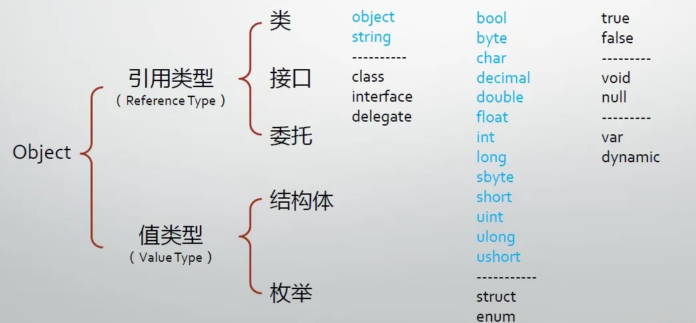
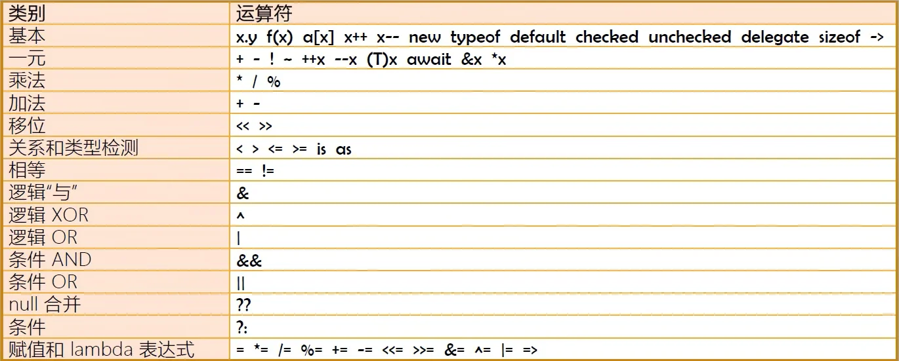
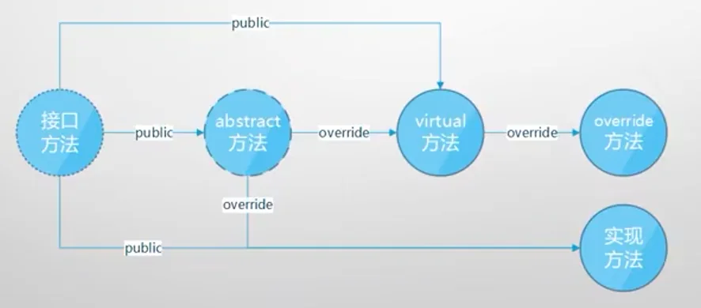

# C# 一周目学习 —— 基本语法

## 零、输入输出

### 1、输入

​    主要使用 `Console.Read()` 和 `Console.ReadLine()` 方法。


### 2、输出

​    主要使用 `Console.Write()` 和 `Console.WriteLine()` 方法。

​    关于字符串格式化，参见：https://www.cnblogs.com/fskong/p/16940917.html

---


## 一、类与命名空间

### 1、概念

​    类（class）构成程序的主体

​    名称空间（namespace）以树型结构组织类（和其他类型）

​    能在命名空间中定义的元素有：类(Class)，接口(Interface)，结构(struct)，委托(delegate)，枚举(enum)


### 2、类库和引用

​    类库引用是使用名称空间的物理基础。不同技术类型的项目会默认引用不同的类库。

- DLL 引用（黑盒引用，无源代码）
- 项目引用（白盒引用，有源代码）


### 3、类的三大成员

- 属性
- 方法
- 事件
  - 类或对象通知其它类或对象的机制，为C#所特有
  - 善用事件机制非常重要

​    各种类的侧重：

- 模型类或对象重在属性，如 Entity Framework
- 工具类或对象重在方法，如 Math，Console
- 通知类或对象重在事件，如各种 Timer


### 4、静态成员与实例成员

- 静态（Static）成员在语义上表示它是"类的成员"
- 实例（非静态）成员在语义表示它是"对象的成员"
- 绑定（Binding）指的是编译器如果把一个成员与类或对象关联起来

---


## 二、数据类型

### 1、五大类型

- 类（classes）如：Window, Form, Console, String
- 结构体（structures）如：Int32, Int64, Single, Double
- 枚举（Enumerations）如：HorizontalAlignment, Visibility
- 接口（Interfaces）
- 委托（Delegates）

​    类型的派生谱系：




### 2、基本数据类型

| 类型    | 描述                                 | 范围                                                    | 默认值 |
| ------- | ------------------------------------ | ------------------------------------------------------- | ------ |
| bool    | 布尔值                               | true 或 false                                           | False  |
| byte    | 8 位无符号整数                       | 0 到 255                                                | 0      |
| char    | 16 位 Unicode 字符                   | U +0000 到 U +ffff                                      | '\0'   |
| decimal | 128 位精确的十进制值，28-29 有效位数 | (-7.9 x 1028 到 7.9 x 1028) / 100 到 28                 | 0.0M   |
| double  | 64 位双精度浮点型                    | (+/-)5.0 x 10-324 到 (+/-)1.7 x 10308                   | 0.0D   |
| float   | 32 位单精度浮点型                    | -3.4 x 1038 到 + 3.4 x 1038                             | 0.0F   |
| int     | 32 位有符号整数类型                  | -2,147,483,648 到 2,147,483,647                         | 0      |
| long    | 64 位有符号整数类型                  | -9,223,372,036,854,775,808 到 9,223,372,036,854,775,807 | 0L     |
| sbyte   | 8 位有符号整数类型                   | -128 到 127                                             | 0      |
| short   | 16 位有符号整数类型                  | -32,768 到 32,767                                       | 0      |
| uint    | 32 位无符号整数类型                  | 0 到 4,294,967,295                                      | 0      |
| ulong   | 64 位无符号整数类型                  | 0 到 18,446,744,073,709,551,615                         | 0      |
| ushort  | 16 位无符号整数类型                  | 0 到 65,535                                             | 0      |

​    另外：

- 可以使用 `var` 关键字在定义时使用类型推导。
- 可以使用 `dynamic` 关键字定义"动态类型"的变量，将不会在编译期进行类型检查。

---


## 三、运算符

### 1、运算符种类与特点



​    运算符重载：

```c#
class Person {
    public static operator +(Person a, Person b) {
        // place your code
    }
}
```

​    default 运算符：https://blog.csdn.net/wsnbbdbbdbbdbb/article/details/125786005

​    checked, unchecked 是用来检查溢出异常的，可以以上下文形式使用：

```c#
checked {
    try {
        uint y = uint.MaxValue + 1;
        Console.WriteLine(y);
    }
    catch (OverflowException e) {
        Console.WriteLine("发生溢出");
    }
}
```

​    delegate 是用于实现委托的运算符，也可以被用来实现匿名方法，不过目前更推荐使用 lambda 表达式。

​    new 运算符的一些用法：

```c#
staic void Main(string[] args) {
    // 使用初始化器
    Form myForm = new Form() { Text="Hello World" }
    // 创建匿名类对象
    var person = new { Name="Person88", Age=34 }
}
```


### 2、类型转换

- 隐式（implicit）类型转换

  - 不丢失精度的转换

  - 子类向父类的转换

  - 装箱


- 显式（explicit）类型转换

  - 有可能丢失精度（甚至发生错误）的转换，即 cast

  - 拆箱

  - 使用Convert类

  - ToString 方法与各数据类型的 Parse/TryParse 方法

- 自定义类型转换操作符

```c#
// cast:
int a = (int) double_value;
// Convert 类方法：
Convert.ToDouble(the_str);
// ToString 方法:
the_int.ToString();
// Parse 和 TryParse:
double.Parse();        // 失败直接抛出异常
double.TryParse();    // 返回值为 bool 值，判断是否转换成功
```

```c#
// 自定义显式转换 A var1 = (A) var2;
public static explicit operator A(B var2) {
    // 转换方法，返回 A 类对象
}
// 自定义隐式转换 A var1 = var2;
public static implicit operator A(B var2) {
    // 转换方法，返回 A 类对象
}
```


### 3、is 和 as

​    is 示例：

```c#
// 假设 Teacher 类继承于 Human
Teacher t = new Teacher();
Console.WriteLine(t is Human);    // true
```

​    as 示例：

``` c#
object o = new Teacher();

if (o is Teacher) {
    Teacher t = (Teacher) o;
    t.Teach();
}
// 等价于：
Teacher t = o as Teacher;
if (t != null) {
    t.Teach();
}
```


### 4、可空类型

```c#
// 定义 x 为可空 int
int? x = null;
x = 100;
Console.WriteLine(x);
Console.WriteLine(x.HasValue);
// 如果是 null，赋值为 1
int y = x ?? 1;
Console.WriteLine(y);
// 当不为空时，和 2 比较是否相等
x?.Equals(2);
```

---


## 四、表达式和语句

### 1、标签语句和块语句

```c#
staic void Main(string[] args) {
    // 一个块语句是独立的上下文环境
    {
        hello: Console.WriteLine("Hello~");
        goto hello;
    }
}
```


### 2、switch 语句

```c#
switch(score) {
    case score >= 80 && score <= 100:
        // ...
        break;
    case score >= 60 && score < 80:
        // ...
        break;
    // case 为 1 和 2 共用一个 section
    case 1:
    case 2:
        // ...
        break;
    default:
        // throw error
        break;
}
```


### 3、try-catch-finally 语句

```c#
try {
    // ...
}
catch (aException e) {
    // e 是异常对象
    Console.WriteLine(e.Message);
}
catch (bException e) {
    // ...
}
finally {
    // ...
}
```

​    抛出异常：

```c#
catch(xxx e) {
    throw;
}
// 或
catch (xxx e) {
    throw e;
}
// 或
catch (xxx e) {
    throw new xxx("custom message");
}
// 或
throw new xxx;
```

​    详细区别见于：https://blog.csdn.net/zwb_578209160/article/details/119384988


### 4、循环迭代

​    `while`、`do-while`、`for` 语句与 C 基本类似。

​    关于 C# 的迭代器和迭代实质：

```c#
List<int> intList = new List<int>() {1, 2, 3, 4, 5, 6};
IEnumerator iterator = intList.GetEnumerator();
while (iterator.MoveNext()) {
    Console.WriteLine(iterator.Current);
}
```

​    而 `foreach` 方法则是内部实现了这个过程：

```c#
List<int> intList = new List<int>() {1, 2, 3, 4, 5, 6};
foreach(var elem in intList) {
    Console.WriteLine(elem);
}
```

---


## 五、方法参数传递

### 1、值参数

- 传递前，必须先明确赋值
- 对于值类型，参数创建变量的副本
- **对于引用类型，参数赋值前是引用，赋值后是新的对象**
- **对于引用类型，直接修改参数，则外部对象随之改变**（此时参数和外部值**指向的地址是相同的**，都指向于堆内存的同一块区域）


### 2、引用参数

```c#
static void hasSideEffect(ref int x, ref int y) {
    x = 1;
    y = 2;
}
```

- 传递前，必须先明确赋值
- 对于值类型，参数不创建变量的副本
- **对于引用类型，参数赋值前是引用，赋值后将会覆盖外部对象。**
- **对于引用类型，直接修改参数，则外部对象随之改变。**（此时参数和外部值**指向的地址是不同的**，参数先指向外部值，外部值指向堆内存中的一块区域）

- 一般用作"改变"操作


### 3、输出参数

```c#
class DoubleParser {
    public static bool TryParse(string input, out double? result) {
        try {
            result = double.Parse(input);
            return true;
        } catch {
            result = null;
            return false;
        }
    }
}
```

```c#
// 使用
double x;
bool status = DoubleParser.TryParse("123.45", out x);
if (!status)
    throw new Exception("转换错误");
Console.WriteLine(x);
```

- 传递前，可以先不赋值，**但是在方法内部必须有赋值**。
- 对于值类型和引用类型的相关特点，和引用参数类似。
- 一般用作"输出"操作


### 4、数组参数

```c#
static int GetSum(params int[] intArr) {
    int sum = 0;
    foreach(var elem in intArr) {
        sum += elem;
    }
    return sum;
}
```

```c#
// 以下传值方法皆可：
GetSum(1, 2, 3);
GetSum(new int[] {1, 2, 3});
```

- 只能有一个且必须是形参列表中的最后一个，由 params 修饰


### 5、具名使用

```c#
Student stu = new Student(name: "123", age: 18);
```

- 参数位置不再受约束


### 6、可选参数（默认参数）

​    和其他语言类似。


### 7、扩展方法

​    在不修改源码，或重新编译 dll 的情况下，进行方法扩展：

```c#
// 声明静态类
static class DoubleExtension {
    public static double Round(this double input, int digits) {
        return Math.Round(input, digits);
    }
}
```

```c#
// 使用
double x = 3.1415926535d;
x.Round(4);
```

- 方法必须是公有、静态的，即被 `public static` 所修饰
- 必须是形参列表中的第一个，由 `this` 修饰
- 必须由一个静态类（一般类名为 xxxExtension ）来统一收纳对 xxx 类型的扩展方法

---


## 六、类、枚举和结构体

### 1、构造，析构和重载

​    **重载**：

```c#
class Student {
    public int ID;
    public string Name;
    
    public Student() {
        this.ID = 1;
        this.Name = "Hello";
    }
    public Student(int id, string name) {
        this.ID = id;
        this.Name = name;
    }
}
```

​    基本原理和细节与 C++ 类似。

​    **静态构造函数**：

```c#
// 静态构造函数只能用于构造静态成员，且必然会先被调用
class Student {
    static Student() {
        Console.WriteLine("静态构造方法必然先被调用");
    }
    public Student(string str) {
        Console.WriteLine(str + "你好呀");
    }
}
```

​    **析构**：

```c#
class Student {
    ~Student() {
        Console.WriteLine("析构完成");
    }
}
```

​    析构无修饰符，无参，无继承和重载。


### 2、默认访问权限

   **默认访问权限**：

- 命令空间中只能使用 public 和 internal 两种访问修饰符，默认为 internal。
- 枚举、接口默认访问权限为 public，不能修改且不能使用访问修饰符。

- 类默认为 internal 访问修饰符。 内部默认为 private 访问修饰符。
- 析构函数不能显式使用，无修饰符。
- 类的成员默认访问修饰符为 private。
- 嵌套类型的默认访问修饰符为 private。
- **派生类的可访问性不能高于基类。成员的可访问性决不能高于包含类的可访问性。**


### 3、方法重载

​    方法重载需要的条件：

- 方法名相同
- 具有不同的参数个数或参数类型或参数顺序，与参数名无关

​    注意：

- 传值参数同时可以与引用参数、输出参数中的一个重载。
- **方法重写和覆写与重载不同**


### 4、partial

​        partial 可以将类、接口或接口的定义拆分到多个源文件中。方便扩展和管理。

```c#
// Book.cs
namespace BookStore {
    public partial class Book {
        public int ID {get; set;}
        public string Name {get; set;}
        public double Price {get; set;}
        public string Author {get; set;}
    }
}

// BookExtends.cs
namespace BookStore {
    public partial class Book {
        public void Show() {
            Console.WriteLine($"Book {Name}'s price is {Price}.");
        }
    }
}
```


### 5、类其他知识

​    **类访问权限**：https://blog.csdn.net/qq_45037155/article/details/123658777

​    **关于继承**：https://blog.csdn.net/QWD8596/article/details/120819502

​    **关于静态成员继承**：https://blog.csdn.net/WuLex/article/details/119342955

​    **关于密封（sealed）**：https://blog.csdn.net/qq_43024228/article/details/89885161

​    **关于重载和多态**：默认不需要 virtual 和 override 关键字，子类也可以实现重写。**但是这些是实现多态的重要手段**。此部分参考：http://t.zoukankan.com/dotgua-p-6287926.html

​    **关于字段，属性和访问器**：https://blog.csdn.net/weixin_44023930/article/details/123447507（为区分，字段首字母小写，而属性首字母大写）

​    **关于抽象类和抽象方法**：

- 抽象方法只在抽象类中定义
- 继承的实现类通过 override 修饰实现虚方法

​    **关于抽象属性**：

- 只在抽象类中定义
- 至少一个访问器
- 详细参见：https://blog.csdn.net/chenweicode/article/details/98849554


### 6、枚举

​    枚举：

- 人为限定取值范围的整数
- 整数值的对应
- 比特位式用法

```c#
enum Level {
    Employee,
    Manager,
    Boss,
    BigBoss
}

// 使用
static void Main() {
    Level lvl = Level.Boss;
}
```

​    注：默认从 0 开始编号，以 1 递增

​    也可以自己赋值：

```c#
// 此时 BigBoss 为 301
enum Level {
    Employee=100,
    Manager=200,
    Boss=300,
    BigBoss
}
```

​    比特位用法：（用于标记和识别是否具有某些特质）

```c#
enum Skill {
    Drive = 1,
    Cook = 1<<1,
    Program = 1<<2,
    Teach = 1<<3
}

static void Main() {
    Skill HasSkill = Skill.Drive | Skill.Cook | Skill.Program | Skill.Teach;
    // 判断是否会编程
    Console.WriteLine((HasSkill & Skill.Program) != 0);
}
```


### 7、结构体

​    结构体：

- 值类型，可装箱、拆箱
- 可实现接口，但不能派生自类或结构体
- 不能有显式无参构造器，但可以有显式有参构造器

```c#
interface ISpeak {
    void Speak();
}

struct Student: ISpeak {
    public int ID {get; set;}
    public string Name {get; set;}
    public void Speak() {
        Console.WriteLine($"I'm {ID} student {Name}.");
    }
}

static void Main() {
    Student stu = new Student() {ID=101, Name="MelodyEcho"};
    // 装箱和拆箱
    object obj = stu;
    Student stu2 = (Student) obj;
    // 拷贝生成新的值，而不是产生引用
    Student stu3 = stu;
}
```

---


## 七、字段、属性、索引器和常量

### 1、字段

​	简述：

- 字段（field）是一种表示与对象或类型（类与结构体）关联的变量。
- 尽管字段声明带有分号，但它不是语句
- 字段的名字一定是名词

​    字段的初始值：

- 无显式初始化时，字段获得其类型的默认值，**所以字段永远都不会未被初始化**

​    字段的修饰符：

- new
- public, protected, internal, private
- static
- readonly
- volatile

​    `new` 修饰符用于隐藏子类中继承的父类成员，以实现重写：

```c#
public class Base {
    public class Nested {};
    public int var1;
    public void method() {}
}

class Sub: Base {
    new public class Nested {};
    new int var1;
    new void method() {}
}
```

​    `volatile` ：多个线程同时访问一个变量，CLR 为了效率，允许每个线程进行本地缓存，这就导致了变量的不一致性。volatile 就是为了解决这个问题，volatile 修饰的变量，不允许线程进行本地缓存，每个线程的读写都是直接操作在共享内存上，这就保证了变量始终具有一致性。

```c#
public volatile int x;
```

​    `readonly`：只读成员。

- 与 `get{}` 区别：
  - readonly 只能够初始化一次，即在定义或者构造方法初始化时。而 `get{}` 虽然也起到的只读的作用，但可以通过 `set{}` 进行多次修改。
- 与 `const` 对比：
  - const 常量必须要有初始值，而 readonly 可以没有
  - readonly 可以在构造方法中进行赋值，而 const 不行。const 一旦确定值就不可以改变了


### 2、属性

​    属性（property）：是一种用于访问对象或类型的特征的成员，特征反映了状态。

- field 更偏向于实例对象在内存中的布局，property 更偏向于反映现实世界对象的特征
- 对外：暴露数据，数据可以是存储在字段里的，也可以是动态计算出来的
- 对内：保护字段不被非法值"污染"
- 属性大多数情况下是字段的包装器（wrapper）

​    **建议**：永远使用属性（而不是字段）来暴露数据。

```c#
class Person {
    // 完整声明
    private int age;
    public int Age {
        get{ return this.age; }
        set {
            if (value >= 0 && value <= 120) {
                this.age = value;
            }
            else {
                throw new Exception("超出范围的值")
            }
        }
    }
    // 简略声明
    public int Height { get; set; }
}
```

```c#
// 控制访问级别：
public int Height { set; private set; }
```


### 3、索引器

​    索引器（indexer）：一种成员。它使对象能够用与数组相同的方式（即使用下标）进行索引。

​    索引器的声明：

```c#
class StuScore {
    private Dictionary<string, int> dict = new Dictionary<string, int>();
    public int ? this[string subject] {
        get {
            if (this.dict.ContainsKey(subject))
                return this.dict[subject];
            else 
                return null;
        }
        set {
            if (!value.HasValue)
                throw new Exception("不能为空值");
            if (this.dict.ContainsKey(subject))
                this.dict[subject] = value.Value;
            else
                this.dict.Add(subject, value.Value);
        }
    }
}
```

​    使用：

```c#
StuScore score = new StuScore();
Console.WriteLine(score["Math"]);
score["Math"] = 123;
Console.WriteLine(score["Math"]);
score["Math"] = null;
Console.WriteLine(score["Math"]);
```


### 4、常量

​    常量（constant）：是表示常量值的类成员。（即可以在编译时计算的值）

​    **常量隶属于类型而不是对象，即没有"实例常量"**。"实例常量"的角色由只读实例字段来担当。

​    同时注意：当希望成为常量的值其类型不能被常量声明接受时（类/自定义结构体），应该使用静态只读字段：

```c#
class Building {
    // MetaInfo 是自定义的类
    public static readonly MetaInfo Meta = new MetaInfo();
}
```

---


## 八、泛型

​    泛型可以很好地解决类型膨胀和成员膨胀的问题。

### 1、泛型类

```c#
class Apple {
    public string Color {get; set;}
}

class Book {
    public string Name {get; set;}
}

class Box<TCargo> {
    public TCargo Cargo {get; set;}
}

static void Main() {
    var apple = new Apple() {Color="Red"};
    var book = new Book() {Name="New Book"};
    // 特化
    Box<Apple> box = new Box<Apple>() {Cargo=apple};
    box<Book> box2 = new Box<Book>() {Cargo=book};
}
```


### 2、泛型接口

```c#
interface IUnique<T> {
    T ID {get; set;}
}

class Student<T>: IUnique<T> {
    public T ID {get; set;}
    public string Name {get; set;}
}

// 也可以直接在实现时特化
class StudentSecond: IUnique<ulong> {
    public ulong ID {get; set;}
    public string Name {get; set;}
}

static void Main() {
    Student<int> stu = new Student<int>();
    stu.ID = 123;
    var stu2 = new Student<string>();
    stu2.ID = "100";
}
```


### 3、泛型方法

```c#
static T[] Zip<T>(T[] a, T[] b) {
    T[] zippped = new T[a.Length + b.Length];
    int ai = 0, bi = 0, zi = 0;
    do {
        if (ai < a.Length) zipped[zi++] = a[ai++];
        if (bi < b.Length) zipped[zi++] = b[bi++];
    }
    while (ai < a.Length || bi < b.Length);
    return zipped;
}
```

---


## 九、委托

​    委托（delegate）是函数指针的"升级版"。


### 1、使用内置委托类型

```c#
// 无返回值、无参数委托
// 此处传递的方法为无返回值、无参数方法
Action action = new Action(Calculator.ReportMethodsNum);
// 触发，以下两种写法皆可
action.Invoke();
action();

// 无返回值、有参数委托
Action<string> action = new Action(StringManager.input);
action.Invoke();
action();
```

```c#
// 有返回值委托
// 假设传递的方法参数类型为：int, int，返回值类型为：float
Func<int, int, float> func = new Func<int, int, float>(Calculator.Div);
// 触发，以下两种写法皆可
func.Invoke();
func();
```


### 2、自定义委托

- 委托是一种类（class）。
- 类是数据类型所以委托也是一种数据类型
- 一般推荐声明在命令空间下，而不是嵌套在类中
- 委托与所封装方法必须类型兼容
  - 返回值数据类型一致
  - 参数列表在个数和数据类型上一致，参数名不需要一致

```c#
public delegate double Calc(double x, double y);
class Program {
    class Calculator {
        public double Add(double x, double y) {
            return x + y;
        }
    }

    static void Main() {
        Calculator calculator = new Calculator();
        Calc calc1 = new Calc(calculator.Add);
        Console.WriteLine(calc1.Invoke(1, 2));
        Console.WriteLine(calc1(1, 2));
    }
}
```

​    主要作用：把方法当作参数传给另一个方法

- 模板方法，"调用"指定的外部方法来产生结果
- 回调（callback）方法，调用指定的外部方法


### 3、自定义泛型委托

```c#
public delegate T MyDele<T>(T a, T b);

static void Main() {
    MyDele<int> deleAdd = new MyDele<int>(Add);
    int res = deleAdd(100, 200);
    MyDele<double> delMul = new MyDele<double>(Mul);
    double res2 = delMul(100.2, 300.5);
}

static int Add(int a, int b) {
    return a + b;
}

static double Mul(double a, double b) {
    return a * b;
}
```


### 4、多播委托与委托隐式异步

​    多播委托（同步调用）：

```c#
Action act1 = new Action(stu1.DoHomework);
Action act2 = new Action(stu2.DoHomework);
act1 += act2;
// 此后执行顺序按合并顺序
act1.Invoke();
```

​    委托隐式异步：

```c#
// 每一个 act 都在一个子线程中执行，默认不加锁
act1.BeginInvoke(null, null);
act2.BeginInvoke(null, null);
```


### 5、Lambda 表达式与匿名函数

```c#
Func<int, int, int> func = (int a, int b) => { return a + b; };
// 因为指定了委托的参数和返回值类型，所以可以不写类型
Func<int, int, int> func = (a, b) => a+b;
```

​    组合使用：（泛型方法、泛型委托参数）

```c#
static void DoSomeCalc<T>(Func<T, T, T> func, T x, T y) {
    T res = func(x, y);
    Console.WriteLine(res);
}
// 使用时：
DoSomeCalc((a, b) => a+b, 1, 2);
```


### 6、Linq

​    Linq：语言集成化查询（Language Integrated Query）

​    参考：https://learn.microsoft.com/zh-cn/dotnet/csharp/linq/write-linq-queries

---


## 十、事件

​    角色：使对象或类具备通知能力的成员

​    使用：用于对象或类间的动作协调与信息传递（消息推送）

​    五个组成部分：

- 事件的拥有者（event source，对象）
- 事件成员（event，成员）
- 事件的响应者（event subscriber，对象）
- 事件处理器（event handler，成员）—— 本质上是一个回调方法
- 事件订阅——把事件处理器与事件关联在一起，本质上是一种以委托类型为基础的"约定"

​    特点：**是委托的封装。保证了委托不在外部被随意的触发和调用，而只是暴露添加和移除事件处理器的功能**。


### 1、事件常见类型

​    事件拥有者和事件响应者在不同的类：

```c#
class Program {
    static void Main() {
        Form form = new Form();
        Controller controller = new Controller(form);
        form.ShowDialog();
    }
}

class Controller {
    private Form form;
    public Controller(Form form) {
        if (form != null) {
            this.form = form;
            this.form.Click += this.FormClicked;
        }
    }
    private void FormClicked(object sender, EventArgs e) {
        this.form.Text = DateTime.Now.ToString();
    }
}
```

​    事件拥有者和事件响应者是同一对象：

```c#
class Program {
    static void Main() {
        MyForm form = new MyForm();
        form.Click += form.FormClicked;
        form.ShowDialog();
    }
}

class MyForm: Form {
    internal void FormClicked(object sender, EventArgs e) {
        this.Text = DateTime.Now.ToString();
    }
}
```

​    事件拥有者是事件响应者的成员：

```c#
class Program {
    static void Main() {
        MyForm form = new MyForm();
        form.ShowDialog();
    }
}

class MyForm: Form {
    private TextBox textbox;
    private Button button;
    
    public MyForm() {
        this.textBox = new TextBox();
        this.button = new Button();
        this.Controls.Add(this.textBox);
        this.Controls.Add(this.button);
        this.button.Click += this.ButtonClicked;
    }
    private void ButtonClicked(object sender, EventArgs e) {
        this.textBox.text = DateTime.Now.ToString();
    }
}
```


### 2、事件完整声明

```c#
class Program {
    static void Main() {
        Customer customer = new Customer();
        Waiter waiter = new Waiter();
        customer.WhenOrder += waiter.AcceptOrder;
        customer.Order();
        customer.Pay();
    }
}

// 传递事件消息的类（定义事件发生时传递的参数）
public class OrderEventArgs: System.EventArgs {
    public string DishName {get; set;}
    public string Size {get; set;}
}

// 事件提供者
public class Customer {
    // 委托声明（定义事件处理器的规格）
    public delegate void OrderEventHandler(Customer customer, OrderEventArgs e);
    // 委托字段（用于保存所有的委托，即事件处理器）
    private OrderEventHandler oeHandler;
    // 事件成员
    public event OrderEventHandler WhenOrder {
        add {
            this.oeHandler += value;
        }
        remove {
            this.oeHandler -= value;
        }
    }

    public double Bill {get; set;}
    public void Pay() {
        Console.WriteLine("The customer Pay ${0}.", this.Bill);
    }
    // 事件触发
    public void Order() {
        if (this.oeHandler != null) {
            OrderEventArgs e = new OrderEventArgs() {
                DishName = "Kongpao Chicken",
                Size = "large"
            };
            this.oeHandler.Invoke(this, e);
        }
    }
}

// 事件响应者
public class Waiter {
    public void AcceptOrder(Customer customer, OrderEventArgs e) {
        Console.WriteLine("The waiter had served the dish:\n{0}, size: {1}", e.DishName, e.Size);
        double price = 10;
        switch (e.Size) {
            case "small":
                price *= 0.5;
                break;
            case "large":
                price *= 1.5;
                break;
            default:
                break;
        }
        customer.Bill += price;
    }
}
```


### 3、事件简略声明

​    简略声明类似于字段式声明（field-like）    

```c#
/* 
 * 其他部分相同，只需要更改以下部分
 */

// 只定义事件字段
// 此时不显式定义委托字段，因此委托字段使用同一名字访问
// 这种写法是一个语法糖，但实际在编译后，内部是有着委托字段的
public event OrderEventHandler WhenOrder;

// 事件触发
public void Order() {
    if (this.WhenOrder != null) {
        OrderEventArgs e = new OrderEventArgs() {
            DishName = "Kongpao Chicken",
            Size = "large"
        };
        this.WhenOrder.Invoke(this, e);
    }
}
```

---


## 十一、接口与抽象类

### 1、简述

​    概念：

- 抽象类是未完全实现逻辑的类（可以有字段和非 public 成员，它们代表了"具体逻辑"）
  - 为复用而生，也具有解耦功能
- 接口是完全未实现逻辑的"类"（即纯虚类，只有函数成员，成员全部 public）
  - 为解耦而生，方便单元测试

​    **共同点**：都不能实例化，只能用来声明变量、引用具体类的实例

​    **区别和联系**：https://www.infoworld.com/article/2928719/when-to-use-an-abstract-class-vs-interface-in-csharp.html

​    **使用范例**：

```c#
interface IVehicle {
    void Stop();
    void Fill();
    void Run();
}

abstract class Vehicle: IVehicle {
    public void Stop() {
        Console.WriteLine("Stopped.");
    }
    public void Fill() {
        Console.WriteLine("Pay and fill.");
    }
    abstract public void Run();
}

class Car: Vehicle {
    public override void Run() {
        Console.WriteLine("Car is running.");
    }
}
```

​    **覆写关系**：



### 2、接口显式实现

```c#
interface ISecret {
    void DoSomethingSecret();
}

interface IPublic {
    void DoSomethingExplicit();
}

class Person: ISecret, IPublic {
    public void DoSomethingExplicit() {
        Console.WriteLine("The thing that Everyone knows.");
    }
    void ISecret.DoSomethingSecret() {
        Console.WriteLine("The thing that only I know. ");
    }
}

static void Main() {
    var publicPerson = new Person();
    publicPerson.DoSomethingExplicit();
    // 也可以使用强制类型转换
    var privatePerson = publicPerson as ISecret;
    privatePerson.DoSomethingSecret();
}
```

​    `DoSomethingSecret()` 方法显式实现，只有在以 `ISecret` 类角色实现时，才可以调用此方法。


### 3、依赖反转

```c#
interface IPhone {
    void Dial();
    void PickUp();
    void Send();
    void Receive();
}

class PhoneUser {
    private IPhone _phone;
    public PhoneUser(IPhone phone) {
        _phone = phone;
    }
    public void UsePhone() {
        _phone.Dial();
        _phone.PickUp();
        _phone.Send();
        _phone.Receive();
    }
}

class XiaoMiPhone: IPhone {
    public void Dial() { Console.WriteLine("XiaoMi Dial working."); }
    public void PickUp() { Console.WriteLine("XiaoMi PickUp working."); }
    public void Send() { Console.WriteLine("XiaoMi Send working."); }
    public void Receive() { Console.WriteLine("XiaoMi Receive working."); }
}

static void Main() {
    // 用户与手机就实现了解耦。接口是用户和手机的"契约"
    // 如果有其他手机类，只需要实例化不同的手机即可，phone 并不需要更改代码
    var user = new PhoneUser(new XiaoMiPhone());
    user.UsePhone();
}
```


### 4、接口隔离

​    尽量避免"胖接口"带来的冗余与不兼容性。

```c#
class Driver {
    // driver 只需要实现驾驶的功能，因此只需要实现 IVehicle 内的功能
    private IVehicle _vehicle;
    public Driver(IVehicle vehicle) {
        _vehicle = vehicle;
    }
    public void Drive() {
        _vehicle.Run();
    }
}

interface IVehicle {
    void Run();
}

interface IWeapon {
    void Fire();
}

class Car: IVehicle {
    public void Run() {
        Console.WriteLine("Car running.");
    }
}

class Tank: IVehicle, IWeapon {
    public void Run() {
        Console.WriteLine("Tank running.");
    }
    public void Fire() {
        Console.WriteLine("Tank fired!");
    }
}
```

​    如果 `Fire()`、`Run()` 整合到一个接口中，会导致接口粒度过大，无法对使用方提供很好的兼容效果。


### 5、反射与依赖注入

​    反射：以不变应万变。

​    反射的实现：

```c#
using System.Reflection;

class Program {
    static void Main() {
        ITank tank = new Tank();
        
        var t = tank.GetType();
        object o = Activator.CreateInstance(t);
        MethodInfo fireMi = t.GetMethod("Fire");
        MethodInfo runMi = t.GetMethod("Run");
        fireMi.Invoke(o, null);
        fireMi.Invoke(o, null);
    }
}
```

​    依赖反转：如果在类 A 的内部去实例化类 B，那么两者之间会出现较高的耦合。要解决这个问题，就要把 A类对 B 类的控制权抽离出来，交给一个第三方去做，把**控制权反转给第三方（一般称 IOC 容器，即实现 IOC 的组件或框架），就称作控制反转（IOC Inversion Of Control）**。

​    依赖注入：是实现依赖反转的一种方法。

```c#
using Microsoft.Extensions.DependencyInjection;

class Program {
    static void Main() {
        var sc = new ServiceCollection();
        sc.AddScoped(typeof(ITank), typeof(MediumTank));
        sc.AddScoped(typeof(IVehicle), typeof(Car));
        sc.AddScoped<Driver>();
        var sp = sc.BuildServiceProvider();
        
        // 实例化 tank 时，借助 IOC 容器
        var tank = sp.GetService<Itank>();
        tank.Fire();
        tank.Run();
        // 实例化 driver 时，由于 Driver 内有实现 IVehicle 的成员，
        // 而 IVehicle 已经注册实例化 Car，因此 driver 内将组合 Car 类对象
        var driver = sp.GetService<Driver>();
        driver.Drive();
    }
}
```
