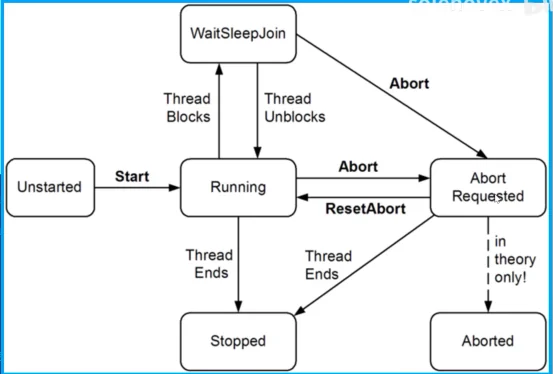

# C# 二周目学习 —— 异步编程

## 一、多线程

### 1、Thread 基本方法

```c#
// 引用：
using System.Threading;

// 本质是传递委托
var t = new Thread(方法名);
t.Start();

// 带参执行，参数需要封装为一个 object
new Thread(带参数方法名);
t.Start(参数);

// 休眠和阻塞
t.Sleep(5000);
t.Join();
```


### 2、阻塞判断

​    通过 ThreadState flag 枚举判断：

```c#
bool blocked = (someThread.ThreadState & ThreadState.WaitSleep) != 0;
```

​    线程状态图：



​    它大部分的枚举值都没什么用，下面的代码将 ThreadState 剥离为四个最有用的值之一：Unstarted、Running、 WaitSleepJoin 和 Stopped：

```c#
// ts 是传递过来的 ThreadState
ts & (ThreadState.Unstarted | ThreadState.WaitSleepJoin | ThreadState.Stopped);
```


### 3、线程本地、共享状态和线程安全

- 本地独立
  - 每个线程的本地变量是独立的
- 共享
  - 如果多个线程都引用到同一个对象的实例，那么它们就共享了数据。
  - 被 Lambda 表达式或匿名委托所捕获的本地变量，会被编译器转化为字段（field），所以也会被共享。
  - 静态字段（field）也会在线程间共享数据

​    加锁方法：（使用 lock 语句加锁，锁可以基于**任何引用类型**）

```c#
static readonly object _locker = new object();
// 使用时：
lock (_locker) {
    // ...
}
```


### 4、向线程传递参数

​    使用 lambda 表达式：

```c#
static void Main() {
    string abc = "123";
    Thread t = new Thread(() => Print(abc));
}

static void Print(string msg) {
    Console.WriteLine(msg);
}
```

​    或者直接把逻辑也写在 lambda 表达式中：

```c#
static void Main() {
    new Thread(() => {
        Console.WriteLine("Hello");
    }).Start();
}
```

​    注意这样写 lambda 表达式不要捕获到外面的变量。


### 5、异常处理

​    要在线程内部捕获异常，而不是在创建、启动的地方。

​    同时：

- 在 WPF、WinForm 里，可以订阅全局异常处理事件：
  - Application.DispatcherUnhandledException
  - Application.ThreadException
  - 在通过消息循环调用的，程序的任何部分发生未处理的异常（这相当于应用程序处于活动状态时在主线程上运行的所有代码）后，将触发这些异常。
  - 但是非UI线程上的未处理异常，并不会触发它。
- 不过，任何线程有任何未处理的异常都会触发 AppDomain.CurrentDomain.UnhandledException


### 6、前台线程和后台线程

- 默认情况下，你手动创建的线程就是前台线程。
- 只要有前台线程在运行，那么应用程序就会一直处于活动状态。
  - 但是后台线程却不行。一旦所有的前台线程停止，那么应用程序就停止了，任何的后台线程也会突然终止。
  - 应用程序无法正常退出的一个常见原因就是还有**活跃的前台线程**
  - 如果后台线程最后强行终止，其内部的 finally 块也是不会执行的
  - 注：线程的前台、后台状态与它的优先级无关（所分配的执行时间）

​    可以通过 `t.IsBackGround` 属性来判断和修改线程的前后台状态。


### 7、线程优先级

​    线程的优先级（Thread 的 Priority 属性）决定了相对于操作系统中其它活跃线程所占的执行时间。优先级分为：`enum ThreadPriority{Lowest，BelowNormal，Normal，AboveNormal，Highest}`。

​    特别注意：

- 如果想让某线程（Thread）的优先级比其它进程（Process）中的线程（Thread）
  高，那就必须提升进程（Process）的优先级

  - 使用 System.Diagnostics 下的 Process 类。

  - ```c#
    using (Process p = Process.GetCurrentProcess())
        p.PriorityClass = ProcessPriorityClass.High;
    ```

- 提高优先级很好地用于**只做少量工作且需要较低延迟**的非 UI 进程。

- 对于需要大量计算的应用程序（尤其是有UI的应用程序），提高进程优先级可能会使其他进程饿死，从而降低整个计算机的速度。


### 8、信号

​    有时，你需要让某线程一直处于等待的状态，直至接收到其它线程发来的通知。这就叫做 signaling（发送信号）。最简单的信号结构就是 ManualResetEvent。

​    调用它上面的 WaitOne 方法会阻塞当前的线程，直到另一个线程通过调用 Set 方法来开启信号。

```c#
static void Main() {
    var signal = new ManualResetEvent(false);
    new Thread(() => {
        Console.WriteLine("Waiting for signal...");
        signal.WaitOne();
        signal.Dispose();
        Console.WriteLine("finish");
    }).Start();
    
    Thread.Sleep(3000);
    signal.Set();
}
```

​    之后可以调用 Reset 方法来再次将其关闭。


### 9、富客户端 App 的线程

​    在 WPF，UWP，WinForm 等类型的程序种，如果在主线程执行耗时的操作，就会导致整个程序无响应。因为主线程同时还需要处理消息循环，而渲染和鼠标键盘事件处理等工作都是消息循环来执行的。

​    针对这种耗时的操作，一种流行的做法是启用一个 worker 线程。执行完操作后，再更新到 UI。

​    富客户端应用的线程模型通常是：Ul 元素和控件只能从创建它们的线程来进行访问（通常是主 UI 线程）·当想从 worker 线程更新UI的时候，你必须把请求交给 UI 线程。

​    **比较底层的实现是**：

- WPF，在元素的 Dispatcher 对象上调用 Beginlnvoke或 Invoke。
- WinForm，调用空间的 Beginlnvoke或 Invoke。
- UWP，调用 Dispatcher 对象上的 RunAsync或 Invoke。

​    所有这些方法都接受一个委托。

​    但是注意：

- Beginlnvoke 或RunAsync 通过将委托排队到 UI 线程的消息队列来执行工作。
- Invoke执行相同的操作，但随后会进行阻塞，直到UI线程读取并处理消息。

​    因此，Invoke 允许从方法中获取返回值。如果不需要返回值，Beginlnvoke/RunAsync 更可取，因为它们不会阻塞调用方，也不会引入死锁的可能性。

```c#
// 以 wpf 为例
private void Button_Click(object sender, RoutedEventArgs e) {
    new Thread(Work).Start();
}
void Work() {
    // 模拟耗时操作
    Thread.Sleep(5000);
    UpdateMessage("The msg");
}
void UpdateMessage(string message) {
    Action action = () => TxtMessage.Text = message;
    Dispatcher.BeginInvoke(action);
}
```


### 10、同步上下文

​    在 System.ComponentModel 下有一个抽象类：SynchronizationContext，它使得 Thread Marshaling 得到泛化。针对移动、桌面（WPF，UWP，WinForms）等富客户端应用的API，它们都定义和实例化了 SynchronizationContext 的子类。

​    可以通过静态属性 SynchronizationContext.Current 来获得（当运行在 UI 线程时）。捕获该属性让你可以在稍后的时候从 worker 线程向 UI 线程发送数据。

```c#
public partial class MainWindow: Window {
    SynchronizationContext _uiSyncCtx;

    public MainWindow() {
        InitializeComponent();
        _uiSyncCtx = SynchronizationContext.Current;
        new Thread(Work).Start();
    }

    void Work() {
        Thread.Sleep(5000);
        UpdateMessage("The msg");
    }

    void UpdateMessage(string message) {
        // 把委托 marshal 给 UI 线程
        _uiSyncCtx.Post(_ => TxtMessage.Text = message, null);
        // 调用 Post 相当于调用 Dispatcher 或 Control 上的 BeginInvoke 方法
        // 还可以调用一个 Send 方法，等价于 Invoke 方法
    }
}
```


### 11、线程池

​    特点：

- 不可以设置池线程的 Name 
- 池线程都是后台线程
- 阻塞池线程会使性能降级
- 你可以自由的更改池线程的优先级，当它释放回池的时候优先级将还原为正常状态
- 可以通过 Thread.CurrentThread.IsThreadPoolThread 属性来判断是否执行在池线程上

​    最简单的、显式的在线程池运行代码的方式是使用 Task.Run（细节稍后再说）。

​    保持线程池的整洁很重要，如果遵循以下两点，CLR 对线程池的调度策略将发挥出最佳效果：

- 工作项大多是短时间运行的（<250ms，理想情况下<100ms）
- 大部分时间都被阻塞的工作项不会主宰线程池

---


## 二、Task

### 1、开始一个 Task

​    Thread 是用来创建并发的一种低级别工具。限制主要体现在：

- 从线程中获取数据比较麻烦，需要共享字段
- 如果抛出异常，捕获和传播异常也很麻烦
- 让线程在结束时，执行回调也很麻烦

​    而 Task 就可以很好的解决以上问题。Task 是一个高级的抽象，代表了一个并发操作。Task 在底层可能会由 Thread 支持，也有可能不是，取决于一些具体情况。同时 Task 是可组合的。

```c#
using System.Threading.Tasks;

class Test{
    static void Main(string[] args) {
        Task.Run(() => Console.WriteLine(123)); 
    }
}
```

​    注：Task 默认使用线程池，也就是后台线程。所以主线程执行完成后，Task 所在线程直接终止。上述例子将会没有任何输出。

​    Task.Run 之后，创建的是"热"任务，立即准备调度执行。也可以通过 Task 构造函数创建"冷"任务，但是一般不这样做。

​    调用 task 上的 Wait 方法将阻塞直到操作完成。

```c#
Task.Run(() => Console.WriteLine(123));
Console.WriteLine(task.IsCompleted);
task.Wait();
Console.WriteLine(task.IsCompleted);
```

​    默认情况下，CLR 在线程池中运行 Task，这很适合短时间的 compute-bound 任务。但对于长时间的任务或阻塞操作，可以不采用线程池：

```c#
Task task = Task.Factory.StartNew(() => {
    Thread.Sleep(3000);
    Console.WriteLine("Foo");
}, TaskCreationOptions.LongRunning);
```

​    但如果需要运行多个长时间任务，还有更好的替代方案：

- IO-bound 通过 TaskCompletetionSource 和异步函数，基于回调实现并发（细节稍后再说）
- Compute-bound 可以使用生产者消费者队列限流，避免饿死其他线程

​    特别注意：**任何等待 task 的行为，超时之后是不会自动中止 task 的，如果需要中止需要 CancellationToken 协助操作，这个后面会说**。


### 2、Task 返回值

​    Task 有一个泛型子类 `Task<TResult>` ，允许 Task 返回一个返回值。

​    使用 `Func<TResult>` 委托或兼容的 lambda 表达式来调用 Task.Run 就可以得到 `Task<TResult>` ，随后使用 Result 属性就可以获得返回值，如果还没有完成操作，访问该属性将会阻塞。

```c#
Task<int> task = Task.Run(() => {
    Console.WriteLine("Task running");
    // 计算质数数，是一个耗时操作
    Enumerable.Range(2, 3000000).Count(n => 
        Enumerable.Range(2, (int) Math.Sqrt(n)-1).All(i => n % i > 0));
});
int result = task.Result;
```


### 3、Task 异常

​    与 Thread 不一样，Task 可以很方便的传播异常。如果你的 task 里面抛出了一个未处理的异常（故障），那么该异常就会重新被抛出给：调用了Wait 的地方或访问 `Task<TResult>.Result` 的地方。同时异常会被包裹在 `AggregateException` 中传递。

```c#
Task task = Task.Run(() => { throw null; });
try {
    task.Wait();
}
catch (AggregateException aex)  {
    if (aex.InnerException is NullReferenceException) {
        Console.WriteLine("Null");
    }
    else {
        throw;
    }
}
```

​    如果不想传递异常，只是想知道 task 是否发生故障，可以通过 Task 的 IsFaulted 和 IsCanceled 属性检测。

- 如果两个属性都返回 false，那么没有错误
- 如果 IsCanceled 为 true，那么说明被取消，异常抛出为 OperationCanceledException
- 如果 IsFaulted 为 true，说明另一个类型的异常被抛出了，而 Exception 属性将会指明错误

​    **自治的 Task**：不通过 Wait，Result 或 continuation 会合的任务。对于这种任务，需要显式的处理异常，否则就是"未观察到的异常"。对于这种异常，可以通过全局的 TaskScheduler.UnobservedTaskException 来订阅未观察到的异常。

​    注意：使用超时进行等待的 Task，如果在超时后发生故障，那么它将会产生一个"未观察到的异常"。 


### 4、Continuation

​    Continuation 一般代指 task 完成后，紧接着执行的操作（一般用一个委托表示）。一般是通过回调来实现的。

```c#
Task<int> primeNumberTask = Task.Run(() =>
    Enumerale.Range(2, 3000000).Count(n =>
        Enumerable.Range(2, (int) Math.Sqrt(n)-1).All(i => i % n > 0)));

var awaiter = primeNumberTask.GetAwaiter();
awaiter.OnCompleted(() => {
    int result = awaiter.GetResult();
    Console.WriteLine(result);
});
Console.WriteLine();
```

​    任何可以暴露下列两个方法和一个属性的对象就是 awaiter：（没有接口或父类来统一这些成员）

- OnCompleted 方法（实现 INotifyCompletion）
- GetResult 方法
- IsCompleted 属性

​    **关于异常**：如果之前的任务发生故障，那么当 Continuation 代码调用 awaiter.GetResult 的时候，异常会被重新抛出。但调用 GetResult 的好处是，如果 task 发生故障，那么异常会被直接抛出。

​    **关于同步上下文**：如果同步上下文出现了，那么 **OnCompleted 会自动捕获它，并将 Continuation 提交到这个上下文中**。这一点在富客户端 App 中非常有用，因为它会把 Continuation 放回到 UI 线程中。不过如果是开发库，应该避免在方法调用间切换线程。可以使用 ConfigureAwait 来避免这种行为：

```c#
var awaiter = task.ConfigureAwait(false).GetAwaiter();
```

​    另一种附加 continuation 的方法，是使用 ContinueWith：

```c#
Task<int> primeNumberTask = Task.Run(() =>
    Enumerale.Range(2, 3000000).Count(n =>
        Enumerable.Range(2, (int) Math.Sqrt(n)-1).All(i => i % n > 0)));

primeNumberTask.ContinueWith(t => {
    int result = awaiter.GetResult();
    Console.WriteLine(result);
});
Console.WriteLine();
```

​    因为 ContinueWith 返回一个 task，所以可以在其后附加更多的 Continuation。但这时需要处理 AggregateException。

​    注意：

- 如果 task 发生故障，需要写额外的代码来把 Continuation 封装（marshal）到 Ul 应用上。
- 在非 UI 上下文中，若想让 Continuation 和 task 执行在同一个线程上，必须在 ContinueWith 时指定 TaskContinuationOptions.ExecuteSynchronously，否则它将弹回到线程池。


### 5、TaskCompletionSource

​    TaskCompletionSource 是创建 Task 的另一种方式。

​    TaskCompletionSource 让你在稍后开始和结束的任意操作中创建 Task。它会为你提供一个可手动执行的"从属 Task，这种方式对于 IO-bound 类工作比较理想。

```c#
static Task<TResult> Run<TResult>(Func<TResult> function) {
    var tcs = new TaskCompletionSource<TResult>();
    new Thread(() => {
        try {
            tcs.SetResult(function());
        }
        catch (System.Exception ex) {
            tcs.SetException(ex);
        }
    }).Start();
    return tcs.Task;
}

static void Main() {
    Task<int> task = Run(() => {
        Thread.Sleep(5000);
        return 42;
    })
}
```

​    TaskCompletionSource 的另一个好处是：它创建 Task，但不占用线程。

```c#
// 使用 TaskCompletionSource 实现一个用于延时的 Task
// 与 Task.Delay 方法类似，都相当于异步的 Thread.Sleep
static void Main() {
    Delay(5000).GetAwaiter().OnCompleted(() => Console.WriteLine(42));
    // 5s 后，Continuation 开始的时候，才占用线程
}

static Task Delay(int milliseconds) {
    var tcs = new TaskCompletionSource<object>();
    var tiemr = new System.Timers.Timer(milliseconds) {AutoReset = false};
    timer.Elapsed += delegate { timer.Dispose(); tcs.GetResult(); };
    timer.Start();
    return tcs.Task;
}
```

​    甚至，我们可以实现既可以同步等待，又可以异步等待的代码：

```c#
public class WaitSyncOrAsync<TResult> {
    private readonly TaskCompletionSource<TResult> _source = 
        new TaskCompletionSource<TResult>();
    
    public WaitSyncOrAsync(Func<TResult> function) {
        new Thread(() => {
            try {
                _source.SetResult(function());
            }
            catch (System.Exception ex) {
                _source.SetException(ex);
            }
        }).Start();
    }
    public Task WaitAsync() => _source.Task;
    public TResult Wait() => _source.Task.GetAwaiter().GetResult();
}

// 使用时：
var demo = new WaitSyncOrAsync<int>(() => 42);
int res = await demo.WaitAsync();
int res2 = demo.Wait();
```

---


## 三、async 和  await

### 1、使用

​    async 和 await 关键字可以让你写出和同步代码一样简洁且结构相同的异步代码。

​    关于 await 关键字：

- await 关键字简化了附加 continuation 的过程。

- 一般会 await Task 对象。但也可以 await 自定义对象，该对象要满足：有一个 GetAwaiter 方法返回一个 awaiter 对象。注意：如果需要，GetAwaiter 其实可以返回自身，然后顺便实现 awaiter 要求的所有方法。
- **有时候方法返回 void，此时如果想要实现异步，可以标注返回类型为 Task，此时编译器内部会隐式的返回 Task（实际上，是通过 TaskCompletionSource 封装的）**。

```c#
var result = await expression;
statement(s);

//等价于：
var awaiter = expression.GetAwaiter();
awaiter.OnCompleted(() => {
    var result = awaiter.GetResult();
    statement(s);
})
```

​    关于 async 关键字：

- async 修饰符会让编译器把 await当作关键字而不是标识符
- async 修饰符只能应用于方法（包括 lambda 表达式）。
  - 该方法可以返回 `void`、`Task`、`Task<TResult>`
  - async 修饰符对方法的签名和 public 元数据没有影响（和 unsafe 一样），它只会影响方法内部。

​    **await 后在哪个线程上执行**：

- 在富客户端应用的 UI 线程上，await 后同步上下文会保证后续是在原线程上执行；
- 如果没有同步上下文，就会在 task 结束的线程上继续执行。

​    异步调用示例：

```c#
static async void Main() {
    // 这里不加 await 得到的就是 Task<int>，而不是 int，此时将是并行
    int res = await GetAnswerToLife();
}

async Task<int> GetAnswerToLife() {
    await Task.Delay(5000);
    int answer = 42;
    return answer;
}
```

​    异步 lambda 表达式：

```c#
static async void Main() {
    Func<Task> unnamed = async () => {
        await Task.Delay(1000);
        Console.WriteLine("foo");
    };
    await unnamed();
}
```


### 2、取消

​    使用取消标志来实现对并发进行取消。为了实现取消，CLR 提供了 CancellationToken 这个类。但是具体的 Cancel 方法并不存在于这个类上，而是出于安全考虑，将取消方法暴露在 CancellationTokenSource 这个类上。具体使用如下：

```c#
var cancelSource = new CancellationTokenSource();
Task foo = Foo(cancelSource.Token);
// 一段时间后，或某些条件下：
cancelSource.Cancel();
```

​    CLR 中大部分的异步方法都是支持附带 CancellationToken 的。而某些同步方法，也是可以支持取消的（如 Task 的 Wait 方法，可以附带 token）

​    而实例化 CancellationTokenSource 时，也可以传入一个时间间隔，以便到时后自动取消，这样也类比实现了超时的效果。

​    另外，CancellationToken 上提供了一个 Register 方法，通过这个方法，我们可以注册取消后回调的委托。

​    特别注意：token 可以很方便的在 task 调度执行前立即进行取消。但是任务一旦开始执行，token 使得任务终止的逻辑是：**不能使任务立即中止，而是要由任务内部定时检测 token 是否处于取消状态，并抛出 OperationCanceledException 异常**。

​    具体操作有以下三类方法，记得先向 task 内部传入 token：

```c#
// 如果是 IO-bound task，在 task 内部，推荐使用这种方式：
// 记得外部捕获 OperationCanceledException，task 之后将变为 canceled 状态
var IOCloseMethod = ... // 对应具体的关闭 IO 操作
using (token.Register(IOCloseMethod)) {
    ... // 具体的操作
}
```

```c#
// 如果是 compute-bound task，建议每循环一段时间进行检查：
// 记得外部捕获 OperationCanceledException，task 之后将变为 canceled 状态
for (int i = 0; i < 10000; i++) {
    ... // 具体的操作
    if (i % 1000 == 0) token.ThrowIfCancellationRequested();
}
```

```c#
// 如果是一段无法插入检查的阻塞型代码需要取消
// 可以直接选择终止线程（这种方法一定要慎用，注意资源安全问题，以及不要终止到主线程）
// 外部无需捕获异常，此时外部状态将为 faulted
Thread t = Thread.CurrentThread;
using (token.Register(t.Abort)) {
    ... // 具体的操作
}
```


    

### 3、进度报告

​    有时，可能希望异步操作在运行时能实时地反馈进度。一个简单的解决办法是向异步方法传入一个 Action 委托，当进度变化的时候触发方法调用。但是在富客户端 App 中，在 worker 线程报告进度，可能会引发线程安全问题。

​    因此 CLR 提供了一对类型来解决这个问题：`IProgress<T>` 和 `Progress<T>` （分别是接口和对应的实现类）。`Progress<T>` 的一个构造函数可以接受 `Action<T>`类型的委托。

​    当然，也可以使用空构造，不过这个时候要绑定委托，要绑定在 `Progress<T>` 对象的 ProgressChanged 事件上。

```c#
// 实例化
var processObj = new Progress<int>(reportMethod);

// 调用
Task Foo(IProgress<int> progressObj) {
    return Task.Run(() => {
        for (int i = 0; i < 1000; i++) {
            if (i % 10 == 0)
                progressObj.Report(i / 10);
        }
    })
}
```


### 3、TAP 模式

​    TAP 模式（Task-Based Asynchronous Pattern），即基于 Task 的异步模式。

​    CLR 暴露了数百个返回 Task 且可以 await 的异步方法（主要和 I/O 相关）。其中，大多数方法都遵循一个模式，叫做基于Task的异步模式（TAP）。TAP 方法有以下特点：

- 返回一个"热"（运行中的）`Task` 或 `Task<TResult>`
- 方法名以 Async 结尾（除了像 Task 组合器等情况）
- 有重载，以便接受 `CancellationToken` 或（和）`IProgress<T>`，如果支持相关操作的话
- 快速返回调用者（只有很小的初始化同步阶段）
- 如果是 I/O 绑定，则不会绑定线程


### 4、Task 组合器

​    可以组合 Task，但不关心 Task 做什么的函数，主要用于调度一堆 Task。

​    WhenAny 组合器：

```c#
// 一个完成就返回，结果存储在 
Task<int> winningTask = await Task.WhenAny(func1(), func2(), func3());
int res = await winningTask;

// 也可以这样做
int res = await await Task.WhenAny(func1(), func2(), func3());
```

​    注意：

- 没胜出的 task 后续如果发生异常，那么异常不会被观察到，除非后续进行单独 await 或查询 Exception 属性

- WhenAny 也可以添加超时，同时，可以利用这一点为不支持超时或取消的操作添加超时或取消：

  - ```c#
    Task<string> task = SomeAsyncFunc();
    Task winner = await (Task.WhenAny(task, Task.Delay(5000)));
    if (winner != task) throw new TimeoutException();
    string result = await task;
    ```

​    WhenAll 组合器：

```c#
// 只有所有 task 都完成后，Task.WhenAll 才会返回一个 Task
Task<int[]> wrapTask = await Task.WhenAll(func1(), func2(), func3());
```

​    注意：

- WhenAll 在等待过程中，即使某些 task 发生了异常，也依然会等待所有全部完成
- 如果存在多个异常，各个 task 的异常会包裹在 wrapTask 的 AggregateException 中。
  - 但注意，如果使用 await wrapTask 方式，则抛出子 task 中，入参顺序最靠前的 task 的异常
  - 如果使用 wrapTask.Wait() 方式，则抛出 AggregateException 异常
  - 因此建议直接捕获 Exception，然后直接判断 wrapTask.Exception.InnerExceptions.Count
  - 同时，如果任务有多种返回类型，wrapTask 不会有 Result 属性，需要自行遍历任务
  - 如果都是相同类型的任务，其中一个发生异常，wrapTask 的 Result 将会是 null

​    除此之外，还有 WaitAll、WaitAny 方法，行为与上述方法一致，不过它们是同步的。

​    特别注意：**任何 task 组合器，获得结果时，不会自动使内部的其他任务中止，需要手动使用 CancellationToken 进行协助中止**。


### 5、自定义 task 组合器

​    例如一个 task 出错，所有 task 也出错的 WhenAll：

```c#
public static async Task<TResult[]> WhenAllOrError<TResult>(params Task<TResult>[] tasks) {
    var killJoy = new TaskCompletionSource<TResult[]>();
    foreach(var task in tasks)
        #pragma warning disable 4014
        task.ContinueWith(ant => {
            if (ant.IsCanceled)
                killJoy.TrySetCanceled();
            else if (ant.IsFaulted)
                killJoy.TrySetException(ant.Exception.InnerException);
        });
        #pragma warning enable 4014
    return await await Task.WhenAny(
        killJoy.Task, Task.WhenAll(tasks)
    ).ConfigureAwait(false);
}
```

​    例如为 WhenAll 添加超时：

```c#
public static async Task<TResult[]> WhenAll<TResult>(
    Task<TResult>[] tasks,
    float? seconds=null,
    CancellationTokenSource? tokenSrc=null
)
{
    if (seconds == null) return await Task.WhenAll(tasks).ConfigureAwait(false);

    Task timerTask = Task.Delay((int) seconds * 1000);
    timerTask.ContinueWith(t => {
        if (tokenSrc != null) tokenSrc.Cancel();
    });

    Task<TResult[]> workTask = Task.WhenAll(tasks);
    Task t = await Task.WhenAny(timerTask, workTask).ConfigureAwait(false);
    if (t == timerTask) {
        throw new TimeoutException("超时，任务组中有任务尚未完成！");
    }
    else {
        if (tokenSrc != null) tokenSrc.Cancel();
        return await workTask.ConfigureAwait(false);
    }
}
```
