# html基础

## 一、标题标签

```html
<h1>...</h1>
...
<h6>...</h6>
```

## 二、段落和换行标签

#### 1、定义一个段落

```html
<p>这是一个段落</p>
```

特点：

1. 文本在一个段落中会根据浏览器窗口的大小自动换行
2. 段落和段落之间保有空隙

#### 2、文本的强制换行

```html
后面有换行哦！<br />
```

特点：

1. 它是单标签
2. 只是简单的开始新的一行，与段落不同，它不会插入垂直间距

## 三、文本格式化标签

  加粗，倾斜，删除线，下划线

```html
<strong>这段文字被加粗</strong>     <b>这段文字也是加粗的</b>
<em>这段文字是倾斜的</em>         <i>这段文字也是倾斜的</i>
<del>这段文字加了删除线</del>       <s>这段文字也加了删除线</s>
<ins>这段文字加了下划线</ins>       <u>这段文字也加了下划线</u>
```

## 四、div和span标签

**div标签用来布局，但是一行只能放一个div，放下后就不能放其他东西，是个大盒子**

**span标签也用来布局，一行可以有多个span，是个小盒子**

```html
<div>
这是一个大盒子，这一行再没有其他东西
</div>
<span>小盒子1</span>
<span>小盒子2</span>
<p>
上面的两个小盒子其实都在一行
</p>
```

## 五、图像标签和路径（重点）

#### 1、图像标签

使用img标签定义HTML页面中的图像

```html

```

注：src是img标签的必须属性，它用于指定图像文件的路径和名称

其他一些常用属性值：

- alt：图像不能显示时的替换文本
- title：提示文本，光标放在图片上显示的文字
- width：宽度
- height：高度
- border：图像的边框粗细

注：图像宽高若只修改一个，则等比例缩放

#### 2、路径

路径采用Windows通用路径规范

## 六、超链接标签（重点）

通过a标签实现

#### 1、超链接的语法格式

```html
<a href="跳转目标" target="目标窗口的弹出方式">文本或图像</a>
```

两个属性的作用如下：

|  属性  |                             作用                             |
| :----: | :----------------------------------------------------------: |
|  href  |                 指定链接目标的url，必填属性                  |
| target | 用于指定链接页面的打开方式，_self为默认值, _blank为新窗口中打开 |

#### 2、链接分类

1. 外部链接

```html
<a href="https://www.baidu.com">百度</a>
```

2. 内部链接（网站内部页面之间的链接）

```html
<!-- 直接链接内部页面名称即可 -->
<a href="index.html">主页</a>
```

3. 空链接（当没有确定链接目标时）

```html
<a href="#">空链接</a>
<!-- 暂时没有链接对象时，更建议使用： -->
<a href="javascript:void(0)">空链接</a>
```

4. 下载链接（链接到一个下载地址或本地文件）

```html
<a href="file.zip">下载</a>
```

5. 锚点链接（点击链接快速定位到页面某个位置）

```html
<!-- href属性设置为#id的形式,可跳转到有该id属性的元素的位置 -->
<!-- 此处可使用CSS选择器 -->
<a href="#two">第二集</a>
<!-- 就跳转到下面这个h3标签的位置了 -->
<h3 id="two">第二集详情介绍</h3>
```

## 七、注释标签和特殊字符

#### 1、注释标签

```html
<!-- 这个就不用说了吧 -->
```

#### 2、特殊字符

|     特殊字符      |       描述       | 字符的代码 |
| :---------------: | :--------------: | :--------: |
|   （space空格)    | 半角不断行空格符 | &amp;nbsp; |
|         <         |      小于号      |  &amp;lt;  |
|         >         |      大于号      |  &amp;gt;  |
|         &         |       和号       | &amp;amp;  |
| (1/2中文宽度空格) |    半角空格符    | &amp;ensp; |
|  (中文宽度空格)   |    全角空格符    | &amp;emsp; |

## 八、表格标签

#### 1、表格的作用

用于显示和展示数据

#### 2、表格的基本语法

```html
<table>
<tr>
  <td>单元格数据</td>
    ...
</tr>
...
</table>
```

#### 3、表头单元格标签

特点：表头单元格文字会加粗居中显示

```html
<table>
<tr>
  <th>姓名</th>
    ...
</tr>
...
</table>
```

#### 4、表格属性（不常用，因为一般使用CSS调整）

|   属性名    |       属性值        |                       描述                       |
| :---------: | :-----------------: | :----------------------------------------------: |
|    align    | left、center、right |         规定表格相对于周围元素的对齐方式         |
|   border    |        1或""        | 规定表格单元是否拥有边框，默认为""，表示没有边框 |
| cellpadding |       像素值        |           规定单元边沿与内容之间的距离           |
| cellspacing |       像素值        |         规定单元格之间的空白，默认2像素          |
|    width    |   像素值或百分比    |                  规定表格的宽度                  |
|   height    |   像素值或百分比    |                  规定表格的高度                  |


#### 5、表格结构标签（为更好的表示语义使用）

```html
<thead></thead>    <!-- 用于定义表格的头部 -->
<tbody></tbody>    <!-- 用于定义表格的主体，主要用于放数据主体 -->
```


#### 6、合并单元格

1. 先确定是跨行合并还是跨列合并

2. 找到目标单元格，写上合并代码（数字为合并几个单元格）

```html
<td colspan="2"></td>    <!-- 跨列合并，基准为左 -->
<tc rowspan="2"></tc>    <!-- 跨行合并，基准为上 -->
```

3. 删除多余的单元格

## 九、列表标签（重要）

列表：用来布局

#### 1、无序列表（使用ul标签定义，使用li定义列表项）

```html
<ul>
<li>列表项1</li>
<li>列表项2</li>
<li>列表项3</li>
...
</ul>
```

注：

1. 无序列表之间各项没有顺序级别之分，是并列的

2. **&lt;ul&gt;&lt;/ul&gt;只能直系嵌套&lt;li&gt;&lt;/li&gt;，在&lt;ul&gt;&lt;/ul&gt;中直接嵌套其他标签是不被允许的。但可以把其他标签放入&lt;li&gt;&lt;/li&gt;中**

3. **&lt;li&gt;&lt;/li&gt;相当于一个容器，可以容纳所有元素**


#### 2、有序列表（使用ul标签定义，使用li定义列表项）

```html
<ol>
<li>列表项1</li>
<li>列表项2</li>
<li>列表项3</li>
...
</ol>
```

注：

1. **&lt;ol&gt;&lt;/ol&gt;只能直系嵌套&lt;li&gt;&lt;/li&gt;，在&lt;ol&gt;&lt;/ol&gt;中直接嵌套其他标签是不被允许的。但可以把其他标签放入&lt;li&gt;&lt;/li&gt;中**

2. **&lt;li&gt;&lt;/li&gt;相当于一个容器，可以容纳所有元素**

3. 有序列表会带有自己的样式属性，实际使用中会使用CSS调整

4. 给li去圆点的方法:style="list-style: none;"


#### 3、自定义列表（常用于对术语或名词进行解释和描述，列表项前没有任何项目符号）

```html
<dl>
<dt>名词1</dt>
<dd>对名词1的解释或扩展1</dd>
<dd>对名词1的解释或扩展2</dd>
<dt>名词2</dt>
<dd>对名词2的解释或扩展1</dd>
<dd>对名词2的解释或扩展2</dd>
...
</dl>
```

注：

1. **&lt;dl&gt;&lt;/dl&gt;只能直系嵌套&lt;dt&gt;和&lt;/dd&gt;**

2. **&lt;dt&gt;和&lt;dd&gt;的个数没有限制，经常是一个&lt;dt&gt;对应多个&lt;dd&gt;**

## 十、表单标签（重要且内容多）

为什么需要表单标签：

与用户进行交互，收集信息（如用户信息）


#### 1、表单的组成

- 表单域
- 表单控件（表单元素）
- 提示信息（表单元素的提示信息）


#### 2、表单域

表单域是一个包含表单元素的区域

使用&lt;form&gt;定义表单域，以实现对用户信息的收集和传递（&lt;form&gt;会把它范围内的表单元素信息提交给服务器）

```html
<form action="url地址" method="提交方式" name="表单域名称">
各种表单元素控件
</form>
```

|  属性  |  属性值  |                        作用                        |
| :----: | :------: | :------------------------------------------------: |
| action | url地址  |  用于指定接受并处理表单数据的服务器程序的url地址   |
| method | get/post |    用于设置表单数据的提交方式，其取值为get/post    |
|  name  |   名称   | 用于指定表单的名称，以区分同一个页面中的多个表单域 |

#### #3、表单控件（表单元素）

在表单域中可以定义各种表单元素，这些表单元素就是允许用户在表单中输入或选择的内容控件

1. &lt;input&gt;输入类标签（单标签）

  type 属性

|   属性   |                            描述                            |
| :------: | :--------------------------------------------------------: |
|   text   | 定义单行的输入字段，用户可在其中输入文本，默认长度为20字符 |
| password |             定义密码字段。该字段中的字符被掩码             |
|  radio   |          定义单选按钮（一组单选的name值必须相同）          |
| checkbox |           定义复选框（一组多选的name值必须相同）           |
|  button  |     定义可点击按钮（多数情况下通过JavaScript实现功能）     |
|   file   |             定义浏览按钮和提示信息，供文件上传             |
|  reset   |            定义重置按钮，会清除表单中的所有数据            |
|  submit  |          定义提交按钮，将会把表单数据提交给服务器          |

  其他属性：

|   属性    |      属性值      |              描述               |
| :-------: | :--------------: | :-----------------------------: |
|   name    | (由开发人员定义) |       定义input元素的名称       |
|   value   | (由开发人员定义) |       定义input 元素的值        |
|  checked  |     checked      | 规定input元素首次加载时应被选中 |
| maxlength |      正整数      |  规定输入字段中字符的最大长度   |

2. &lt;label&gt;标注标签（双标签）

作用：

a、为input元素定义标注

b、**绑定一个表单元素，当点击&lt;label&gt;标签内的文本时，自动将光标转到对应的表单元素上，可以提升用户体验**

使用方法：

```html
<!-- <label>标签的for属性与<input>标签的id相匹配即可 -->
<label for="sex">男</label>
<input type="radio" name="sex" id="sex" />
```


3. &lt;select&gt;下拉列表元素（双标签）

使用场景：*有多个选项让用户选择，为了避免占用页面空间，可使用下拉列表*

```html
<select>
<option>北京</option>
<option>天津</option>
<option>河北</option>
<option>山东</option>
...
</select>
```

注：

a、至少包含一对option（双标签）

b、若某一个option定义selected属性为"selected"，则该项为默认选中项

4. &lt;textarea&gt;多行文本输入标签（双标签）

属性：cols="字符数"，rows="字符数"

**通过这两个属性可以规定不创建滑动条可以容纳的字符数，也就规定了文本框的大小**（但这两个属性不常用，因为一般使用CSS调整） 

```html
<textarea>
  这里写默认显示的文字
</textarea>
```

---

---

# CSS

## 一、前言

<h4>1、HTML主要做结构，显示元素内容</h4>
<h4>2、CSS美化HTML，布局网页</h4>
<h4>3、CSS最大价值：由HTML专注去做结构呈现，样式交给CSS，即结构与样式相分离</h4>

## 二、语法规范

#### 1、结构

css由两个主要部分构成：选择器和声明

如：

```css
p {
  color: white;
}
```


#### 2、CSS代码风格

1. 展开格式和紧凑格式

```css
p {
  color: pink;
  font-size: 20px;
}

/* -------------------------*/

p {color: pink; font-size: 20px;}
div {position: relative; color: skyblue; width: 300px; height: 200px;}
```

2. 样式小写（特殊情况除外）

3. 空格规范

a、属性值前，冒号后保留一个空格

b、选择器和大括号中间保留空格

## 三、CSS选择器

#### 1、基础选择器

1. 标签选择器 （选择全部某种标签）

```css
div {
color: pink;
}
```

2. **类选择器 **（选择有相应类属性的标签）（长词组可使用-间隔）

```html
<!-- 单类名 -->
<!-- 技巧：把标签要更改的样式作为属性值写入class -->
<head>
<style>
    .red {
        color: red;
    }
</style>
</head>
<body>
<p class="red">这个段落需要变成红色</p>
</body>
```

```html
<!-- 多类名，类名用空格隔开 -->
<!-- 技巧：元素的公共样式可以被统一的定义和修改，提高了效率 -->
<head>
<style>
    .box {
        width: 150px;
        height: 100px;
    }
    .red {
        color: red;
    }
    .green {
        color: green;
    }
</style>
</head>
<body>
<div class="box red"></div>
<div class="box green"></div>
</body>
```


3. id选择器（**每个元素的id是唯一的**）

```html
<head>
<style>
    #mainpara {
        color: red;
    }
</style>
</head>
<body>
<p id="mainpara">主要段落需要变成红色</p>
</body>
```


4. 通配符选择器（匹配所有元素，可以用来清除浏览器默认样式）

```css
* {
margin: 0;
padding: 0;
}
```

## 四、CSS字体属性

#### 1、文本字体

```css
p {
font-family： Arial, "Microsoft YaHei", "Hiragino Sans GB";
}
```

注：

1. 各种字体必须使用半角逗号隔开

2. 字体名有空格最好用引号包含

3. 常见字体:body{font-family: "Microsoft YaHei", tahoma, arial, "Hiragino Sans GB"}


#### 2、字体大小

```css
p {
font-size: 20px;
}
```

注：

1. **不同浏览器字号大小可能不一致，给一个确定的值**

2. 可以给body指定文字大小，以控制整个页面的文字大小

3. **body中标题标签比较特殊，需要单独设置文字大小**

#### 3、字体粗细

```css
p {
font-weight: bold;
}
```

|    属性     |                           可选值                           |
| :---------: | :--------------------------------------------------------: |
| font-weight | normal(400)，bold(700)，bolder，lighter，*number*(100~900) |

#### 4、文字样式

```css
p {
font-style: ltalic;
}
```

|    属性    |     可选值     |
| :--------: | :------------: |
| font-style | normal，italic |

#### 5、字体的复合属性（字体连写）

```css
/* 格式如下：
p {
font : font-style font-weight font-size/line-height font-family;
}
*/
p {
font: italic 700 16px "Microsoft yahei";
}
```

注：

1. **顺序不能颠倒！**

2. **不要的属性可以不写，但只要使用font复合属性font-size和font-family必须写**

```css
p {
font: 16px "Microsoft yahei";
}
```

## 五、CSS文本属性

#### 1、文本颜色

```css
div {
color: blue;
}
```

|      表示      |       属性值        |
| :------------: | :-----------------: |
| 预定义的颜色值 | red、green、blue... |
|    十六进制    |       #66ccff       |
|    RGB代码     |     (255, 0, 0)     |
|    RGBA代码    |   (255, 0, 0, .7)   |

注：

**十六进制表示出现两两相同的情况，可以简写**

如：**#66CCFF ---> #6CF**

#### 2、对齐文本

```css
div {
text-align: center
}
```

  三种属性值：left、center、right

#### 3、装饰文本

```css
div {
text-decoration: underline;
}
```

|    属性值    |       描述       |
| :----------: | :--------------: |
|     none     | 默认，没有装饰线 |
|  underline   |      下划线      |
|   overline   |      上划线      |
| line-through | 删除线（不常用） |

#### 4、文本缩进

通常用来指定段落的首行缩进

指定按像素值缩进：

```css
p {
text-indent: 32px;
}
```

按em为单位缩进，就是当前元素（font-size）1个文字的大小，若当前元素没有设置大小，则按照父元素一个文字的大小

```css
p {
text-indent: 2em;
}
```

#### 5、行间距

用于设置行间的距离（行高），可以控制文字行与行之间的距离

注：**完整的行间距包括上间距、文本高度和下间距**

```css
p {
line-height: 28px;
}
```

## 六、CSS的引入方式

#### 1、内部样式表（内嵌样式表）

```html
<head>
<style>
    p {
        text-indent: 2em;
        color: blue;
    }
    ...
</style>
</head>
```

#### 2、行内样式表（内联样式表）

```html
<p style="color: blue; font-size: 18px;">
这个段落使用了行内样式表
</p>
```

#### 3、外部样式表（外链式引入）（最常用）

```html
<head>
<link rel="stylesheet" href="css文档位置" />
</head>
```

```css
/*css文档*/
p {
text-decoration: underline;
font-style: italic;
font-family: "Microsoft YaHei";
}
a {
text-decoration: none;
color: #000;
font-size: 28px;
}
...
```

&lt;link&gt;标签的属性值：

| 属性值 |                             作用                             |
| :----: | :----------------------------------------------------------: |
|  rel   | 定义当前文档与被链接文档之间的关系，若为css文档则指定为“stylesheet" |
|  href  |       定义所链接的外部文件的url，可以是相对或绝对路径        |

## 七、Emmet语法

#### 1、Emmet语法（快速生成html结构）

1. 输入标签名按tab可直接生成一对标签

div + <kbd style="font-weight: bold;">tab</kbd> --->  &lt;div&gt;&lt;/div&gt;

2. 生成多个相同标签，如生成3个div

div*3  --->  &lt;div&gt;&lt;/div&gt; &lt;div&gt;&lt;/div&gt; &lt;div&gt;&lt;/div&gt;

3. 若需要生成父子级关系标签

div>p  --->  &lt;div&gt; &lt;p&gt;&lt;/p&gt; &lt;/div&gt;

4. 若需要生成兄弟级关系的标签

div+p  --->  &lt;div&gt;&lt;/div&gt; &lt;p&gt;&lt;/p&gt;

5. 生成带有类名或id的标签（不指明标签默认生成div）

.demo  --->  &lt;div class="demo"&gt;&lt;/div&gt;

p#mainpara  --->  &lt;p id="mainpara"&gt;&lt;/p&gt;

6. 如果生成的结构带有数字顺序，可使用$

p.para$*2  --->  &lt;p class="para1"&gt;&lt;/p&gt; &lt;p class="para2"&gt;&lt;/p&gt;

7. 若想要在生成标签内部写内容，可使用{}

p.para${$}*2  --->  &lt;p class="para1"&gt;1&lt;/p&gt; &lt;p class="para2"&gt;2&lt;/p&gt;

## 八、CSS复合选择器（重要）

特点：

1. 可以更准确、更高效的选择目标元素

2. 复合选择器由两个或多个基础选择器，通过不同的方式组合而成


#### 1、后代选择器

```css
/*选择ul下的所有li*/
ul li {
color: blue;
}
```

注：

1. **不仅是直系选择，可以跨级选择**

2. **以空格隔开的各级元素可以是任意基础选择器**

#### 2、子选择器

```css
/*只选择ul下直系的li*/
ul > li {
color: blue;
}
```

#### 3、并集选择器

特点：**可以选择多组标签，常用于集体声明**

```css
h1,
h2,
h3,
ul li > p {
color: blue;
}
```

语法规范：竖着写

#### 4、伪类选择器

1. 链接伪类选择器

```css
a {
color: #333;
font-decoration: none;
}
a:hover {
color: skyblue;
font-decoration: underline;
}
```

| 链接伪类选择器 |            选择的链接            |
| :------------: | :------------------------------: |
|     a:link     |        所有未被访问的链接        |
|   a:visited    |        所有已被访问的链接        |
|  **a:hover**   |      **鼠标指针悬停的链接**      |
|    a:active    | 活动链接（鼠标按下未弹起的链接） |

注：

**在书写时严格遵守LVHA顺序规则，否则不会生效！**


2. focus伪类选择器

特点：用于选择获取**焦点（光标）**的**表单元素**

一般&lt;input&gt;类表单元素才能获取焦点

```css
input:focus {
background-color: skyblue;
color: white;
}
```

## 九、CSS元素的显示模式

#### 1、什么是元素显示模式

元素显示模式就是元素以什么方式进行显示

HTML元素一般分为块元素和行内元素两种类型


#### 2、块元素（h1~h6, p, div, ul, ol, li等。div最典型）

特点：

1. **独占一行**

2. **高度，宽度，外边距和内边距都可以控制**

3. **宽度默认是容器（父级宽度）的100%**

4. **是一个容器（盒子），里面可以放其他元素**

5. **文字类元素内部不能放块级元素**

#### 3、行内元素（内联元素）（a, strong, b, em, i, del, s, ins, u, span等。span最为典型）

特点：

1. **相邻元素可在一行上，一行可以显示多个**

2. **高宽直接设置是无效的**

3. **默认宽度就是它本身内容的宽度**

4. **行内元素只能容纳文本或其他行内元素**

注：链接中不能再放链接

    **但特殊情况下&lt;a&gt;里面可以放块级元素，但是将&lt;a&gt;转化为块级模式最安全**（在实际开发中通常转化为块级元素）

#### 4、行内块元素（特殊）（img, input, td)

特点：

1. 一行可以显示多个（行内元素特点）

2. 默认宽度由内容决定（行内元素特点）

3. 宽高，内外边距都可控制（块级元素特点）

#### 5、元素显示模式的转换

需求：特殊情况下，我们需要元素模式的转换，即一种模式的元素需要另一种模式元素的特性

方法：在CSS中添加样式:

转化为块元素：display: block;（重点）

转化为行内元素：display: inline;

转化为行内块元素：display: inline-block;（重点）

```css
a {
display: block;
}
div {
display: inline;
}
span {
display: inline-block;
}
```

#### 6、小技巧：单行文字垂直居中

方法：**让文字的行高等于盒子的高度，这样即可垂直居中**

```css
a {
display: block;
width: 100px;
height: 100px;
text-indent: 100px;
}
```

## 十、CSS背景

#### 1、背景颜色

使用background-color属性定义

默认为transparent，值的写法和color类似

```css
div {
background-color: blue;
}
```

#### 2、背景图片

使用background-image属性定义，可用于超大的背景图片装饰或一些小的标志

默认为none，可填url(url)

```css
div {
background-image: url(bd.jpg)
}
span {
background-image: url(https://www.xxx.com/...)
}
```

#### 3、背景平铺

使用background-repeat定义

默认为repeat，可选no-repeat、repeat-x、repeat-y 

注：页面元素可以同时添加颜色和背景图片，但背景图片会盖住颜色

#### 4、背景图片位置

使用background-position定义，使用场景：

*为方便调整图片位置，小的标志图案或大的背景图片可以以背景图片形式插入*

```css
ul div {
background-position: left center;
}
ol div {
background-position: 20px 40px;
}
dl div {
background-position: center 45px;
}
```

|  参数值  |                        说明                        |
| :------: | :------------------------------------------------: |
|  length  |       百分数，浮点数和单位表示符组成的长度值       |
| position | top \| center \| bottom \| left \| center \| right |

只使用方位名词：

1. 若指定的都是方位名词，则顺序是可颠倒的

2. **若只指定了一个方位名词，则另一个默认设置为居中**

只使用具体参数值：

1. **若都设置为具体参数值，则顺序绝对不能颠倒**

2. **若只指定一个具体参数值，则它一定是x坐标**

混合使用：第一个值一定表x坐标，第二个值一定y坐标

####   #5、背景图像固定

使用background-attachment定义,使用场景：

*制作视差滚动效果*

默认为scroll，可选fixed

```css
div {
background-attachment: fixed;
}
```

####   6、背景的复合写法（类似font）

顺序：**背景颜色 背景图片地址 图片平铺 背景图像滚动 背景图片位置**

```css
div {
background: #6cf url(bd.png) repeat-x fixed center;
}
```

#### 7、背景颜色半透明（CSS3新特性）

使用rgba(r, g, b, a)定义，a表示alpha透明度，从0~1（1为绝对不透明）

```css
div {
background-color: rgba(0, 255, 0, 0.5);
}
ul > li span {
background: rgba(0, 255, 0, 0.5) url(bd.png) no-repeat fixed center;
}
```

#### 8、背景图像尺寸

使用 background-size 调整

```css
div {
background-size: 500px 500px;
}
```

单位：px | 百分比 | cover | contain

1. cover：通过缩放使盒子完全被覆盖即停止

2. contain：宽和高一边缩放覆盖完全即停止

#### 9、背景线性渐变

在 background-image 属性中使用 linear-gradient 属性

```css
div {
background-image: linear-gradient(...);
}
```

一些示例：

```css
/* 从上到下，蓝色渐变到红色 */
linear-gradient(blue, red);
 
/* 渐变轴为45度，从蓝色渐变到红色 */
linear-gradient(45deg, blue, red);
 
/* 从左上到右下、从蓝色渐变到红色 */
linear-gradient(left top, blue, red);

/* 从右下到左上、从蓝色渐变到红色 */
linear-gradient(to left top, blue, red);
 
/* 从下到上，从蓝色开始渐变、到高度40%位置是绿色渐变开始、最后以红色结束 */
linear-gradient(0deg, blue, green 40%, red);
```

关于角度的解释：

> 0deg 将创建一个从下到上的渐变，90deg 将创建一个从左到右的渐变。

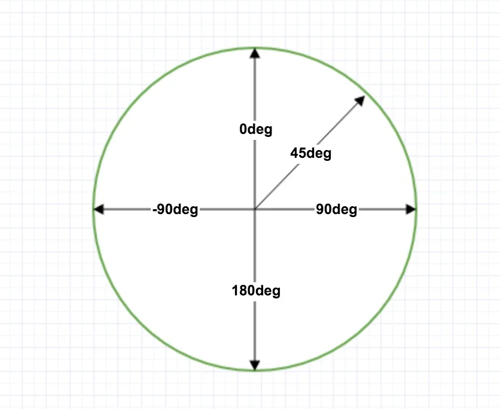

同时注意：线性渐变**可以使用透明度，也可以多个渐变叠加**

```css
div {
background: linear-gradient(217deg, rgba(255,0,0,.8),rgba(255,0,0,0) 70.71%),
    linear-gradient(127deg, rgba(0,255,0,.8), rgba(0,255,0,0) 70.71%),
      linear-gradient(336deg, rgba(0,0,255,.8), rgba(0,0,255,0) 70.71%);
}
```

## 十一、CSS三大特性（核心）

#### 1、层叠性

**完全相同的选择器若设置了相同的样式，就会发生层叠。此时哪个样式离结构近，就使用哪个样式。**

```html
<head>
<style>
    div {
        background-color: red;
    }
    div {
        background-color: blue;
    }
</style>
</head>
<body>
<div>
    这个div背景是蓝色的，而不是红色
</div>
</body>
```

#### 2、继承性

**子元素可以继承父元素的某些样式（text-，font-，line- 及color这些样式可以继承）（而长宽和边距一般不可继承，但一定注意行高是可以继承的！！）**

关于行高的继承和行高的倍率写法：

```html
<head>
<style>
    body {
        font: 12px/1.5 "Microsoft YaHei";
    }
    p {
        font: 16px "Microsoft YaHei";
    }
</style>
</head>
<body>
<p>
    这个段落最终的行高是16*1.5px，体现了行高的继承和行高相对于字体大小的设置方法
</p>
</body>
```

body 行高 1.5 写法的优势：***不独立设置样式的子元素会继承body的样式，而独立设置字体大小样式的子元素，行高就自动是其自定义字体大小的1.5倍***

#### 3、优先级（特别重要）

|        选择器        |                  权重                   |
| :------------------: | :-------------------------------------: |
|   继承或通配符(*)    |                 0,0,0,0                 |
|      元素选择器      |                 0,0,0,1                 |
| 类选择器（包含伪类） |                 0,0,1,0                 |
|       id选择器       |                 0,1,0,0                 |
|       行内样式       |                 1,0,0,0                 |
|    !important修饰    | <span style="font-size: 25px;">∞</span> |

理解：

1. 权重优先从高位比较，同时永远不会有进位

2. **继承的权重是0，同时继承的权重是最低的。不管父元素优先级有多高，子元素得到的权重都是0**

3. 复合选择器可通过权重计算比较优先级，即权重加和大优先级大。

计算方法：**各位相加，但不进位，最后从高位开始依次比较**

```html
<!-- 继承权重为0的理解 -->
<head>
<style>
    div {
        color: red !important;
    }
    p {
        color: blue;
    }
</style>
</head>
<body>
<div>
    <p>
        这个段落的文字不会继承div的颜色，即使它是!important修饰的。
        因为继承权重为0，小于元素选择器权重，元素选择器优先为蓝色。
    </p>
    <p>
        实际上继承权重最低的另一个例子是写body的样式并不会直接影响a的样式,
        因为a有默认的浏览器样式，其优先级高于继承，所以a为蓝色+有下划线。
        标题标签也是类似
    </p>
</div>
</body>
```

```html
<!-- 复合选择器权重计算 -->
<head>
<style>
    div .demo {
        /* 权重(0,0,0,1) + (0,0,1,0) = (0,0,1,1) */
        color: blue;
    }
    div ul {
        /* 权重(0,0,0,1) + (0,0,0,1) = (0,0,0,2) */
        color: red;
    }
</style>
</head>
<body>
<div>
    <ul class="demo">
        <li>从权重计算可以看出第一个选择器优先级更高，所以这里的文字是蓝色的</li>
        <li>好耶！我也是蓝色(ﾉﾟ▽ﾟ)ﾉ</li>
        ...
    </ul>
</div>
</body>
```

## 十二、盒子模型

#### 1、看透网页布局的本质

1. 先准备好相关的网页元素，网页元素基本都是盒子Box

2. 利用CSS设置好盒子样式，然后摆放到相应位置

3. 往盒子里装内容

网页布局的核心：**利用CSS摆盒子**

#### 2、盒子模型的组成

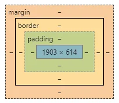

#### 3、边框（border）

三个属性：  boder-width、border-style、border-color

1. border-width通常使用px单位

2. border-style有实线(solid)、虚线(dashed)和点线(dotted)

3. border-color按常规颜色填写即可

合并简写：没有相关顺序


若需要设置单边的边框：（其余同理）

```css
div {
border-top: 5px solid blue;
}
```

但若只需要设置单边边框的样式，可四边先设置为一个样式再覆盖

```css
/* 后一句样式部分覆盖了前一句的样式，层叠性的体现 */
div {
border: 5px solid blue;
border-top: 5px solid pink;
}
```

**border会额外增加盒子的实际大小（类似外描边），使用时注意测量即可**（也可使用 box-sizing: border-box; 调整）

#### #4、表格边框绘制方式（border-collapse）

将相邻的表格边框合并在一起，而不是直接像素叠加：

```css
table {
border-collapse: collapse;
}
```

#### 5、内边距（padding）

padding用于设置内边距，即边框与内容间的距离

可设置四个属性：padding-left、padding-right、padding-top 和 padding-bottom（单位为px）

复合简写：（四种写法都是重点）

```css
div {
padding: 5px;    /* 上下左右 */
}

div {
padding: 5px 10px;    /* 上下 左右 */
}

div {
padding: 5px 10px 20px;    /* 上 左右 下 */
}

div {
padding: 5px 10px 20px 30px;    /* 上 右 下 左 （顺时针）*/
}
```

**padding会额外增加盒子的实际大小（向外扩展出内边距） ，测量使用时注意即可**

**但注意若盒子的长/宽没有指定， 那对应的长或宽就不会向外扩展，反而是向内扩展！！**

padding的应用：***设置padding让盒子长宽自然随content长宽变化，而不是设置固定的盒子长宽值***

#### 6、外边距（margin）

margin用于设置外边距，即控制盒子和盒子间的距离

可设置四个属性：margin-left、margin-right、margin-top和margin-bottom（一般使用px衡量）

可复合简写，写法与padding一致

```css
div {
margin: 20px 30px;
}
```

应用场景：*margin可以让块级盒子水平居中*，但必须满足两个条件：

1. 盒子必须指定width

2. 盒子左右外边距设置为auto

如：

```css
div {
margin: 0 auto;
}
```

注：**以上方法是让块元素水平居中，而如果需要行内元素或行内块元素水平居中，可以对元素使用text-align: center;**

#### #7、margin在垂直和嵌套时的塌陷（重难点）

相邻块元素垂直外边距的合并：

- 当上下相邻的两个块元素相遇时，如果上面的元素有下外边距margin-bottom
- 下面的元素有上外边距margin-top，则他们之间的垂直间距不是margin-bottom与margin-top之和
- 取两个值中的较大者这种现象被称为相邻块元素垂直外边距的合并（也称外边距塌陷）

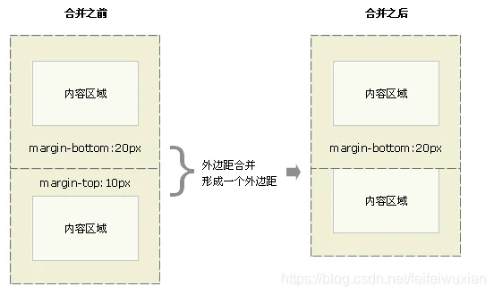

解决方法：**尽量只给一个盒子添加margin**

嵌套块元素垂直外边距的合并（塌陷）

- 对于两个嵌套关系的块元素，如果父元素没有上内边距及边框

- 父元素的上外边距会与子元素的上外边距发生合并

- 合并后的外边距为两者中的较大者

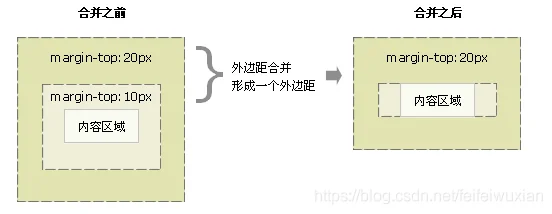

解决方法：**给父元素添加样式：overflow: hidden;** 或**对子元素使用浮动**

#### 8、清除默认padding和margin

```css
* {
padding: 0;
margin: 0;
}
```

注：

**行内元素为照顾兼容性，尽量只设置左右的内外边距，不要设置上下的内外边距。若实在需要，可以转化为块元素或行内块元素**

#### 9、行内块及行内元素排列空隙的解决方案（标准流下的解决方案）

行内块和行内元素间因有换行，会被保留为一个空格

解决方法：*主要思路都是避免产生空白文本节点：各元素的标签的尖括号换到下一行，或将所有元素写在一行，或者最后进行代码压缩*

如下方的h4和em标签

```html
<div class="info">
<h4 class="product-name">
    <a href="https://www.mi.com" target="_blank">Redmi AirDots真无线蓝...</a>
</h4
><em>|</em
><span class="price">99.9元</span>
</div>
```

#### 10、圆角边框

在CSS3中，新增了圆角边框样式。

使用border-radius设置，对应的值越大，弧度越为明显

单位：px 或 %

```css
div {
border-radius: 5px;
}
```

四个角单独的圆角属性名：border-top-left-radius、border-top-right-radius、border-bottom-right-radius和border-bottom-left-radius（顺序为顺时针）（border-radius可以看做是合并简写，写法和margin类似）

注：**将border-radius设置为长和宽的一半，矩形的边将会完全被弧线所替代，这时矩形将变成圆或椭圆**

#### #11、盒子阴影

使用box-shadow定义

```css
div {
box-shadow: h-shadow v-shadow blur spread color inset;
}
```

|    值    |               描述               |
| :------: | :------------------------------: |
| h-shadow |  必需，水平阴影的位置，允许负值  |
| v-shadow |  必需，垂直阴影的位置，允许负值  |
|   blur   |          可选，模糊距离          |
|  spread  |         可选，阴影的尺寸         |
|  color   |         可选，阴影的颜色         |
|  inset   | 可选，将外部阴影改为内部内部阴影 |

1. **默认是外部阴影，但是不可以写outset这个值，否则阴影会无效**

2. 盒子阴影不占用空间，不影响其他盒子的布局

#### #12、文字阴影

使用text-shadow定义

```css
p {
text-shadow: h-shadow v-shadow blur color
}
```

各值含义与盒子阴影一致

## 十三、CSS浮动

#### 1、传统网页布局的三种方式：

1. 标准流（普通流/文档流）：标签按照规定好的默认方式排列，是最基本的网页布局方式

2. 浮动：可以改变标签默认的排列方式，实现复杂的布局需求（浮动最典型的应用：可以让多个块级元素一行内排列显示）

3. 定位：可以随意改变元素的位置，实现更加复杂的布局需求

注：

**实际开发中，一个页面基本都包含了这三种布局方式**

#### 2、浮动

网页布局第一准则：**多个块级元素纵向排列找标准流，多个块级元素横向排列找浮动**


float属性用于创建浮动框，将其移动到一边，直到左边缘或右边缘触及包含块或另一个浮动框的边缘。

```css
div {
float: left;
}
```

| 属性值 |     描述     |
| :----: | :----------: |
|  none  |  元素不浮动  |
|  left  | 元素向左浮动 |
| right  | 元素向右浮动 |

#### 3、浮动特性（重点难点）

1. 浮动特性会脱离标准流（脱标），**浮动的盒子不再保留原来的位置**，这时其他标准流的盒子就**会占用它的位置**，发生**重叠**的现象

如：

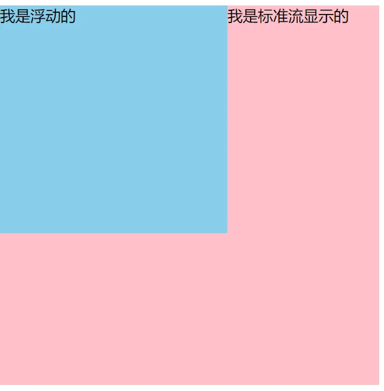

2. 浮动的元素会**一行显示并且按元素顶端对齐**，若父元素宽度不能容纳，则另起一行对齐

3. 浮动元素会**具有行内块元素的特性**（宽度由内容决定等）

#### 4、浮动元素的使用

为了约束浮动元素的位置，网页布局的一般策略是：

**先用标准流的父元素排列上下位置，之后内部子元素采取浮动排列左右位置**

网页布局第二准则：**先设置盒子的大小，再调整盒子的位置**

#### 5、常见网页布局

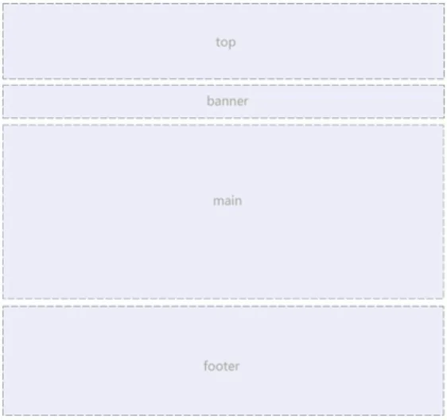

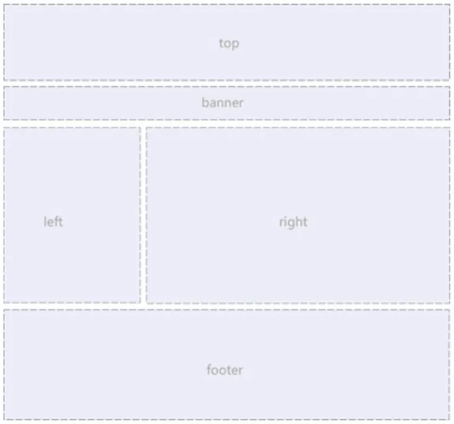

以上为两种不太常用的布局方式

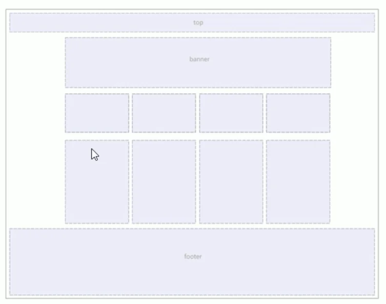

**以上是最常见、最常用的布局方式**

#### 6、浮动注意事项

1. 浮动和标准流的父盒子搭配

2. **一个元素浮动了，理论上其余的兄弟元素也要浮动**

因为：**浮动盒子只会影响浮动盒子后面的标准流的布局，不会影响前面的标准流布局**；若其中一个不浮动，盒子排列可能就会错行

#### 7、清除浮动

问题：在子元素长宽或数量不确定的情况下，写死父盒子的高度是不方便的。但若不写父盒子高度，因为子元素是浮动的不占用布局空间，父元素高度就会变为0，影响整体布局

因此：**此时应该清除浮动**

清除浮动的本质：本质是清除浮动元素造成的影响。

清除浮动的作用：清除后，父级会根据浮动的子盒子自动检测高度，父级有了高度，就不会影响整体布局了

注：**父盒子如果已有高度，就不需要清除浮动**

方法详解：

1. 额外标签法

在最后一个浮动元素后添加一个**带clear属性的块元素**空标签，如：

```html
<style>
.float-div {
    float: left;
}
</style>
<div>
<div class="float-div">1</div>
<div class="float-div">2</div>
<div class="float-div">3</div>
<div style="clear: both;"></div>    
</div>
```

缺点：添加了无意义的标签，结构化较差

原理：空标签clear属性要求它自己不被浮动元素所覆盖，而它又是没有高度的块级元素，浏览器渲染时必然会将它置于最末尾，而它又是包含于父元素的标准流，父元素必然会被撑开

2. 给父级添加overflow属性

给父级添加overflow属性，值可以为hidden、auto、scroll，如：

```html
<style>
.box {
    overflow: auto;
}
.float-div {
    float: left;
}
</style>
<div class="box">
<div class="float-div">1</div>
<div class="float-div">2</div>
<div class="float-div">3</div> 
</div>
```

缺点：溢出的部分的显示会受影响

3. ::after伪元素法

定义clearfix伪元素类样式，父级引用这个类样式即可

```html
<style>
.clearfix::after {
    content: "";
    display: block;
    height: 0;
    clear: both;
    visibility: hidden;
}
.clearfix {
    *zoom: 1;  /*IE6、7专用*/
}
.float-div {
    float: left;
}
</style>
<div class="box clearfix">
<div class="float-div">1</div>
<div class="float-div">2</div>
<div class="float-div">3</div> 
</div>
```

4. 双伪元素清除浮动

和第三种方法类似，给父元素添加一些样式

```html
<style>
  .clearfix:before,
.clearfix:after {
    content: table;
}
.clearfix:after {
    clear: both;
}
.clearfix {
    *zoom: 1;
}
.float-div {
    float: left;
}
</style>
<div class="box clearfix">
<div class="float-div">1</div>
<div class="float-div">2</div>
<div class="float-div">3</div> 
</div>
```

#### 8、CSS属性书写顺序

1. 布局定位属性：display / position / float / clear / visibility / overflow（建议display最先写，其关系模式）

2. 自身属性：width / height / margin / padding / border / background

3. 文本属性：color / font / text-decoration / text-align / vertical-align / white-space / break-word

4. 其他属性（CSS3属性）：content / cursor / border-radius / box-shadow / text-shadow / background / linear-gradient...

例:

```css
/*这里空行是为了划分四个部分的属性，实际书写合在一起写即可*/
.jdc {
display: block;
positon: relative;
float: left;

width: 100px;
height: 100px;
margin: 0 10px;
padding: 20px 0;

font-family: Arial, "Helvetica Neue", Helvetica, sans-serif;
color: #333;

background: rgba(0, 0, 0, .5);
border-radius: 10px; 
}
```

## 十四、CSS定位

#### 1、定位

当网页元素需要自由移动位置或固定在屏幕某个位置时，使用标准流和浮动是无法实现效果的。这时便需要使用定位

#### 2、定位组成

定位：将盒子定在某个位置。因此定位也是摆盒子，只是按照定位的方式来进行

**定位 = 定位模式 + 边偏移**

1. 定位模式

定位模式决定元素的定位方式，使用position属性定义

|    值    |   语义   |
| :------: | :------: |
|  static  | 静态定位 |
| relative | 相对定位 |
| absolute | 绝对定位 |
|  fixed   | 固定定位 |

边偏移就是定位的盒子移动到的最终位置

| 边偏移属性 |     示例     |                          描述                          |
| :--------: | :----------: | :----------------------------------------------------: |
|    top     |  top: 80px   | **顶端**偏移量，定义盒子相对于其父元素**上边线的距离** |
|   bottom   | bottom: 80px | **底部**偏移量，定义盒子相对于其父元素**下边线的距离** |
|    left    |  left: 80px  | **左侧**偏移量，定义盒子相对于其父元素**左边线的距离** |
|   right    | right: 80px  | **右侧**偏移量，定义盒子相对于其父元素**右边线的距离** |

#### 3、静态定位static（了解）

静态定位是元素默认定位方式，其实就是无定位

```css
div {
position: static;
}
```

1. **静态定位按照标准流特性摆放位置，所以没有边偏移**

2. 静态定位在页面布局中很少用到

#### 4、相对定位relative（重要）

相对定位是元素在移动位置时，相对于**它原来的位置**作移动

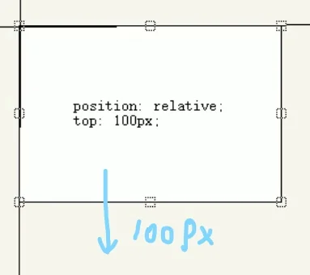

```css
div {
posiotion: relative;
top: 100px;
left: 50px;
}
```

1. **相对定位的元素（无论是否有边偏移量），后面的盒子不会占用它的位置（即相对定位元素不脱标，仍然占有原来的布局空间）**

2. 相对定位的主要使用情形：*父级添加相对定位，子级的绝对定位就会以它为基准*

#### 5、绝对定位absolute（重要）

绝对定位是元素在移动位置时，是相对于它的**祖先元素**（不一定是父元素）来移动的

```html
<style>
.father {
    position: relative;
    width: 500px;
    height: 500px;
}
.son {
    position: absolute;
    top: 100px;
    left: 50px;
    width: 100px;
    height: 100px;
}
</style>
<body>
<div class="father">
    <div class="son"></div>
</div>
</body>
```

1. 如果没有**祖先元素**或**祖先元素没有定位**，则以浏览器为准定位（Document文档）

2. 如果祖先元素有定位（相对、绝对或固定定位），则以最近一级的有定位的祖先元素为基准

3. **只要加绝对定位（无论是否有边偏移量）就不再占用原来的布局空间（即绝对定位元素是脱标的）**

#### 6、子绝父相的由来 

含义：**子级若使用绝对定位，则父级一般使用相对定位**

原因：

1. 子级绝对定位，不会占有位置，可以放到父盒子里的任何地方

2. 为了使子级绝对定位以父级为基准，父级必须有定位。而父级不能也使用绝对定位，因为父级脱标后会影响整体布局，所以父级只能使用相对定位

注：子绝父相不是绝对的，只是最常用的方法，有时也可以使用子绝父绝

#### 7、固定定位fixed（重要）

固定定位是将元素**固定于浏览器可视区**的位置，主要应用场景：*浏览器页面滚动时元素的位置不会发生改变*

```css
div {
position: fixed;
top: 100px;
right: 0;
}
```

注：

1. 以浏览器的可视窗口为参照移动元素（**和父元素无关**）

2. 固定定位元素不再占用原来的布局空间（即是脱标的）

#### 8、固定定位小技巧：固定在版心右侧位置

算法设计：

1. 让固定定位的盒子left: 50%，走到浏览器可视区的一半位置

2. 让固定定位的盒子margin-left: 版心宽度的一半。（再走一半的版心宽度即是版心右侧）

#### 9、粘性定位sticky（了解）

粘性定位可以被认为是相对定位和固定定位的混合

```css
div {
position: sticky;
top: 10px;
}
```

注：

1. 以浏览器的可视窗口为参照移动元素（固定定位特点）

2. 粘性定位**占有原先的位置**（相对定位特点）

3. 必须添加边偏移才有效

4. 兼容性差，IE不支持

表现：当粘性定位元素与浏览器可视窗口的边距大于粘性定位的边偏移时，此时元素表现出相对定位的特性：占有指定区域的布局空间。当与浏览器可视窗口的边距等于粘性定位的边偏移时，元素表 现出固定定位的特点，使元素和浏览器可视窗口的边距不小于边偏移量

#### 10、定位叠放次序z-index

在使用定位布局时，可能会出现盒子重叠的情况，此时可使用z-index控制盒子的显示顺序

```css
/* 按照层叠规律，默认是靠后的盒子显示优先级更高 */
div {
z-index: 1;
position: relative;
width: 100px;
height: 100px;
}
span {
position: relative;
width: 100px;
height: 100px;
}
```

注：

1. 数值可以是正整数、负整数和0，默认是auto，**数值越大，优先级越高**

2. 数字后面不能跟单位

3. 只有定位的盒子才有z-index属性

#### #11、定位拓展

1. 绝对定位的盒子如何水平垂直居中

以水平居中为例：

算法设计：

    a、left: 50%（让盒子的左侧移动到父级元素的水平中心位置）

    b、margin-left: -盒子宽度的一半（让盒子移动自身宽度的一半）(或使用 transform: tranlate(-50%, 0); )

2. 定位特殊特性

    a、**行内元素添加绝对或固定定位后，就可以直接设置高度和宽度**

    b、**块级元素添加绝对或固定定位，如果不给宽度或高度，默认大小是内容的大小**

3. **脱标的盒子不会触发外边距塌陷**

4. **绝对定位 / 固定定位会完全压住盒子**

浮动元素不同，他只会压住他下面标准流的盒子，但不会压住标准流盒子中的图片或文字，借此原理可用浮动实现文字环绕的效果

而绝对定位 / 固定定位会完全压住它下方标准流的所有内容

## 十五、CSS隐藏

#### 1、三种隐藏方法

display 显示隐藏

visibility 显示隐藏

overflow 溢出隐藏

#### 2、display属性（重点）

display用于设置一个元素如何显示，其用途及其广泛，搭配 JS 可以做很多特效

```css
div {
display: none;  /* 隐藏对象 */
}
```

注：

1. display: block; 除了有转换为块级元素的功能，同时还有显示元素的意思

2. **display 隐藏元素之后，不再占有原来的布局空间**


#### 3、visibility 可见性

visibility 也用于设置元素的可见性（相对display属性用的较少）

```css
div {
visibility: hidden;
}
```

|   参数   |              行为              |
| :------: | :----------------------------: |
| inherit  |       继承父元素的可见性       |
| visible  |            对象可视            |
|  hidden  |            对象隐藏            |
| collapse | 用于隐藏表格的行和列（不常用） |

注：**visibility 隐藏元素后，继续占有原来的位置**

#### 4、overflow 溢出

overflow 属性指定了如果内容溢出一个元素的框（超过指定的宽或高）时会发生什么

```css
div {
overflow: hidden;
}
```

| 属性值  |                     描述                     |
| :-----: | :------------------------------------------: |
| visible |           不剪切内容也不添加滚动条           |
| hidden  | 不显示超过对象尺寸的内容，超出的部分直接隐藏 |
| scroll  |  无论内容是否超出尺寸限制，都强制添加滚动条  |
|  auto   |      内容超出尺寸限制，则强制添加滚动条      |

注：一般情况下我们不希望盒子中的内容溢出，因此会采用 overflow: hidden; **但如果是有定位的盒子，慎用overflow: hidden; 因为它会剪切所有超出边界的内容**

## 十六、CSS高级技巧

#### 1、精灵图

为了有效的减少服务器接受和发送请求的次数，提高网页的加载速度，出现了CSS精灵技术（

CSS Sprites / CSS 雪碧）

核心原理：**将网页中的一些小背景图像整合到一张大图片上，这样只需要向浏览器请求这一张图片即可**


使用：

1. 精灵图主要针对小的背景图片使用

2. 主要使用 background-posiotion 来调整位置对齐（一般为负值）

示例：

```css
/* 假设我们有一张精灵图，我们需要的图标的参数：
width: 30px
height: 30px
x-position: 145px
y-position: 150px */

/* 那么如果将其设为某个盒子的背景 */
div {
width: 30px;
height: 30px;
background: url(path) -145px -150px;
}
```

#### 2、字体图标

使用场景：主要用于显示网页中通用、常用的一些小图标

对比精灵图，精灵图的缺点：

1. 图片文件还是比较大的

2. **图片本身放大和缩小会失真**

3. 精灵图一旦制作完成，更换起来就很复杂

此时一种技术可以解决以上问题：字体图标（iconfont），**其展示的是图标，但本质是字体**

字体图标的优点：

1. 轻量级：字体图标文件大小比图像小，一旦字体加载了，字体图标也会立即渲染出来

2. 灵活性：**本质是文字，可以随意轻松地修改颜色，产生阴影，做透明效果等**

3. 兼容性：几乎支持所有浏览器

总结：

1. 如果需要使用一些结构和样式简单的小图标，选择字体图标

2. 如果需要使用一些结构和样式比较复杂的小图标，选择精灵图

使用步骤：

1. 下载字体图标（推荐icomoon和阿里iconfont字库）

2. 将字体图标引入html页面,建议使用link导入它的样式表

3. 字体图标追加（使用selection.json)

#### 3、CSS三角

使用场景：网页中一些常见的三角，可以直接用CSS画出来

原理：**给一个没有宽高的盒子四个方向描边，每个方向都会占一块三角形面积，这时设置其他三边的描边为透明即可**


```css
div {
width: 0;
height: 0;
line-height: 0;  /* 照顾兼容性 */
font-size: 0;  /* 照顾兼容性 */
border: 50px solid transparent;
border-left: 50px solid skyblue;
}
```

#### #4、CSS用户界面样式

1. 鼠标样式 cursor

```css
div {
cursor: pointer;
}
```

|   属性值    |     描述     |
| :---------: | :----------: |
|   default   | 小白（默认） |
|   pointer   |     小手     |
|    move     |     移动     |
|    text     |     光标     |
| not-allowed |     禁止     |

2. 轮廓线去除 outline（去掉表单默认的边框）

```css
input {
outline: none;
}
/* 或 */
input {
outline: 0;
}
```

3. 防止拖拽文本域 resize

实际开发中，我们不希望textarea的区域可被拖动

```css
textarea {
resize: none;
}
```

#### #5、vertical-align 居中对齐

vertical-align 常用于设置图片或者表单（行内块元素）和文字垂直对齐的方式

官方解释： **用于设置一个元素的垂直对齐方式，但只针对于行内元素和行内块元素**

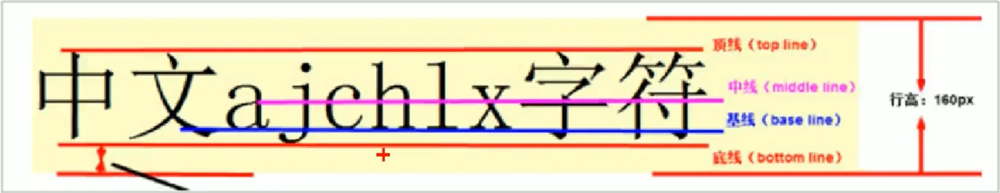

```css
img {
vertical-align: middle;
}
```

|    值    |                     描述                     |
| :------: | :------------------------------------------: |
| baseline |        默认，元素和父元素下标基线对齐        |
|   top    |      把元素顶端与行中最高元素的顶端对齐      |
|  middle  | 使该元素中线在父元素基线上一半x-height的距离 |
|  bottom  |      把元素底端与行中最低元素的底端对齐      |
|  super   |          把元素和父元素上标基线对齐          |


使用 vertical-align 解决图片底部默认空白缝隙的问题：

原因：行内块会和文字的基线对齐

解决方法：

1. 给图片添加 vertical-align: middle、top、bottom等

2. 把图片转化为块级元素 display: block;

#### 6、溢出文字省略号显示

1. 单行文字的省略显示

```css
div {
/* 1、先强制一行内显示文本 */
white-space: nowrap;
/* 2、超出的部分隐藏 */
overflow: hidden;
/* 3、溢出的文字使用省略号替代 */
text-overflow: ellipsis;
}
```

2. 多行文字的省略显示

多行文本溢出显示省略号，有较大兼容性问题，适合于webkit浏览器和移动端

```css
div {
overflow: hidden;
text-overflow: ellipsis;
/* 弹性伸缩盒子模型展示 */
display: -webkit-box;
/* 限制在一个块元素显示的文本的行数 */
-webkit-line-clamp: 2;
/* 设置或检索伸缩盒对象的子元素的排列方式 */
-webkit-box-orient: vertical;
}
```

#### #7、常见布局技巧

1. margin 负值的运用

a、问题：一排盒子浮动时若左右都有边框则会发生边框重叠

解决方法：让每个盒子 margin 往左侧移动负的一个边框厚度，就正好抵消了边框重叠的影响

```css
div ul li {
float: left;
width: 150px;
height: 150px;
border: 1px solid skyblue;
margin-left: -1px;
}
```

b、问题：一排浮动盒子都有边框时，如何实现经过某一个盒子变化边框颜色

提示：加边框使用上面的方法，若直接使用边框变色会导致中间的盒子只有三条边有变色效果，因为另一条边被后面的盒子压住了

解决方法（提高当前盒子的层级）：

    i、给当前盒子添加相对定位，提高层级

    ii、若一排盒子都已有相对定位，则使用z-index提高层级

```css
/* 没有相对定位的情况 */
div ul li:hover {
position: relative;
border-color: skyblue;
}
```

```css
/* 都有相对定位的情况 */
div ul li:hover {
position: relative;
z-index: 1;
border-color: skyblue;
}
```

2. 文字围绕浮动元素

原理：先向父元素中填入文字，再添加浮动的图片，而浮动不会压住文字，就会造成文字环绕显示的效果

3. 巧妙使用 inline-block 元素

应用：

1. 使用 inline-block 元素，元素之间会自动带有空隙

2. 元素的居中对父元素使用 text-align: center; 即可

3. CSS三角的巧妙运用 

a、CSS绘制直角三角形

如：（只描边两侧，而两侧描边依然要组合成矩形，因此每一侧的描边都是一个直角三角形）

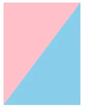

```css
div {
width: 0;
  height: 0;
  border-color: pink skyblue transparent transparent;
  border-style: solid;
  border-width: 160px 120px 0 0;
}
```

b、CSS绘制任意形状的三角形

同样使用上面的原理，我们使用两对边的描边长度构造三角形上顶点距下方两顶点的水平距离。然后使用另一边描边限制高度，则可以绘制出任意形状的三角形，同时可搭配 transform: rotate(deg); 使用

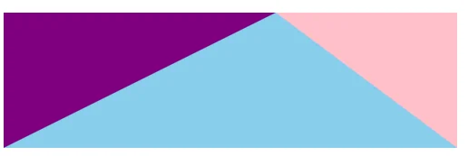

```css
div {
  width: 0;
  height: 0;
  border-color: transparent pink skyblue purple;
  border-style: solid;
  border-width: 0 160px 120px 240px;
}
```

#### 8、CSS初始化（CSS reset）

简单理解：CSS初始化是指重设浏览器的样式

每个网页都必须首先进行CSS初始化

京东主页的CSS初始化分析：

```css
* {
margin: 0;
padding: 0;
}

/* em 和 i 斜体的文字不倾斜 */
em,
i {
font-style: normal;
}

/* 去掉 li 的小圆点 */
li {
list-style: none;
}

img {
border: 0;  /* 照顾兼容性 */
vertical-align: middle;  /* 去除图片底端的空白缝隙 */
}

button {
cursor: pointer;
}

a {
color: #666;
text-decoration: none;
}

a: hover {
color: #01a4ff;  /* 网站特有的设置 */
}

button,
input {
font-family:  Microsoft YaHei, Heiti SC, tahoma, arial, Hiragino Sans GB, "\588B\4F53", sans-serif;
}

body {
-webkit-font-smoothing: antialiased;
background-color: #fff;
/* 将宋体的中文名称转为unicode编码，防止解释时乱码 */
font: 12px/1.5 Microsoft YaHei, Heiti SC, tahoma, arial, Hiragino Sans GB, "\588B\4F53", sans-serif;
color: #666;
}

.hide,
.none {
display: none;
}

/* 清除浮动 */
.clearfix::after {
visibility: hidden;
clear: both;
display: block;
content: ".";
height: 0;
}

.clearfix {
*zoom: 1;
}
```

---

---

# JavaScript

## 一、初识JavaScript

#### 1、JS是什么

是一种**运行在客户端**的脚本语言

现在也可以基于Node.js技术进行服务器端编程

#### 2、JS的作用

表单动态验证（如密码强度检测）（JS最初产生的目的）

网页特效

服务端开发（Node.js）

桌面程序（Electron）

App（Cordova）

控制硬件——物联网（Ruff）

游戏开发（cocos2d-js）

#### 3、浏览器执行JS的过程

浏览器分为两部分：**渲染引擎**和 **JS 引擎**

渲染引擎：用来解析HTML和CSS，俗称内核，比如chrome的blink，老版本的webkit

JS引擎：也成为JS解释器，用来读取网页中的JS代码，对齐处理后运行，比如chrome浏览器的V8


注：**浏览其本身不会执行JS，而是通过内置的JS引擎来解释JS代码**


#### 4、JS的组成

- ECMAScript （规定了JS语法）
- DOM（页面文档模型）
- BOM（浏览器对象模型）

1. DOM

文档对象模型（Document Object Model，简称DOM），是W3C组织推荐的处理可扩展标记语言的标准编程接口

通过DOM提供的接口可以对页面上的各种元素进行操作（大小、位置、颜色等）

2. BOM

BOM（Browser Object Model，简称BOM）是指浏览器对象模型，它提供了独立于内容的、可以与浏览器窗口进行互动的对象结构。通过BOM可以操作浏览器窗口，比如弹出框、控制浏览器跳转、获取分辨率等

#### 5、JS的书写位置

1. 行内式的JS

```html
<input type="button" value="BLCU" onclick="alert('北京语言大学')" />
```

2. 内嵌式的JS

```html
<script>
  alert('Hello World！')
</script>
```

3. 外部JS引入

```html
<!-- 若确定使用外部引入方法，script标签内不要写任何内容 -->
<script src="control.js"></script>
```

注：写JS代码时建议使用单引号，而不是双引号


#### 6、JS注释

如下：

```html
<script>
  // 单行注释  Ctrl + /

/* 多行  可更改为 Ctrl + Shift + /
注释 */
</script>
```

#### 7、JS输入输出语句

1. prompt方法：弹出输入框（返回的是字符串）

```js
prompt('请输入您的年龄：');
```

2. alert方法：弹出警示框

```js
alert('计算的结果是：');
```

3. console.log方法：控制台打印输出信息

```js
console.log('Hello World!');
```

## 二、变量

#### 1、变量的使用

1. 声明变量

```js
var age;  //声明一个名为age的变量，var是关键字
```

2. 赋值

```js
age = 18;  //给变量赋值10
```


和写：

```js
var age = 18;
```

#### 2、同时声明多个变量

```js
var start = 1,
end = 2,
age = 16;
```

#### 3、声明变量的特殊情况

|            情况             |       说明       |   结果    |
| :-------------------------: | :--------------: | :-------: |
| var age; console.log(age);  |  只声明，不赋值  | undefined |
|      console.log(age);      | 不声明，也不赋值 |   报错    |
| age = 10; console.log(age); | 不声明，直接赋值 |    10     |

#### 4、变量命名规则

与其他编程语言类似

**只是注意一点最好不要使用 name 作为变量名**，在一些浏览器中它也是有特殊用处的

## 三、数据类型（重要）

#### 1、变量的数据类型

JS是一种弱类型（动态类型）语言，因此**变量类型不用提前声明，在程序运行中变量类型会随数据而被确定**

```js
var age = 18;
var age = '18';
```

#### 2、数字型 number

```js
var num1 = 10;  // 十进制10
var num2 = 010;  // 八进制8(前面加0)
var num3 = 0xf;  // 十六进制16(前面加0x)
```

1. 数字型最大值和最小值

```js
alert(Number.MAX_VALUE);
alert(Number.MIN_VALUE);
```

2. 三个特殊值：

```js
alert(Infinity);  // 无穷大
alert(-Infinity);  // 无穷小
alert(NaN);  // Not a number，非数值
```

3. isNaN( )方法判断是否为非数字型

```js
console.log(isNaN(12));  // 返回false
```

#### 3、字符串类型 string

```js
var Msg = '提示信息：...';
```

注：转义字符类似其他编程语言。

同时字符串可相加，**字符串和任何其他类型相加，最后结果都为字符串**

1. length属性实现字符串长度检测

```js
var strMsg = 'Hello World!';
console.log(str.length);
```

#### 4、布尔型 boolean

```js
var flag1 = true;
var flag2 = false;
```

注：**JS中的布尔型可与数字型运算，这时 true 看做1，而 false 看做0**

#### 5、未定义型 undefined

```js
var variable = undefined;

//任何类型与字符串相加转化为字符串型
console.log(variable + 'blue');  // 返回undefinedblue

console.log(variable + 12);  // 返回NaN
```

#### 6、空类型 null

```js
var variable = null;

console.log(variable + 'blue');  // 返回nullblue

console.log(variable + 12);  // 返回12
```

#### 7、使用 typeof 关键字检测数据类型

```js
var num = 10;
console.log(typeof num);  // 返回'number'

var str = 'blue';
console.log(typeof str);  // 返回'string'

var flag = true;
console.log(typeof flag);  // 返回'boolean'

var variable = undefined;
console.log(typeof variable);  // 返回'undefined'

var timer = null;
console.log(typeof timer);  // 返回'object'
```

#### 8、数据类型的转换

1. 转化为字符串型

```js
var num = 10;

var str = num.toString();  // 使用数字型的toString方法
var str = String(num);  // 使用String函数
var str = '' + num;  // 与空字符串相加（隐式转换）
```

2. **转化为数字型（重点）**

a、使用 parseInt 和 parseFloat 函数

```js
var numStr = '10.62';
var widthStr = '120px';
var dirty = 'em120px';

var num = parseInt(numStr);  // 向下取整为10
var width = parseInt(widthStr);  //也可以用来去单位(这里返回120)
var dirty = parseInt(dirty);  //返回NaN(无法做到在任意字符串中取数字)

var num = parseFloat(numStr)  //  取浮点为10.62
var width = parseFloat(widthStr);  //也可以用来去单位(返回120)
var dirty = parseFloat(dirty);  // 返回NaN(无法做到在任意字符串中取数字)
```

b、使用 Number 函数

```js
var numStr = '10';
var num = Number(numStr);
```

c、利用算术运算符（ - * / 隐式转换）（不能使用 + ）

```js
var numStr = '10';
var num = numStr - 0;
var num = numStr * 1;
var num = numStr / 1;
```

3. 转换为 boolean 型

只有一种方法：使用 Boolean 函数

注：

**代表空、否定的值（''、0、NaN、null、undefined）会被转换为：false**

**其余值都会被转化为 true**

```js
var flag = Boolean('');  // 为false
var another_flag = Boolean(666);  // 为true
```

## 四、JS运算符

#### 1、算术运算符

与其他编程语言类似

+ - * / % 

若需要取整可通过 / ，然后使用parseInt取整得到

#### 2、递增、递减运算符

```js
// 前置,先运算再返回值
var num = 10, num2 = 10;
++ num;
-- num2;
```

```js
// 后置，先返回值再运算
var num = 10, num2 = 10;
num ++;
num2 --;
```

#### 3、关系运算符

与其他编程语言类似

但注意：

1. == 会将等式两边数据类型转为相同类型（隐式转换）（**但注意若有一侧为布尔类型，则不会进行隐式转换**）

2. 特有的比较运算符： === 和 !=\= （值和类型都判断）

#### 4、逻辑运算符

符号与 C 语言一致

特点分析：

1. 逻辑与的实现：**逻辑与短路运算**（从左到右依次判断是否为 false，若为 false 则短路返回当前表达式的值，否则继续向右判断）

2. 逻辑或的实现：**逻辑或短路运算**（从左到右依次判断是否为 true，若为 true 则短路返回当前表达式的值，否则继续向右判断）

#### 5、赋值运算符

符号与 C 语言一致

#### 6、运算符优先级

小括号 > 一元运算符(含非) > 算术运算符 > 比较运算符 > 相等运算符 > 与 > 或 > 赋值运算符 > 逗号运算符

## 五、流程控制

#### 1、if-else（与C语言基本一致）

#### 2、if-else if（与C语言基本一致）

#### 3、三元表达式（与C语言基本一致）

#### 4、switch 语句（与C语言基本一致）

#### 5、for 循环（与C语言基本一致）

#### 6、代码调试：

使用开发工具中的Source选项卡，定位到代码调试

#### 7、while 循环（与C语言基本一致）

#### 8、do while 循环（与C语言基本一致）

#### 9、continue break 循环（与C语言基本一致）

## 六、JS数组

#### 1、数组的创建方式

1. 利用 new 创建数组

```js
var an_array = new Array()
```

2. 通过数组字面量来创建数组（这种创建数组的方法与 Python 类似，但记住创建时要加 var）

```js
var an_array = [1, true, 'an_string', undefined]
```

#### 2、数组访问方式

与其他语言基本一致

但注意：**直接使用不存在的数组下标访问并不会报错，而是返回 undefined**

#### 3、数组长度

访问可通过：

```js
console.log(an_array.length)
```

#### 4、数组元素的追加

1. 修改数组的 length 属性

```js
an_array.length = 10
```

2. 直接给超出索引范围的下标对应元素赋值

```js
/* 假设数组已有三个元素 */
an_array[3] = '这是新增的元素  ddddd'
```

## 七、函数

#### 1、函数的定义

```js
function funcName(arg) {
// do something here
return result // if it need return...
}
```

注：**JS 的函数可以嵌套定义，但嵌套的函数只能在外层函数中使用，不可被外界直接引用**

```js
function outer() {
function inner() {
    ...
}
}
```

#### 2、函数的参数

1. **若实参个数多于形参，并不会报错，只是最后一个实参不参与运算**

2. **若实参个数小于形参，也并不会报错，只是缺少的参数没有接收值，默认为 undefined**

#### 3、函数 return 注意事项

若函数没有 return ，则返回的是 undefined

#### 4、arguments对象

所有函数都有 arguments 对象，**其存储了传递给函数的所有实参**

其为一个类数组对象（只支持 length属性和下标访问），可通过下标直接访问传入的各个参数

通过 arguments 对象，可以实现函数可传入任意个数的参数，同时定义时也不必再写实参

#### 5、函数的两种声明方式

1. 利用函数关键字声明

```js
function fn() {
console.log('第一种声明方式')
}
fn();
```

2. 函数表达式（将函数定义赋值给一个变量）（匿名函数，类似于 Python 中的 lambda）

```js
var fn = function() {
console.log('第二种声明方式')
}
fn();
```

#### 6、立即执行函数

在声明后即刻执行

两种声明方法：

```js
(function() {})();
// 或
(function() {} ());
```

```js
(function(a, b) {
console.log(a + b);
})(1, 2);
// 或
(function(a, b) {
console.log(a + b);
} (1, 2));
```

#### 7、箭头函数

ES6 允许使用 “箭头” 定义函数：

```js
var f = v => v * v;

// 等同于：
var f = function(v) {
return v * v;
}
```

如果箭头函数不需要参数或需要多个参数，就使用一个圆括号代表参数部分

```js
var f = () => 5;

var sum = (num1, num2) => num1 + num2;
```

如果箭头函数的代码块部分多于一条语句，就要使用大括号将它们括起来，并且使用 `return ` 语句返回

```js
var sum = (num1, num2) => { return num1 + num2; }
```

由于大括号被解释为代码块，所以如果箭头函数直接返回一个对象，必须在对象外面加上括号，否则会报错

```js
let getTempItem = id => ({ id: id, name: "Temp" });
```

## 六、JS 作用域

#### 1、全局作用域

1. 整个 script 标签，或是一个单独的js文件

2. 局部作用域：函数或其他结构内部

#### 2、变量的作用域

1. 全局变量（与C语言类似）

2. 局部变量 （与C语言类似）

注：**在特殊情况下，在函数内不使用 var 声明的变量也是全局变量（不建议这样使用）**

#### 3、JS 块级作用域

注：在 ES6 的方法中才有块级作用域，同时新增了 let 和 const 关键字

对 let 关键字：

1. let不能在定义之前访问该变量

2. let不能被重新定义


以下为例子：

```html
<script>
  if (1) {
  var num = 10
  }
  console.log(num)  // 此时外部是可以引用 num 变量的，因为 num 使用 var 初始化，作用范围是函数作用域
</script>
```

```html
<script>
  if (1) {
  let num = 10
  }
  console.log(num)  // 此时外部不可以引用 num 变量，因为 num 使用 let 初始化，作用范围是块级作用域
</script>
```

```html
<script>
  if (1) {
  const var num = 10
  }
  console.log(num)  // 此时不可以改变 num 的值
</script>
```

#### 4、作用域链

内部函数访问外部函数的变量，采用的是链式查找的方式来决定取哪个变量，这种结构就是作用域链

如：函数嵌套定义

```js
function outer() {  // 外层函数
var num = 20
function inner() {
    console.log(num)  // 内层函数
}
inner()
}
outer()  // 最后输出为20
```

## 七、JS 预解析

JS 引擎运行代码分为两步：预解析和代码执行

1. 预解析：js 引擎会把 js 里面所有的 var 声明和 function 声明提升到当前作用域的最前面

2. 代码执行：按照代码书写顺序从上往下执行

```js
hi()
function hi() {
console.log('hi')
}
// 最后输出hi，这里是function声明的提升
```

注：预解析分为变量预解析（变量提升）和函数预解析（函数提升），**在提升过程中，只提升声明，若同时有赋值操作是不会被提升的**

如：

```js
console.log(num)
var num = 10
// 最后输出 undefined，因为赋值不被提升
```

```js
hi()
var hi = function() {
console.log('hi')
}
// 会直接报错，函数表达式中的函数不会被提升，那么只提升hi变量，但不进行赋值，因此hi对象没有被赋值函数
```

## 八、JS 面向对象

#### 1、对象

对象是一组无序的相关属性和方法的集合

对象是由属性和方法组成的

**属性**：事物的特征，通常用名词表示

**方法**：事物的行为，通常用动词来表示

#### 2、创建对象

1. 利用对象字面量创建对象

```js
var obj = {
person_name : 'Ironic',
height : 170,
weight : 120,
strengthening : function() {
    obj.height += 1
    obj.weight += 2
}
}
```

使用上述方法就创建了一个名为 obj 的对象，调用如下：

```js
console.log(obj.height)  // 常规方法
console.log(obj['height'])  // 或使用类似 python 字典的方式调用属性

obj.strengthening()  // 调用方法
```

2. 使用 new Object 创建对象

```js
var obj = new Object()  // 创建一个空对象
obj.uname = 'Ironic'
obj.age = 18
obj.gender = 'male'
obj.Hi = function() {
console.log('Hi~')
}
```

3. 使用构造函数创建对象（类似于定义类）

使用前两种方法创建对象， 每次只能创建一个对象。构造函数方法可解决这个问题

```js
// 构造函数（类似于其他语言的类定义）
// 类似于类定义，但不需要传入类的实例参数，会自动传值
function Human(_name, gender, height, weight) {
this._name = _name
this.gender = gender
this.height = height
this.weight = weight
this.strengthening = function() {
    this.height += 1
    this.weight += 10
}
}
var XiaoMing = new Human()  // 实例化一个人类对象...
```

更建议使用一下写法：

```js
// 更符合类与对象的思想
class Human {
// 此方法类似于 Python 中的__init__()方法
constructor(_name, gender, height, weight) {
    this._name = _name
  this.gender = gender
  this.height = height
  this.weight = weight
}
strengthening() {
    this.height += 1
    this.weight += 10
}
}
var XiaoMing = new Human()
```

#### 3、遍历对象

使用 for in 遍历对象的属性

```js
// 假设已有对象 obj
for (var k in obj) {
console.log(k, obj[k])  // 直接取得到的是属性名，若需要访问值，使用obj[k]
}
```

## 九、JS内置对象

#### 1、JS 内置对象

JS 中对象分为3种：自定义对象、内置对象和浏览器对象

#### 2、查文档

1. 查阅该方法的功能

2. 查看里面参数的意义和类型

3. 查看返回值的意义和类型

4. 通过 demo 测试

#### 3、Math 对象（无需构造）

Math 对象不是构造函数，它具有数学常数和函数的属性方法。

```js
Math.PI                    // 圆周率
Math.floor()               // 向下取整
Math.ceil()                // 向上取整
Math.round()               // 四舍五入
Math.abs()                 // 绝对值
Math.max() / Math.min()    // 求最大值和最小值
```

#### 4、Math 对象随机数方法

使用 Math.random( ) 函数返回 [0, 1) 之间的浮点数

若需要得到两个整数间的随机整数，可使用下面的方法：

```js
// 范围：[min, max]
function randint(min, max) {
return Math.floor(Math.random() * (max - min + 1)) + min;
}
```

#### 5、Date 对象（需要构造）

无参数：

```js
var today = new Date()
```

有参数：

```c
var one_day = new Date('2019-10-1 8:8:8')
```

#### 6、Date 对象方法

```js
var date = new Date()

date.getFullYear()

date.getMonth() + 1  // 默认返回的月份是[0, 11]中的，所以需要加1

date.getDate()  // 返回几号

date.getDay()  // 返回星期几,但注意周一到周六是1到6，而周日是0

date.getHours()  // 24h制

date.getMinutes()

date.getSeconds()

```

#### 7、Date 对象获取毫秒时间戳

```js
var date = new Date()
date.valueOf()
// 或 
date.getTime()
```

```js
var date1 = +new Date()
```

```js
Date.now()
```

#### 8、倒计时

```js
function countDown(givenTime) {
var currentTime = +new Date()
var givenTime = +new Date(givenTime)
time = (givenTime - currentTime) / 1000

var days = parseInt(time / 60 / 60 / 24)
days = days < 10 ? '0' + days : days
var hours = parseInt(time / 60 / 60 % 24)
hours = hours < 10 ? '0' + hours : hours
var mins = parseInt(time / 60 % 60)
mins = mins < 10 ? '0' + mins : mins
var secs = parseInt(time % 60)
secs = secs < 10 ? '0' + secs : secs

return days + '天' + hours + '时' + mins + '分' + secs + '秒'
}
console.log(countDown('2021-5-5 18:20:00'))
```

 #### 9、数组对象

```js
// 创建一个长度为2的空数组
var arr = new Array(2)

// 创建并初始化数组为 [1, 2]
var arr = new Array(1, 2)
```

#### 9、数组常用方法

```js
push(element1, elements2, ...)  // 末尾添加一个或多个元素，返回新数组长度
pop()  // 与其他编程语言 pop() 类似
unshift(element1, element2, ...) // 开头添加一个或多个元素，返回新数组长度
shift()  // 弹出第一个元素
reverse()  // 对原数组操作

concat(arr1, arr2, ...)  // 连接数组
slice(a, b)  // 类似 Python 中作数组的切片，切片范围 [a, b)
```


splice ( ) 方法

```js
splice(index, howmany, item1, item2, ...)
// index 为操作起始索引
// howmany 为删除多少个元素，为0则不删除元素
// itemX 新添加的元素
```

sort( ) 方法

```js
sort()  // 无参数按字符编码顺序排序

// 为使其按照数字大小排序：
sort(function(a, b) {
return a - b // 升序,需要降序替换为下行
// return b - a
})
```

特别注意：在 JS 中函数参数若是数组或对象，**传递的参数实际上是这些参数的地址**，函数内的操作会直接影响这些变量，**这时应该复制对象，而不是直接赋值传递引用**

下面是常用的复制方法：

```js
// 使用扩展符 ... 复制
var arr1 = [1, 2, 3, 4, 5]
var arr2 = [...arr1, 6]
console.log(arr1)
console.log(arr2)
```

```js
// 使用 foreach() 方法，其对每个数组元素依次执行方法下函数定义的方法
// 原型： array.forEach(function(item, index, arr), thisValue)
// thisValue 指定 this 应该对应哪个对象，若为空，则对于 callback，this 为 undefined
// item 指数组元素的值
// index 指数组元素的索引
// arr 指操作的数组
var arr1 = [1, 2, 3, 4, 5]
var arr2 = new Array()
arr1.forEach(function(item) {
arr2.push(item)
})
arr2.push(6)
console.log(arr1)
console.log(arr2)
```

```js
// 使用 slice() 做全切片
// 这个简单，不写了ヽ(￣▽￣)ﾉ
```

#### 10、数组索引方法

indexfOf( ) 方法 和 lastIndexOf( ) 方法

```js
// 函数原型： indexOf(value, index),从 index 开始匹配
// 从左到右查询第一个匹配的数组元素的索引，若不存在返回-1
array.indexOf('blue')

// 从左到右查询第一个匹配的数组元素的索引，若不存在返回-1
array.lastIndexOf('blue')
```

#### 11、数组转化为字符串方法

toString( ) 方法

```js
array = [1, 2]
console.log(array.toString())  // 用逗号分隔
```

join( ) 方法 （类似 Python ）

```js
array.join() // 无参数默认采用逗号分隔
array.join('/')  // 采用其他符号分隔
```

#### 12、字符串对象

1、字符串具有不可变性

字符串的值不能改变，修改字符串变量好像修改了字符串的值，但实际并没有。**只是新开辟了内存，存储了新的字符串，重新改变了变量指向的内存空间**。

因此：**请尽量少使用字符串拼接，因为每拼接一次，就会产生一个新的字符串**

#### 13、字符串方法

注：所有字符串方法不会修改原字符串，只会返回新的字符串

```js
// 索引方法，类似数组使用即可
indexOf(index)
lastIndexOf(index)

// 查找方法，根据位置返回字符
str.charAt(index)、str[index]  // 作用一致
str.charCodeAt(index)  // 返回 ASCII 值，可判断按下了什么键

// 操作方法
concat(str1, str2, ...)
substr(start, length)  // 从 start 开始，取 length 个
slice(start, end)
substring(start, end)  // 基本和 slice 相同，但不接受负值

// 替换字符串
replace(searchValue, replaceValue)  // 默认只替换第一个字符，可使用 RegExp

// 字符串替换为数组，结合数组转化为字符串可实现数组复制
split(sep)  // 返回的是数组

// 大小写转换
toUpperCase()
toLowerCase()
```

## 十、JS 简单类型与复杂类型

#### 1、简单类型和复杂类型

又称**基本数据类型**或**值类型**，复杂类型又叫做**引用类型**

1. ***值类型***：内存中存储的是本身

例： String值, Number值, Boolean值, undefined, null

注：

**但 null 比较特殊，返回的是一个空对象**

2. ***引用类型***：复杂数据类型，在存储变量是存储的仅仅是地址（类似于指针）

通过 new 关键字创建的对象（系统对象，自定义对象），如 Object、Array、Date等

#### 2、堆和栈

简单数据类型存放在栈里面

复杂数据类型存放在堆里面

## 十一、Web APIs

Web API 是浏览器提供的一套**操作浏览器功能**和**页面元素**的 API （BOM 和DOM）

## 十二、DOM

#### 1、DOM 树

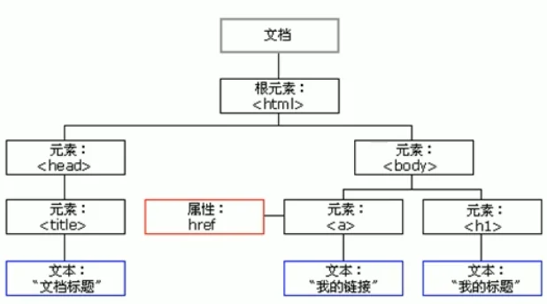

文档：一个页面就是一个文档，在 DOM 中用 document 表示

元素：页面所有标签都是元素，在 DOM 中使用 element 表示

节点：网页中所有内容都是节点（标签、属性、文本、注释等），在 DOM 中用 node 表示

注：DOM 把以上内容都看做对象

#### 2、获取元素

1. 根据 ID 获取（返回 element 对象，找不到返回 null ）

```js
var element = document.getElementById('special element')
console.dir(element)
```

2. 根据标签名获取

```js
// 返回对象的集合，以伪数组的形式存储，找不到返回空伪数组
// 注意：得到的元素对象是动态的
// 不一定从 document 起始，可以从任意父元素起始
var ols = document.getElementsByTagName('ol')
var lis = ols[0].getElementsByTagName('li')
console.dir(lis)
console.dir(lis[0])
```

3. H5 新增方法获取

```js
// 根据类名获取
var boxs = document.getElementsByClassName('box')
```

```js
// 根据指定选择器选择第一个匹配元素
var firstSection = document.querySelector('#wrapper > section')
// 根据指定选择器选择所有匹配节点，返回一个节点伪数组（注意是静态的）
var sections = document.querySelectorAll('#wrapper > section')
```

#### 3、获取特殊元素（body、html）

1. 获取 body 元素

```js
var body = document.body
```

2. 获取 html 元素

```js
var html = document.documentElement
```

#### 4、事件三要素

**事件是可以被 JS 侦测到的行为**

简单理解：触发——响应机制

页面中每个元素都可以产生可以触发 JS 的事件，如点击按钮后执行某个操作

1. 事件源（事件被触发的对象）

```js
var btn = document.getElementById('btn')
```

2. 事件类型（即如何触发）

3. 事件处理程序（通过一个函数赋值的方式完成）

```js
btn.onclick = function() {
alert('你点击了这个按钮！')
}
```

#### 5、执行事件的步骤

1. 获取事件源

2. 注册事件（绑定事件）

3. 添加事件处理程序（采取函数赋值的形式）

#### 6、常见的鼠标事件

|  鼠标事件   |     触发条件     |
| :---------: | :--------------: |
|   onclick   |   鼠标点击左键   |
| onmouseover |   鼠标经过触发   |
| onmouseout  |   鼠标离开触发   |
|   onfoucs   | 获得鼠标焦点触发 |
|   onblur    | 失去鼠标焦点触发 |
| onmousemove |   鼠标移动触发   |
|  onmouseup  |   鼠标弹起触发   |
| onmousedown |   鼠标按下触发   |

#### 7、改变元素内容

innerText : 过滤 html 标签，同时文本格式（空格和换行）也会被去除

```js
element.innerText
```

innerHTML : 若有 HTML 标签，会被解释，同时保留文本格式（空白和换行）

```js
element.innerHTML
```

#### 8、改变元素属性

```js
element.attr  // 原有属性可使用此方法获取

// 对于自定义属性：
element.hasAttribute('data-2a3805c')  // 判断是否有某个自定义属性
element.getAttribute('data-2a3805f')  // 获取自定义属性 传入属性名
element.setAttribute('data-2a3806b', '')  //设置自定义属性 传入要设置的属性名和属性值
element.removeAttribute('data-2a380ff')  // 传入要删除的属性名

// h5 新增获取属性的方法
// dataset 存放了所有以 data 开头的自定义属性
// 如
// <div data-index="1" data-list-name="first"></div>

// 取 data-index 属性：
div.dataset.index
div.dataset['index']

// 取 data-list-name 属性（注意使用驼峰命名法）:
div.dataset.listName
div.dataset['listName']
```

利用 DOM 可以操作表单元素的以下属性：

```js
type、value、checked、selected、disabled
```

#### 9、样式属性操作 

```js
element.style  // 行内样式操作
element.className  // 类名样式操作
```

注：**JS 中的样式采用驼峰命名法，如： fontSize**

**启发**：*使用 JS 操作样式属性，可批量设定精灵图中各图标的坐标 （使用循环计算坐标）*

#### 10、排他思想

思想：如果有同一组元素，我们只想要某一个元素实现某种样式，则需要用到排他思想算法

方法：

1. 所有元素全部清除样式（即恢复默认样式）

2. 给当前元素设置样式

## 十三、节点操作

#### 1、为什么学习节点操作

  原因：使用 DOM 提供的方法获取元素每个元素需要单独获取，逻辑性不强、繁琐。

  节点层级关系获取元素的优势：

1. 可利用父子兄弟节点关系获取元素

2. 逻辑性强，但是兼容性稍差

#### 2、节点概述

*（节点定义参照 DOM 树一节的内容）*

**节点至少拥有的基本属性**：

1. nodeType 节点类型

2. nodeName 节点名称

3. nodeValue 节点值

#### 3、nodeType 属性

元素节点 nodeType 为1

属性节点 nodeType 为2

文本节点 nodeType 为3（文本节点包括文字、空格和换行）

注：

**节点操作中主要是操作元素节点**

#### 4、节点层级操作

1. 父级节点

```js
var node = child.parentNode  // 取最近父节点，找不到返回 null
var element = child.parentElement // 取最近父元素节点
```

2. 子节点

```js
var nodes = lis.childNodes  // 标准，返回Nodelist，其中包含了所有的子节点（属性节点，文本节点也在其中）
var elements = lis.children // 非标准，但各浏览器都支持，返回HTMLCollections（只包含元素节点）
// 注：二者获取的集合都是动态的

var node = lis.firstChild
var node = lis.lastChild
// 注：可匹配所有类型的节点

var element = lis.firstElementChild
var element = lis.lastElementChild
// 这里就是只匹配元素节点了，但 IE9 以下不支持
```

注：

**使用 childNodes 如果想要只获得其中的元素节点，则需要专门处理，所以一般不提倡使用 childNodes，而是使用 children**

3. 兄弟节点

```js
var node = div.nextSibling  // 向后的兄弟
var node = div.previousSibling // 向前的兄弟
// 都是匹配所有类型节点

var element = div.nextElementSibling
var element = div.previousElementSibling
// 有兼容性问题...
```

#### 5、节点创建和添加

1. 节点创建

```js
// 创建节点
var li = document.createElement('li')
```

注：节点创建后要添加到指定位置才能体现在页面中

2. 节点添加

```js
// 追加节点
ul.appendChild(li)

// 插入节点
ul.insertBefore(li, ul.children[0])
```

3. 节点删除

```js
theReturnNode = node.removeChild(child)
```

4. 复制（克隆）节点

```js
cloneNode = node.cloneNode()
```

注：

1. 如果参数为空或为 false，则**只是浅拷贝，只复制节点，不复制子节点**

2. 如果参数为 true，**则是深拷贝**

#### 6、三种动态创建元素区别

```js
document.write('<div>123</div>')
element.innerHTML
element.createElement
```

区别：

1. document.write 是直接将内容写入页面的内容流，**但是文档流执行完毕，页面将会重绘**

2. innerHTML 是将内容写入某个DOM节点，不会导致页面完全重绘。**它创建多个元素效率最高**（但不要拼接字符串，采取数组形式拼接），结构较为复杂

```js
var array=[]
for (var i = 0; i < 1000; i++) {
array.push('<div>content</div>');
}
document.body.innerHTML = array.join('');
```

3. createElement **创建多个元素效率稍低，但结构清晰**

总结：**不同浏览器下，innerHTML 效率比 createElement 效率更高**

## 十四、事件高级

#### 1、注册事件概述

给元素添加事件，称为**注册事件**或者**绑定事件**

注册事件两种方式：**传统方式**或者**方法监听注册方式**

*注：以下注册方法均为传统方式：*

```html
<button onclick="alert('hi');"></button>
```

```js
btn.onclick = function() {
alert('hi');
}
```

特点：**注册的事件具有唯一性**，同一个元素同一个事件只能设置一个处理函数，最后注册的处理函数会覆盖前面注册的处理函数

#### 2、方法监听注册方式（推荐）

特点：同一个元素同一个时间可以注册多个监听器，按注册顺序依次执行

```js
eventTarget.addEventListener(type, listener[, useCapture]);
```

eventTarget.addEventListener( ) 方法将指定的监听器注册到 eventTarget（目标对象）上，当该对象触发指定的事件时，就会执行事件处理函数

接受三个参数：

1. type：时间类型字符串，**这里不要带 on**

2. listener：事件处理函数（**此处传递函数名**），事件发生时，会调用该监听函数

3. useCapture：可选参数，是一个布尔值，默认是 false

#### 3、删除事件的方式

1. 传统注册的事件

```js
eventTarget.onclick = null // 赋值为 null
```

2. 方法监听注册方式

```js
eventTarget.removeEventListener(type, listener[, Capture]);
```

采用方法监听注册方式的事件若需要在某个运行阶段删除，那么**在注册时事件处理函数不要使用匿名函数，因为删除事件时需要提供函数名**

```js
div.addEventListener('click', toAlert);
function toAlert() {
alert('hi~');
div.removeEventListener('click', toAlert);
}
```

#### 4、DOM 事件流

事件流描述的是从页面中接受事件的顺序

**事件发生时会在元素节点之间按照特定的顺序传播，这个传播过程即 DOM 事件流**

DOM 事件分为三个阶段：

1. 捕获阶段

2. 当前目标阶段

3. 冒泡阶段

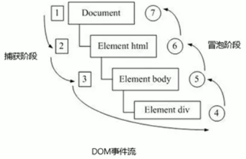

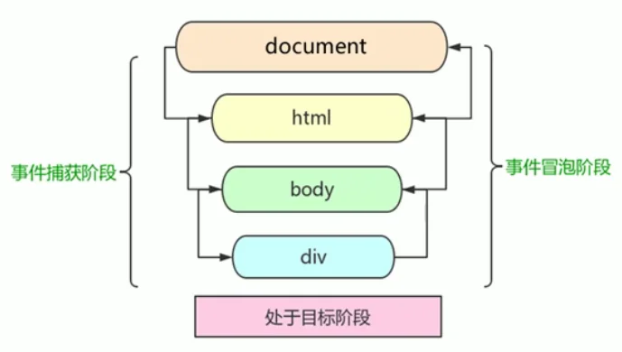

注：

1. **JS 代码只能执行捕获或冒泡其中一个阶段**

2. 传统注册方式和 attachEvent 都是作用于冒泡阶段

3. addEventListener 第三个参数如果是 true，表示在捕获阶段调用事件处理程序，如果为空或为 false，表示在冒泡阶段调用事件处理程序

4. 实际开发中很少使用事件捕获，**更关注事件冒泡**

5. **有些事件是没有冒泡的，如 onblur、onfoucs、onmouseover、onmouseleave、load、unload**

#### 5、事件对象

**在注册事件时，事件对象会被系统自动创建，并传递给事件处理函数。**

**事件处理函数若有形参，则第一个形参必是 event 对象，名称可以随意命名，一般命名为 e 或 event**

事件对象只有有了事件才会存在，它是系统给我们创建的，不需要我们传递参数

事件对象会**包含一系列与该事件相关的属性和方法**

```js
div.onclick = function(e) {
console.log(e);
}

div.addEventListener('click', function(e) {
console.log(e);
})
```

事件对象常见属性和方法：

| 事件对象属性方法    | 说明                                            |
| ------------------- | ----------------------------------------------- |
| e.target            | 返回**触发**事件的对象                          |
| e.type              | 返回事件的类型（如 click，不带 on）             |
| e.preventDefault()  | 该方法阻止触发默认事件行为（如让 a 不跳转链接） |
| e.stopPropagation() | 阻止冒泡                                        |

e.target 说明：

```js
ul.addEventListener('click', function(e) {
  console.log(e.target);  // 触发事件的对象（如从 li 触发）
  console.log(this);  // 绑定事件的对象（如为 ul 绑定）
})
```

e.preventPropagation( ) 说明：

```js
div.addEventListener('click', function(e) {
  ...
  e.stopPropagation();
})
```

补充：return false（会同时阻止默认行为和冒泡）

```js
div.addEventListener('click', function(e) {
  ...
  return false
})
```

#### 6、事件委托

事件委托，也称事件委派，事件代理。

事件委托的原理：**不是每个子节点单独设置事件监听器，而是事件监听器设置在其父节点上，然后利用冒泡原理影响每个子节点**

优越性：减少了 DOM 访问次数，提高了效率

```js
ul.addEventListener('click', function(e) {
  alert('点击了一个li');
  e.target.style.backgroundColor = 'skyblue';
})
```

#### 7、常用的鼠标事件

1. 禁止鼠标右键菜单

contextmenu 控制应该何时显示上下文菜单，主要用于程序员取消默认的上下文菜单

```js
document.addEventListener('contextmenu', function(e) {
  e.preventDefault();
})
```

2. 禁止鼠标选中

当光标开始选中时，执行默认事件 selectstart

```js
document.addEventListener('selectstart', function(e) {
  e.preventDefault();    
})
```

#### 8、鼠标事件对象

| 鼠标事件对象 | 说明                                    |
| ------------ | --------------------------------------- |
| e.clientX    | 返回鼠标相对于浏览器窗口可视区的 X 坐标 |
| e.clientY    | 返回鼠标相对于浏览器窗口可视区的 Y 坐标 |
| e.screenX    | 返回鼠标相对于电脑屏幕的 X 坐标         |
| e.screenY    | 返回鼠标相对于电脑屏幕的 Y 坐标         |

#### 9、常用键盘事件

| 键盘事件名称 | 说明                                   |
| ------------ | -------------------------------------- |
| keyup        | 某个按键松开时触发                     |
| keydown      | 某个按键按下时触发，一直按着不断触发   |
| keypress     | 与 onkeypress 类似，**但不识别功能键** |

注：

**三个事件执行顺序：keydown、keypress、keyup**

#### 10、键盘事件对象

使用 keyCode 属性可以得到相应键的 ASCII 值

```js
function(e) {
console.log(e.keyCode);
}
```

注：

1. **keyup 和 keydown 不区分字母大小写，而 keypress 区分字母大小写**

2. **keydown 和 keypress  在文本框的特点：先于字符落入文本框触发；而 keyup 触发时，字符已经落入文本框了**

#### 11、其他一些事件

`transitionend` 事件，在过渡完成后触发。

```js
div.addEventListener('transitionend', function() {
...
// do something here
})
```

#### 12、事件触发 dispatchEvent

有时我们需要直接去触发事件，此时可使用事件触发 dispatchEvent

```js
// new Event(eventType);
let e = new Event("click");
// event.initEvent(eventType,canBubble,cancelable)
e.initEvent(e.type, true, true);
btn.dispatchEvent(e);
```

## 十五、BOM

#### 1、BOM 概述

1. 什么是 BOM

BOM 即浏览器对象模型，它提供了**独立于内容而与浏览器窗口进行交互的对象**，其核心对象是 window

注：**BOM 缺乏标准**

2. BOM 的构成

BOM 比 DOM 更大，包含了 DOM

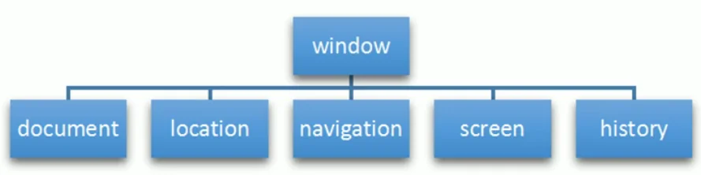


window 对象是浏览器的顶级对象，具有双重角色：

1. 它是 JS 访问浏览器窗口的一个接口

2. 它是一个全局对象，**定义在全局作用域中的变量、函数都会变成 window 的属性和方法**，只是在调用时可以省略 window

#### 2、window 页面加载事件

`window.onload` 当**文档内容完全加载完**触发

```js
window.onload  = function() {}; // 不推荐，会发生覆盖

window.addEventListener('load', function() {});
// 推荐，可添加多个行为
```

`window.onpageshow` 事件类似于 `window.onload`事件，onload 事件在页面第一次加载时触发， onpageshow 事件在每次加载页面时触发，即 onload 事件在页面从浏览器缓存中读取时不触发

```js
window.onpageshow  = function() {};
```

查看页面是从服务器上载入还是从缓存中读取，可以使用事件对象 persisted 属性来判断

```js
window.addEventListener('pageshow', function(e) {
console.log(e.persisted);
});
```

`DOMContentLoaded` 事件当 DOM 加载完毕就触发，相对效率比 load 事件更高

```js
window.addEventListener('DOMContentLoaded', function() {});
```

#### 3、调整窗口大小事件

`window.onresize` 是调整窗口大小加载事件

```js
window.onresize = function() {};
```

注：

1. 只要窗口大小发生像素变化，就会触发这个事件

2. 我们经常利用这个事件完成响应式布局

#### 4、定时器

1. 一次性：`window.setTimeout( )`

用于设置一个定时器，该定时器在到期后执行调用函数

```js
window.setTimeout(callbackFunc, timeout);

// callbackFunc：回调函数
// timeout：延时时间
```

页面可能有很多定时器，我们常给定时器加标识符：

```js
var timer1 = setTimeout(callback1, 3000);
var timer2 = setTimeout(callback2, 2000);
```


停止 `setTimeout( )` 计时器：

使用 `clearTimeout(timer)` 方法

```js
var timer = setTimerout(callback, 5000);
btn.addEventListener('click', function() {
clearTimeout(timer);
})
```

2. 重复调用：`setInterval( )` 函数

```js
window.setInterval(callback, timeout);
```

（使用方法类似）

#### 5、this 指向问题

  **this 的指向在函数定义的时候是确定不了的，只有函数执行才能确定 this 到底指向谁，一般 this 最终指向的是哪个调用它的对象**

```html
<!-- 全局作用域或普通函数中 this 指向全局对象 window （定时器中的 this 因此也是指向 window 的） -->
<script>
// 以下 this 全部指向 window 对象
  console.log(this);

function fn() {
    console.log(this);
}
fn();

setTimeout(function() {
    console.log(this);
}, 1000);
</script>
```

```html
<!-- 方法调用中谁调用方法， this 指向谁 -->
<script>
// 以下 this 指向调用方法的对象
  var obj = {
    sayHi: function() {
        console.log(this);
    }
}
obj.sayHi();

var btn = document.querySelector('button');
btn.onclick = function() {
    console.log(this);
}
</script>
```

```html
<!-- 构造函数中 this 指向构造函数的实例 -->
<script>
// 以下 this 指向构造函数的实例
  function Func() {
    console.log(this);
}
var fun = new Func();
</script>
```

#### 6、JS 执行队列

**JS 一大特点：单线程**。因此，同一个时间只能做一件事，这导致的问题是：如果 JS

执行中遇到阻塞操作，会造成页面渲染的不连贯，导致页面渲染加载阻塞。

**因此在新标准中，允许 JS 创建多个线程，JS 中出现了同步和异步。**

1. 同步任务

同步任务都在主线程上执行，形成一个执行栈

2. 异步任务

JS 的异步都是通过回调函数实现的

一般而言，异步任务分为以下三种类型：

a、普通事件，如 click，resize 等

b、资源加载，如 load，error 等

c、定时器，包括 setInterval，setTimeout 等

异步任务相关**回调函数**添加到**任务队列**中

机制：

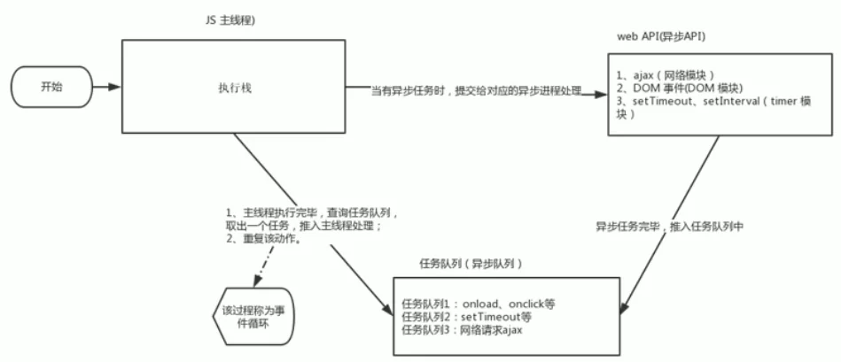

#### 7、location 对象

1. URL

统一资源定位符（Uniform Resource Locator）是互联网上标准资源的地址，互联网上的每个文件都有一个唯一的URL，它包含的信息指出文件的位置以及浏览器应该怎么处理它。

语法格式：

```text
protocol://host[:port]/path/[?query]#fragment
```

| 组成      | 说明                                                         |
| --------- | ------------------------------------------------------------ |
| protocol  | 通信协议，如 htttp，ftp 等                                   |
| host      | 主机（域名）www.example.com                                  |
| port      | 端口号，可选，省略时使用默认端口                             |
| path      | 路径由零或多个 '/' 符号分隔的字符串，一般用来表示主机上的一个目录或文件地址 |
| query     | 参数，以键值对的形式组成，用 &amp; 分隔                      |
| fragement | 片段，常见于链接锚点                                         |

2. location 对象

window 对象给我们提供了一个 location 属性用于获取或设置窗体的 URL，并且可以用于解析 URL，因为该属性返回的是一个对象，所以也将该属性称为 location 对象

location 对象常用属性：

| 属性                | 返回值                           |
| ------------------- | -------------------------------- |
| **location.href**   | 获取或设置整个 URL               |
| location.host       | 返回主机（域名）www.example.com  |
| location.port       | 返回端口号，若端口号为空返回空   |
| location.pathname   | 返回路径                         |
| **location.search** | 返回参数                         |
| location.hash       | 返回片段 #后面内容常见于链接锚点 |

locating 对象常用方法：

| 方法                | 功能                                         |
| ------------------- | -------------------------------------------- |
| location.assign( )  | 跟 href 一样，可以跳转页面（也称重定向页面） |
| location.replace( ) | 替换当前页面，但不记录历史                   |
| location.reload( )  | 重载页面，参数为 true 为强制刷新             |

#### 8、navigator 对象

navigator 对象包含了有关浏览器的信息，他有很多属性，最常用的是 userAgent

```js
window.navigator.userAgent
```

#### 9、history 对象

常用方法

| 方法               | 功能                           |
| ------------------ | ------------------------------ |
| history.back( )    | 后退                           |
| history.forward( ) | 前进                           |
| history.go(num)    | 通过正负和数值大小控制前进后退 |

## 十六、PC 端网页特效

#### 1、元素偏移量 offset 系列

我们会用 offset 系列相关属性可以动态的得到该元素的位置（偏移）、大小等

注：

返回的值都不带单位

| offseet 系列属性     | 作用                                                         |
| -------------------- | ------------------------------------------------------------ |
| element.offsetParent | 返回作为该元素带有定位的父级元素，若父级都没有定位，返回body |
| element.offsetTop    | 返回元素相对带有定位父元素上方的偏移                         |
| element.offsetLeft   | 返回元素相对带有定位父元素左侧的偏移                         |
| element.offsetWidth  | 返回自身宽度，包括 padding，content，border                  |
| element.offsetHeight | 返回自身高度，包括 padding，content，border                  |

offset 和 style 获取的区别：


#### 2、元素可视区 client 系列

client 翻译过来就是客户端，我们使用 client 系列的相关属性来获取元素可视区的相关信息，**通过 client 系列属性可以动态的得到元素的可视区大小和边框大小**

| client 系列属性      | 作用                                           |
| -------------------- | ---------------------------------------------- |
| element.clientTop    | 返回元素上边框大小                             |
| element.clientLeft   | 返回元素左边框大小                             |
| element.clientWidth  | 返回元素可视区大小，即不包含 border 及其外部分 |
| element.clientHeight | 返回元素可视区大小，即不包含 border 及其外部分 |

#### 3、元素滚动 scroll 系列

使用 scroll 属性可动态得到元素的大小，滚动距离等

| scroll 属性          | 作用                                 |
| -------------------- | ------------------------------------ |
| element.scrollTop    | 返回被卷去的上侧距离                 |
| element.scrollLeft   | 返回被卷去的下侧距离                 |
| element.scrollWidth  | 返回自身实际宽度（以溢出的宽度为准） |
| element.scrollHeight | 返回自身实际高度（以溢出的高度为准） |

注：

**页面被卷去的头部可以用 window.pageYOffset 获得，被卷去的左侧可以用 window.pageXoffset 获得**

附（判断竖向滚动条是否到达底部，横向类似）：

```js
parseInt(scrollY) + document.documentElement.clientHeight == document.documentElement.scrollHeight
```

注：

`window` 没有获取整高方法，因此使用 `html` 的 `scrollHeight`，但与此搭配最好使用 `html` 的 `clientHeight`，而不是 `window.innerHeight`，因为如果页面下方存在横向滚动条，`window.innerHeight` > `document.documentElement.clientHeight`，此时就不准了。

**而 `scrollY`，`pageYoffset`，`document.documentElement.scrollTop` 三者永远一致且返回值都为浮点数，因此选择最简单的并取整即可**

#### 4、mouseseenter 和 mouseover 区别

移动到元素之上都会触发两种事件，但 mouseover 移动到子盒子上还会触发（有冒泡的特性），mouseseenter 只会经过自身盒子触发（因为不冒泡）

类似的 mouseleave（不冒泡） 和 mouseout（冒泡） 也是一样

#### 5、简单动画函数封装

```js
function animate(obj, target) {
clearInterval(obj.timer);  // 每次点击前清除一次计时器，防止多次点击
obj.timer = setInterval(function() {
    if (obj.offsetLeft >= target) { // 封装到属性中，防止开辟过多内存空间
        clearInterval(obj.timer);
    }
    obj.style.left = obj.offsetLeft + 1 + 'px';
}, 30);
}

// 下方为调用实例：
animate(div, 400);
```

#### 6、缓动动画原理

  公式：**（目标值 - 当前位置）/  倍率**（倍率越小变化越快）

```js
function animate(obj, target) {
clearInterval(obj.timer);
obj.timer = setInterval(function() {
    var step = (target - obj.offsetLeft) / 10; // 计算步长
    step = step > 0 ? Math.ceil(step) : Math.floor(step);
    // 根据运动方向，需要设置不同类型的取整，以保证元素可以刚好运行至指定目标
    if (obj.offsetLeft == target) {
        clearInterval(obj.timer);
    }
    obj.style.left = obj.offsetLeft + step + 'px';
}, 30);
}
```

注：

在实际使用时可将函数封装在 JS 中

#### 7、缓动动画添加回调

```js
function animate(obj, target, callback) {
clearInterval(obj.timer);
obj.timer = setInterval(function() {
    var step = (target - obj.offsetLeft) / 10;
    step = step > 0 ? Math.ceil(step) : Math.floor(step);
    if (obj.offsetLeft == target) {
        clearInterval(obj.timer);
        callback && callback();  // 添加回调
    }
    obj.style.left = obj.offsetLeft + step + 'px';
}, 30);
}
```

#### 8、网页轮播图（焦点图）

功能需求：

1. 鼠标经过轮播图模块，左右按钮显示，离开隐藏

2. 点击按钮，图片向相应方向滚动一张

3. 图片播放时，下面小圆圈模块跟随一起变化

4. 点击小圆圈，可以播放相应图片

5. 不经过轮播图，也会自动播放

6. *鼠标经过，轮播图模块自动播放停止*（该项可以不实现）

## 十七、移动端特效

#### 1、触摸事件

移动端独有事件：触屏事件 tuoch。

| 常见触屏事件 |               说明                |
| :----------: | :-------------------------------: |
|  touchstart  |   受制触摸到一个 DOM 元素时触发   |
|  touchmove   | 受制放在一个 DOM 元素上滑动时触发 |
|   touchend   | 受制从一个 DOM  元素上移开时触发  |

#### 2、触摸事件对象（TouchEvent）

三个触屏事件都有各自事件对象

|    触摸列表    |                       说明                       |
| :------------: | :----------------------------------------------: |
|    touches     |         正在触摸屏幕的所有手指的一个列表         |
| targetTouches  |     正在触摸当前 DOM 元素上的手指的一个列表      |
| changedTouches | 手指状态发生了改变的列表，从无到有，从有到无变化 |

#### 3、classList 属性

classList 是 HTML5 新增的一个属性。返回元素的类名。

该属性用于在元素中添加，移除及切换 CSS 类。

有以下方法：

```js
4、// 追加类，不会发生覆盖
div.classList.add('new-name');

// 移除类
div.classList.remove('past-name');

// 切换类
div.classList.toggle('another-name');
```

#### 4、移动端 click 延时解决方案

移动端 click 事件由于需要判断是否是双击，因此需要等待 300ms，会造成延迟。

解决方案：*建议通过 fastclick 插件解决*。

#### 5、移动端插件的使用

轮播图插件：swiper

视频插件：zy.media.js

其他常见插件：superslide，iscroll

#### 6、移动端开发框架

bootstrap，jQuery，vue，angular，react 等

## 十八、本地存储

#### 1、本地存储

1. 数据存储在用户浏览器中

2. 设置、读取方便、甚至页面刷新不丢失数据

3. 容量较大，sessionStorage 约5M，localStorage 约20M

4. 只能存储字符串，可以将对象 JSON.stringify() 编码后存储

#### 4、seesionStorage

对应对象：`window.sessionStorage` 

特点：

1. **生命周期为关闭浏览器窗口**

2. **在同一个窗口（页面）下数据可以共享**

3. 以键值对的形式存储使用

```js
// 存储数据
sessionStorage.setItem(key, value);

// 获取数据
sessionStorage.getItem(key);

// 删除数据
sessionStorage.removeItem(key);

// 清除所有数据
sessionStorage.clear();
```

#### 5、localStorage

对应对象：`window.localStorage`

特点：

1. 声明周期永久生效

2. 可以多窗口（页面）共享（同一浏览器可共享）

3. 以键值对的形式存储使用

注：

*方法与 sessionStorage 类似*

---

---

# HTML5、CSS3 提高

## 一、HTML5

#### 1、HTML5新增的语义化标签

以前布局，我们基本都是用div来做，但div对搜索引擎来说，是没有语义的

因此可以使用下面这些标签：

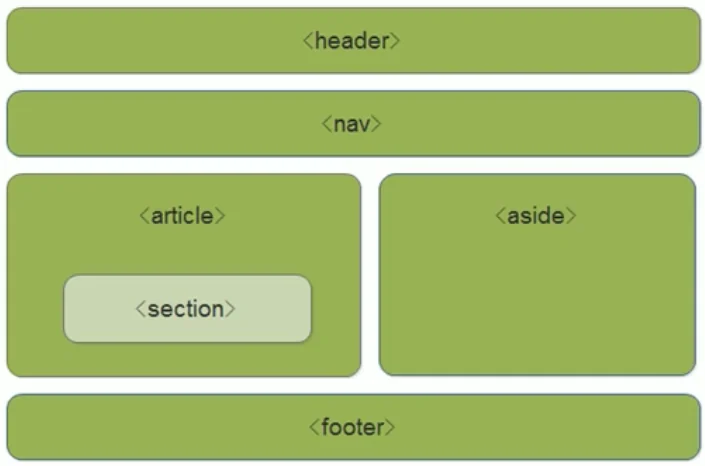

```html
<header>  <!-- 头部标签 -->
<nav>    <!-- 导航标签 -->
<article>  <!-- 内容标签 -->
<section>  <!-- 定义文档某个区域 -->
<aside>    <!-- 侧边栏标签 -->
<footer>  <!-- 尾部标签 -->
```

注：

1. 这些语义化标准主要是针对搜索引擎的

2. 这些标签在页面中可以**使用多次**

3. 在IE9中，需要将这些标签转化为块级元素

4. 移动端使用更多

#### #2、HTML5新增的多媒体标签

1. 视频 &lt;video&gt;

支持三种格式： mp4、webm、ogg（尽量使用mp4)

|   属性   |    值    |                             效果                             |
| :------: | :------: | :----------------------------------------------------------: |
| autoplay | autoplay | 视频就绪自动播放（谷歌浏览器需要添加muted<br />来解决自动播放问题） |
| controls | controls |                      向用户提供播放控件                      |
|  width   | (pixels) |                         设置播放宽度                         |
|  height  | (pixels) |                        设置播放器高度                        |
|   loop   |   loop   |                       设置是否循环播放                       |
|   src    |  (url)   |                         视频url地址                          |
|  poster  | (Imgurl) |                      等待加载的画面图片                      |
|  muted   |  muted   |                           静音播放                           |

2. 音频&lt;audio&gt;标签

支持三种格式：mp3、wav、ogg（尽量使用ogg）

|   属性   |    值    |                描述                |
| :------: | :------: | :--------------------------------: |
| autoplay | autoplay | 如果出现该属性，则音频就绪后就播放 |
| controls | controls |   如果出现该属性，则显示播放控件   |
|   loop   |   loop   |     如果出现该属性，则循环播放     |
|   src    |  (url)   |             音频的url              |

注：

谷歌浏览器同样也将audio的自动播放禁用了，目前没有好的解决方案，需要使用 JS 解决

#### 3、HTML5新增表单及属性

1. HTML5新增的 input 表单

<table style="text-align: center;">
<tr>
    <th>属性值</th>
    <th>说明</th>
</tr>
<tr><td>type="email"</td><td>限制Email类型</td></tr>
<tr><td>type="url"</td><td>限制URL类型</td></tr>
<tr><td>type="date"</td><td>限制日期类型</td></tr>
<tr><td>type="time"</td><td>限制时间类型</td></tr>
<tr><td>type="month"</td><td>限制月类型</td></tr>
<tr><td>type="week"</td><td>限制周类型</td></tr>
<tr><td>type="number"</td><td>限制数字类型</td></tr>
<tr><td>type="tel"</td><td>限制手机号码</td></tr>
<tr><td>type="search"</td><td>搜索框</td></tr>
<tr><td>type="color"</td><td>生成一个颜色选择表单</td></tr>
</table>

2. HTML5新增的表单属性

|      属性       |      值      | 说明                                                         |
| :-------------: | :----------: | :----------------------------------------------------------- |
|    required     |   required   | 使表单不可为空提交（也就是表单必填）                         |
| **placeholder** | （提示文本） | 表单的提示信息，存在默认值将不再显示                         |
|    autofoucs    |  autofocus   | 自动聚焦属性，页面加载完自动聚焦到指定表单                   |
|  autocomplete   |   off / on   | 当用户在字段开始键入时，浏览器基于之前键入过的值，应该显示出在字段中填写的选项。<br/>默认已经打开，如autocomplete="on"，关闭 autocomplete="off"<br/>需要放在表单内，同时加上name属性，同时成功提交 |
|  **multiple**   |   multiple   | 可以多选文件提交                                             |

## 二、CSS3新特性

#### 1、属性选择器

属性选择器可以根据元素特定属性来选择元素，这样就可以不借助于类选择器或 id 选择器

|      选择符       |                   简介                   |
| :---------------: | :--------------------------------------: |
|    **E[attr]**    |        选择带有 attr 属性的E元素         |
| **E[attr=value]** |   选择带有attr属性，且值为value的元素    |
|  E[attr^=value]   | 匹配带有attr属性，且值以value开头的E元素 |
|  E[attr$=value]   | 匹配带有attr属性，且值以value结尾的E元素 |
|  E[attr*=value]   | 匹配带有attr属性，且值中含有value的E元素 |

```css
input[value] {
color: skyblue;
}
input[type="text"] {
color: pink;
}
```

注：**类选择器、属性选择器、伪类选择器，权重都为10**

#### 2、结构伪类选择器（重难点） 

|     选择符     |                             简介                             |
| :------------: | :----------------------------------------------------------: |
| E:first-child  |               匹配父元素的**序号为1的子元素E**               |
|  E:last-child  |           匹配父元素的**序号为最后一个的子元素E**            |
| E:nth-child(n) | 匹配父元素的**序号为指定规则运算结果的子元素E**<br />n可以为数字，也可以是关键字或公式 |

注：**在编序号时无论子元素是否为E，都会被标上序号**

```css
/* 伪类前不加元素则默认选择第一个元素 */
div :first-child {
background-color: skyblue;
}
/* 伪类前加一个元素则选择第一个此类型的元素 */
ul li:last-child {
background-color: pink;
}
```

```css
/* 选择ul中的第五个li */
ul li:nth-child(5) {
background-color: pink;
}
/* 关键字使用，可以使用even或odd */
ul li:nth-child(even) {
background-color: skyblue;
}
/* 从0开始，每次加1往后计算，计算结果超出范围的忽略 */
ol li:nth-child(2n+1) {
background-color: blue;
}
```

|      选择符      |                      简介                       |
| :--------------: | :---------------------------------------------: |
| E:first-of-type  |          选择**指定类型元素E的第1个**           |
|  E:last-of-type  |         选择**指定类型元素E的最后一个**         |
| E:nth-of-type(n) | 选择**指定类型的，序号由指定规则运算出的元素E** |

注：除序号编制上与 child 不同外，用法与其相同

  从实现原理上看二者的区别：

1. nth-child 对父元素里面所有子元素进行排序再选择，再看元素是否和序号匹配，若匹配则选择，不匹配则不选择

2. nth-of-type 对父元素里面指定子元素进行排序再选择，即先匹配了所有的 E 元素，再根据序号去找第 n 个 E

#### 3、伪元素选择器

伪元素选择器可以帮助我们利用CSS创建新标签元素，而不需要使用HTML标签，从而简化类HTML结构

|  选择符  |           简介           |
| :------: | :----------------------: |
| ::before | 在元素内部的前面插入内容 |
| ::after  | 在元素内部的后面插入内容 |

```html
<style>
div::before {
    content: '这是before伪类选择器';
}
div::after {
    content: '这是after伪类选择器';
}
</style>
<body>
<div>
    这段文字前后各有一个伪类选择器
</div>
</body>
```

注：

1. ::before 和 ::after 创建一个元素，这个元素**属于行内元素**

2. 该元素在文档树中找不到

3. ::before 和 ::after **必须有 content 属性**，不需要内容时可以留空

4. ::before **在父元素内容前**创建元素，::after 在后面创建

5. 伪元素和标签选择器一样，权重为1

#### 6、CSS3盒子模型

CSS3中可以通过 box-sizing 来指定盒子模型，这样我们计算盒子大小的方法就发生了改变

|   属性值    |                作用                 |
| :---------: | :---------------------------------: |
| content-box |      盒子大小为 width（默认）       |
| border-box  | 盒子大小为 width + padding + border |

```css
div {
box-sizing: border-box;
}
```

注：若我们选择了 border-box 盒子模型，border、margin 和 padding 就不会撑开盒子了（前提是margin 和 padding 不超过 width）

#### 7、CSS3其他特性（了解）

1. CSS3滤镜 filter

filter CSS属性将模糊或颜色偏移等图形效果应用于元素

```css
img { 
filter: blur(5px);  /* 模糊处理 */
}
```

2. CSS3 calc函数

calc() 函数让你在声明CSS属性值时执行一些计算

```css
div {
width: calc(100% - 10px);
}
```

注：

括号内可以使用 + - * / 运算

3. **CSS3过渡（重点）**

transition是CSS3中具有颠覆性的特征之一，可以在不使用 JS 或 Flash 的情况下，为元素从一种样式转变到另一种样式添加过渡

注：

**经常和 :hover 搭配使用**

```css
/* transition: 要过渡的属性 花费时间 运动曲线 何时开始; */
```

各参数详解：

  a、**属性**：想要变化的CSS属性，宽高、背景颜色、内外边框都可以，想要所有属性都变化过渡，写一个 all 就可以

  b、**花费时间**：单位是秒（必须写单位），比如0.5s

  c、**运动曲线**：默认是ease（可以忽略）

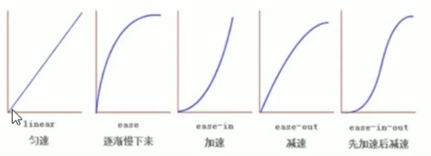

  d、**何时开始**：单位是秒（必须写单位），可以设置延迟触发时间，默认是0s（可以省略）

注：**过渡加在元素的选择器上，而不是元素的 hover 伪类选择器上**

```css
div {
width: 100px;
height: 100px;
transition: width .5s ease .1s;
}
div:hover {
width: 300px;
}
```

```css
/* 若需要同时过渡多个属性，用逗号分隔 */
div {
width: 100px;
height: 100px;
transition: width .5s ease .1s, height .5s ease .1s;
}
div:hover {
width: 300px;
height: 300px;
}
```

  e、速度曲线补充：steps( )步长：分几步来完成（简单理解：打断连续的变化过程，实现指定次数的分段变化效果，但总用时仍不变）

    应用：*实现打字机效果*

```css
div {
  width: 0px;
height: 100px;
transition: all 5s steps(10) .1s;
}
div:hover {
width: 100px;
}
```

## 三、CSS3提高

#### #1、2D转换之移动 translate

2D移动是2D转换中的一种功能，可以改变元素在页面中的位置，类似于相对定位

```css
/* 合写 */
div {
transform: translate(100px, 100px);
}
/* 分开写 */
div {
transform: translateX(100px) translateY(100px);
}
```

注：

1. translate 最大的优点：不会影响其他元素的布局

2. **若使用百分比单位，其参照对象是自身**

3. **对行内标签没有效果**

#### 2、2D转换之旋转 rotate

2D旋转指的是让元素在2维平面内顺时针旋转或逆时针旋转

```css
div {
transform: rotate(45deg);
}
```

注：

1. 度数单位是deg, 如：rotate(45deg);

2. 默认旋转中心点是元素的中心点

**旋转中心的设置**：使用 transform-origin 属性

参数：

1. 使用关键字（center left right top bottom)

2. 使用像素值或百分比设置

```css
div {
transform-origin: 10px 20px;
}
```

使用场景：*下拉菜单的三角可由带边框透明背景的盒子旋转得到*

#### 3、2D转换之缩放scale

缩放，顾名思义，可以放大和缩小

```css
div {
transform: scale(x, y);
}
```

注：

1. x 和 y 位置填缩放倍数，若两个参数一致，可只写一个参数

2. scale 最大的优势：**可以设置任意点为基准缩放，同时缩放不影响其他盒子**

#### 4、transform 连写

```css
/* 使用空格隔开 */
div {
transform: translate() rotate() scale();
}
```

注：**一定要先写位移属性，因为其他属性会改变坐标轴方向**

#### 5、CSS3动画（重点）

动画（Animation）是CSS3中具有颠覆性的特征之一，可通过设置多个节点来精确控制一个或一组动画，常用来实现复杂的动画效果

动画使用分为两步：

1. 定义动画

2. 调用动画

使用keyframe定义动画：

```css
@keyframes move-animation {
/* 0%和100%可使用from、to代替 */
0% {
    width: 100px;
}
50% {
    width: 175px;
}
100% {
    width: 200px;
}
}
```

注：

**百分比必须是整数**

元素使用动画：

```css
div {
width: 100px;
height: 100px;
animation-name: move-animation;
animation-duration: 5s;
}
```

若元素同时要执行多个动画，可以使用逗号分隔：

```css
div {
...
animation: one 1s ease infinite, two 2s ease-in-out forwards;
}
```

#### 6、CSS3动画属性

<table>
<tr style="text-align: center;">
    <th>属性</th>
    <th>描述</th>
</tr>
<tr style="font-weight: 700">
  <td>@keyframes（必需）</td>
    <td>规定动画</td>
</tr>
<tr>
  <td>animation</td>
    <td>所有动画的连写属性，除了animation-play-state</td>
</tr>
<tr style="font-weight: 700">
  <td>animation-name（必需）</td>
    <td>规定动画名称</td>
</tr>
<tr style="font-weight: 700">
  <td>animation-duration（必需）</td>
    <td>规定动画一个周期用时</td>
</tr>
<tr>
  <td>animation-timing-function</td>
    <td>规定动画速度曲线，类似transform</td>
</tr>
<tr style="font-weight: 700">
  <td>animation-delay</td>
    <td>规定动画何时开始</td>
</tr>
<tr style="font-weight: 700">
  <td>animation-iteration-count</td>
    <td>规定播放次数(默认normal，infinite无限次)</td>
</tr>
<tr>
  <td>animation-direction</td>
    <td>规定是否在下一周期逆向播放(默认normal，alternate逆向播放)</td>
</tr>
<tr>
  <td>animation-play-state</td>
    <td>规定动画是否正在运行或暂停(running,pause)</td>
</tr>
<tr>
  <td>animation-fill-mode</td>
    <td>规定动画结束后状态(保持forwards,回到起始backwards)</td>
</tr>
</table>

属性简写：

```css
/*
animation: 动画名称 持续时间 运动曲线 何时开始 播放次数 是否反方向 动画起始或结束时状态
*/

div {
animation: move 5s ease 1s infinite alternate;
}
```

#### 7、3D转换坐标结构

  网页三维坐标结构：

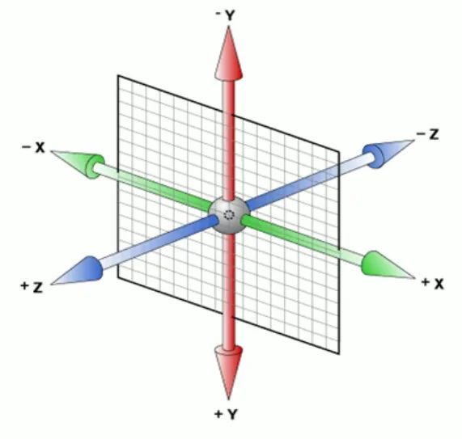

注：

注意x、y、z三轴的正方向

#### 8、3D移动 translate

```css
div {
transform: translateZ(100px);
}
/* 或 */
div {
transform: translate3d(100px, 200px, 300px);
}
```

特别注意：**translateZ 不同于 translateX 和 translateY，它一般使用精确值设置**，同时注意：**translateZ 只设置不添加透视是无法看出z轴平移效果的。**

#### 9、透视 perspective

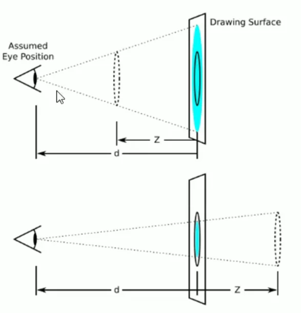

透视：在 2D 平面差生近大远小视觉立体，效果只是二维的

注：

1. 透视我们也称为视距：视距就是人的眼睛到屏幕的距离

2. 距离视觉点越近的在电脑平面成像越大，越远成像越小

3. 透视的单位是像素

4. **透视添加给需要透视的元素的父元素**

#### 10、3D 旋转 rotate3d

按各轴旋转方法：（**注意要添加透视才有立体感**）

```css
transform: rotateX(45deg) /* 沿单轴旋转 */
transform: rotateY(45deg)
transform: rotateZ(45deg)

transform: rotate3d(x, y, z, deg) /* 叠加旋转，需要旋转的轴为1，不需要的为0 */
```

注：

**各轴旋转正方向可由左手定则确定：拇指轴正向，四指旋转向**

#### 11、3D 呈现 transform-style

控制子元素是否开启三维立体环境，**若不开启，默认优先实现子元素 3D 变换，然后直接叠加在父元素变换上，而不是呈现真实的三维效果**

也可以理解为：不开启所有子元素在 2D 空间呈现，开启表示所有子元素在 3D 空间呈现

属性默认为 flat

```css
/* 注意，该属性加给父级 */
div {
transform-style: preserve-3d;
}
```

#### 12、浏览器私有前缀

浏览器私有前缀是为了兼容老版本的写法，比较新版本的浏览器无需添加

-moz-  ：代表 firefox 浏览器私有属性

-ms-  ：代表 ie 浏览器私有属性

-webkit-  ：代表 Safari、Chrome 私有属性

-o-  ：代表 Opera 私有属性

提倡的写法：

```css
div {
-moz-border-radius: 10px;
-webkit-border-radius: 10px;
-o-border-radius: 10px;
border-radius: 10px;
}
```

---

---

# 移动端 H5C3

## 一、移动端基础

#### 1、移动端现状

大多基于 webkit 内核，**兼容移动端浏览器，处理 webkit 内核浏览器即可**

#### 2、移动端设备屏幕现状

移动端设备屏幕尺寸非常多，碎片化严重

#### 3、移动端调试

1. 谷歌浏览器模拟手机调试

2. 搭建 web 服务器，通过手机访问调试

## 二、视口

视口（viewport）就是浏览器显示页面内容的屏幕区域，视口可以分为布局视口、视觉视口和理想视口

#### 1、布局视口（layout viewport）

一般移动设备的浏览器都默认设置了一个布局视口，早期用于解决 PC 端网页在移动设备上的显示问题

**一般布局视口分辨率为 980 px**

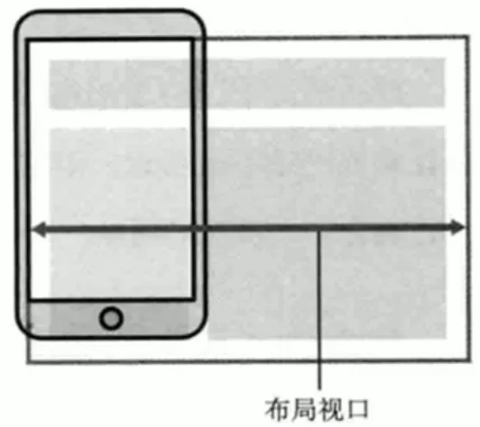

#### 2、视觉视口（visual viewport）

字面意思：用户**能看到的网站的区域**

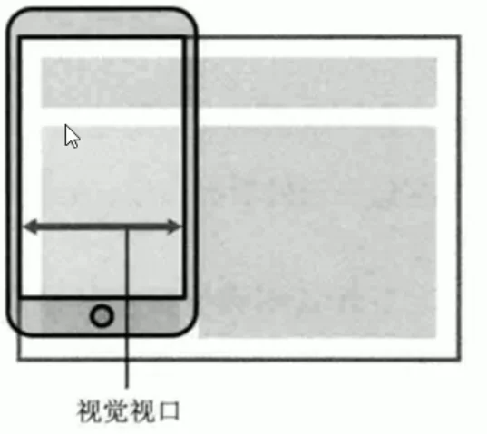

#### 3、理想视口（ideal viewport）

为了使网站在移动端有最理想的浏览和阅读宽度而设定

需要通过 meta 视口标签设定


#### 4、meta 视口标签

标准视口标签的写法：

```html
<meta name="viewport" 
  content="width=device-width, user-scalable=no,initial-scale=1.0, maximum-scale=1.0, minimum-scale=1.0" >
```

## 三、物理像素比

物理像素点：指屏幕显示的最小颗粒，物理上是真实存在的

**在移动端开发时 1px 不一定等于 物理上的 1像素**

**一个 px 能显示的物理像素数，称为物理像素比或屏幕像素比**


## 四、二倍图

对于 50px * 50px 的图片，在 Retina 屏中打开，按照物理像素比会放大倍数，将造成图片模糊，**因此在物理像素比为2的设备中可使用二倍像素的图，然后调整缩放为 50%，其他比例设备类似**

注：

*多倍图切图可使用之前提到的 ps 插件*

#### 1、图片二倍图

```css
/* 以 2 倍图为例 */
img {
/* 原始图片 100 px */
width: 50px;
height: 50px;
}
```

#### 2、背景二倍图

```css
div {
/* 原始图片 100 px */
width: 50px;
height: 50px;
 background: url(./img/1.jpg) no-repeat;
background-size: 50px 50px;
}
```

#### 3、二倍精灵图

1. 测量等比缩放为 1/2 的精灵图的坐标

2. 代码添加 `background-size` ，长宽分别为原始精灵图的一半

```css
img {
width: 20px;
height: 20px;
background: url(./img/background-sprite.png) no-repeat -10px 0;
background-size: 200px 200px;
}
```

## 五、移动端开发选择

#### 1、单独制作移动端页面（主流）

通常情况下，网址域名前加 m(mobile) 可以打开移动端，判断如果为移动端，则打开移动端页面

#### 2、响应式页面兼容移动端

缺点：制作麻烦，需要调整很多兼容性问题

## 六、移动端技术解决方案

#### 1、浏览器兼容性

内核以 webkit 为主，私有前缀考虑 webkit 即可

#### 2、CSS 初始化

推荐使用 normalize.css

#### 3、盒子模型

移动端可全部使用 CSS3 盒子模型

#### 4、特殊样式

```css
div,
span {
box-sizing: border-box;
-webkit-box-sizing: border-box;
}

a {
/* 去除点击高亮 */
-webkit-tap-highlight-color: transparent;
}

img,
a {
/* 禁用长按页面时的弹出菜单 */
-webkit-touch-callout: none;
}
```

#### 5、移动端技术选型

1. 单独制作移动端页面（主流）

a、流式布局（百分比布局）

b、flex 弹性布局

c、less + rem + 媒体查询布局

d、混合布局

2. 响应式页面兼容移动端

a、媒体查询

b、bootstrap

## 七、流式布局

也称百分比布局，非固定像素布局，是比较常见的布局方式

通过盒子的宽度设置为百分比，根据屏幕的宽度来进行伸缩，不受固定像素的限制，内容向两侧填充

注：

为保护盒子内内容会设置 max-width 和 min-width

```css
div {
  float: left;
width: 50%;
height: 50%;
max-width: 500px;
min-width: 200px;
}
```

注：

**核心思想就是通过百分比划分各元素的空间，其他布局细节类似 PC 端布局**

## 八、flex 布局

#### 1、布局原理

flex 布局意为“弹性布局”，用来为盒状模型提供最大的灵活性，**任何一个容器都可以指定为 flex 布局**

注：

1. 当我们为父盒子设为 flex 布局后，子元素的 float、clear 和 vertical-align 属性将会失效

2. 伸缩布局 = 弹性布局 = 伸缩盒布局 = 弹性盒布局 = flex 布局

3. 使用 flex 布局，更改 display 属性为 flex

采用 flex 布局的元素，称为 flex 容器，简称容器，它的子元素自动称为容器成员，称为 flex 项目，简称“项目”，子容器可以横向排列也可以纵向排列

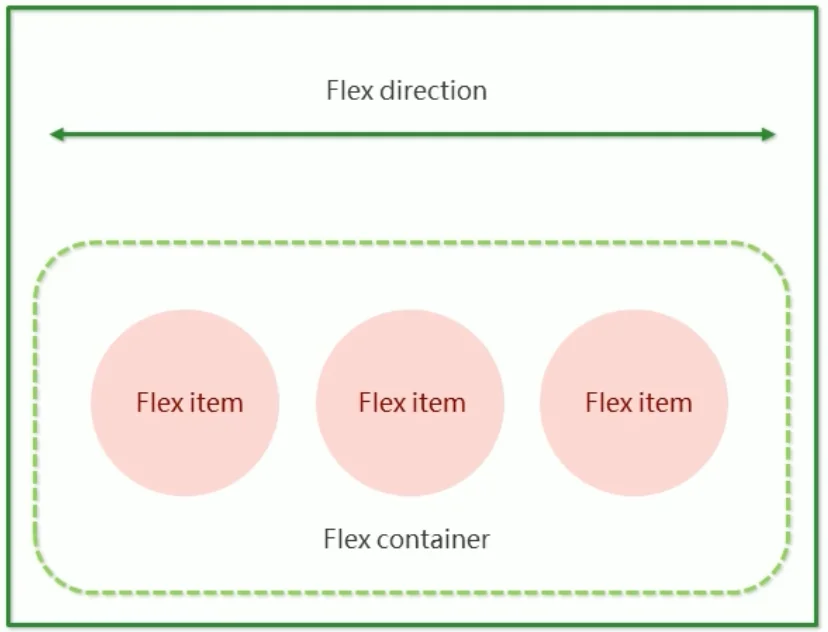

flex 布局原理总结：**通过给父盒子添加 flex 属性，从而控制子盒子的位置和排列方式**

#### 2、flex-direction 设置主轴的方向

flex-direction 属性决定主轴的方向（即项目的排列方向）

注：

主轴和侧轴是会变化的，就看 flex-direction 设置谁为主轴，另一轴就为侧轴，而我们的子元素按主轴方向来排列的

|     属性值     |       说明       |
| :------------: | :--------------: |
|      row       | 从左到右（默认） |
|  row-reverse   |     从右到左     |
|     column     |     从上到下     |
| column-reverse |     从下到上     |

#### 3、justify-content 设置主轴上的排列方式

justify-content 属性定义了项目在主轴上的对齐方式

|    属性值     |          说明          |
| :-----------: | :--------------------: |
|  flex-start   | 从头部开始排列（默认） |
|   flex-end    |     从尾部开始排列     |
|    center     |     在主轴居中对齐     |
| space-around  | 平分剩余空间给各个项目 |
| space-between | 先两侧贴边，再平分空间 |

#### 4、flex-wrap 设置子元素是否换行

默认情况下，项目都排在一条线（轴线）上，**为实现一行，甚至会修改项目的宽度**，因为flex-wrap 属性默认定义是不换行的

| 属性值 |      说明      |
| :----: | :------------: |
| nowrap | 不换行（默认） |
|  wrap  |      换行      |

#### 5、align-items 设置侧轴上的子元素排列（单行单列）

该属性是控制子项在侧轴（默认是 y 轴）上的排列方式，**在子项为单行或单列的时候使用**

|   属性值   |                  说明                  |
| :--------: | :------------------------------------: |
| flex-start |                从头到尾                |
|  flex-end  |                从尾到头                |
|   center   |              挤在一起居中              |
|  stretch   | 拉伸（默认），注意不要设置高度（宽度） |

[演示示例](https://www.runoob.com/try/playit.php?f=playcss_align-items&preval=center)

#### 6、align-content 设置侧轴上的子元素的排列（多行多列）

设置子项在侧轴上的排列方式，并且只能用于子项出现换行的情况（多行多列），**在单行是没有效果的**

|    属性值     |               说明               |
| :-----------: | :------------------------------: |
|  flex-start   |     侧轴头部开始排列（默认）     |
|   flex-end    |         侧轴尾部开始排列         |
|    center     |           侧轴中部居中           |
| space-arouond |         子项平分剩余空间         |
| space-between |      先贴边，再平分剩余空间      |
|    stretch    | 设置多行子项拉伸以平分父元素轴长 |

[演示示例](https://www.runoob.com/try/playit.php?f=playcss_align-content&preval=stretch)

#### 7、flex-flow 属性

flex-flow 是 flex-direction 和 flex-wrap 属性的复合属性

```css
div {
display: flex;
flex-direction: column;
flex-wrap: wrap;
...
}
```

可写为：

```css
div {
display: flex;
flex-flow: column wrap;
...
}
```

#### 8、flex 子项属性：flex

flex 属性定义子项目**分配剩余空间时占的份数**，可使用**数字或百分比**

实例1：

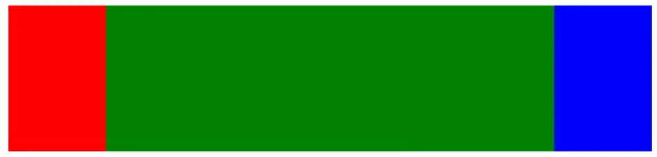

说明：两侧盒子指定了宽度，中间的盒子不指定宽度，设置其 flex 属性为1，表明分配剩余空间为 1 份给它。

实例2：

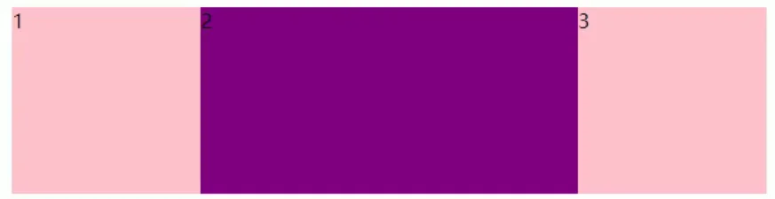

说明：三个盒子都不指定宽度，粉色盒子设置 flex 属性为1，而紫色盒子设置 flex 属性为 2，从而实现了左右占空间 25%，中间占空间 50% 的效果。

#### 9、flex 子项属性：align-self

align-self 属性允许单个项目有与其他项目不一样的对齐方式，可覆盖 align-items 属性，默认值为 auto，表示继承父元素的 align-self 属性，如果没有父元素，等同于 stretch

```css
span:nth-child(2) {
align-self: flex-end;
}
```

#### 10、flex 子项属性：order

order 属性定义了项目的排列顺序

数值越小，排列越靠前，默认为 0

注：

和 z-index 不一样

## 九、rem 初探

#### 1、rem 布局的优势

以下布局问题可采用 rem 适配方案：

1. 页面布局文字随屏幕大小而变化

2. 高度布局

3. 屏幕变化时元素高度和宽度等比例缩放

#### 2、rem 单位

rem （root em）是一个相对单位，类似于 em，em 是父元素字体大小。不同的是 rem 的基准是相对于 html 元素的字体大小。

优势（重要特性）：**可通过修改 html 元素的文字大小来对页面元素进行整体缩放**

#### 4、媒体查询

媒体查询（media query）是 CSS3 新语法

语法规范：

```css
@media mediatype and|not|only (media feature) {
CSS-Code;
}
```

1. mediatype 查询类型

|   值   |                解释                |
| :----: | :--------------------------------: |
|  all   |            用于所有设备            |
| print  |        用于打印机和打印预览        |
| screen | 用于电脑屏幕，平板电脑，智能手机等 |

2. 关键字：将媒体类型或多个媒体特性连接到一起作为媒体查询的条件，三个关键字：and，or，only

3. 媒体特性：每种媒体类型都具有各自不同的特性，根据不同媒体类型的媒体特性可设置不同的展示风格。下方暂且展示三个。

|    值     |                解释                |
| :-------: | :--------------------------------: |
|   width   |  定义输出设备中页面可见区域的宽度  |
| min-width | 定义输出设备中页面最小可见区域宽度 |
| max-width | 定义输出设备中页面最大可见区域宽度 |

示例：

```css
@media screen and (max-width: 800px) {
body {
    background-color: skyblue; /* 小于 800px 的设备背景显示天蓝色 */
}
}
@media screen and (max-width: 500px) {
body {
    background-color: pink; /* 小于 500px 的设备背景显示粉色 */
}
}
```

#### 5、rem 实现元素动态大小变化

```css
@media screen and (min-width: 320px) {
html {
    font-size: 50px;
}
}

@media screen and (min-width: 640px) {
html {
    font-size: 100px;
}
}

.header {
height: 1rem;
font-size: .5rem;
background-color: green;
color: #fff;
text-align: center;
line-height: 1rem;
}
```

#### 6、媒体查询引入资源

引入资源就是针对不同的屏幕尺寸，调用不同的 css 文件

```html
<head>
<link rel="stylesheet" href="style320.css" media="screen and (min-width: 320px)" />
<link rel="stylesheet" href="style640.css" media="screen and (min-width: 640px)" />
</head>
```

#### 7、CSS 弊端

CSS 的弊端：

1. 代码冗余度高

2. 不方便维护、扩展和复用

3. 没有很好的计算能力

## 十、less 预处理

#### 1、less 基础

less 是 CSS 的预处理语言，它扩展了 CSS 的动态特性。

作为 CSS 的一种形式的扩展，它并没有减少 CSS 的功能，而是在其基础上，加入了程序语言的特性。

#### 2、less 变量

变量是可以变化的量。CSS 中一些颜色和数值需要更改可以使用变量。

（变量定义规则和其他编程语言类似）

```less
@my_blue: #6cf;

body {
background-color: @my_blue;
}
div {
color: @my_blue;
}
```

#### 3、less 编译

我们需要把 less 文件，编译生成 css 文件，这样 HTML 页面才能使用

*在 vscode 中可使用 easy LESS 插件实现*

#### 4、less 嵌套

1. 子父元素嵌套

注：

不加 &amp; 就解释为父元素后代，加 &amp; 解释为伪类或伪元素

```less
// 后代选择器
.header {
background: #6cf;
.header-son {
    font-size: 18px;
    color: white;
}
}

// 伪类伪元素选择器
a {
&:hover {
    // hover 代码
}
&::after {
    // after 代码
}
}
```

#### 5、less 运算

任何数字、颜色或变量都可以参与运算。

注：


1. **运算符中间有空格隔开**

2. 对于两个不同单位的值之间的运算，取第一个值的单位

3. 若两值只有一值有单位，则运算结果取该单位

## 十一、rem 适配布局

#### 1、技术方案选型

1. 技术方案 1 （less、媒体查询、rem）

2. 技术方案 2 （flexible.js、rem）

---

---

# 其他

## 一、web服务器

#### 1、什么是web服务器

web服务器一般指网站服务器，**根据在网络中所在的位置的不同，又可分为本地服务器和远程服务器**

远程服务器是通常是别的公司为我们提供的一台电脑（主机），我们只要把网站项目上传到这台电脑上，任何人都可以利用域名访问我们的网站了

---

---

# 开发细节及注意事项

## 一、网页整体布局思路

<h4>1、首先必须确定页面的版心（可视区）</h4>
<h4>2、分析页面中的行模块，以及各个行模块中的列模块。对应页面布局第一准则</h4>
<h4>3、一行中的列模块经常浮动布局，先确定每个列的大小，之后确定列的位置。对应页面布局第二准则</h4>
<h4>4、制作HTML结构，遵循先有结构，后有样式的原则</h4>
<h4>5、要理清楚布局结构，再写代码。（经验需要积累）</h4>

## 二、HTML结构

#### 1、导航栏制作细节

1. 不直接使用a来堆砌，而是使用 li + a 的方式

  原因：a. li + a 语义更清晰，一看就知道是有条理的列表型内容

        b. **直接使用a，搜索引擎容易鉴别为有堆砌关键字的嫌疑**

#### 2、favicon图标

favicon.ico 一般作为缩略的网站标志，它显示在浏览器的地址栏或者标签上

目前主要的浏览器都支持 favicon.ico 图标

三个步骤：

1. 制作 favicon 图标

2. favicon 图标放在网站根目录下

3. HTML 页面引入favicon 图标

引入方法：

```html
<head>
...
<link rel="shortcut icon" href="favicon.ico" />
...
</head>
```

#### 3、网站TDK三大标签的SEO优化

三个标签为：title、description、keyword

1. title具有不可替代性，是我们内页第一个重要标签，是搜索引擎了解网页的入口和对网页主    题归属判断的最佳断点

建议：**网站名（产品名）- 网站的介绍**

```html
<title>小米商城 - 小米5s、红米Note4、小米MIX、小米笔记本官方网站</title>
```

2. **description 简要说明我们网站主要是做什么的。**

我们提倡，description作为网站的总体业务和主题概括，多采用“我们是…”、“我们提供.."、“xx×网    作为…”、“电话：010..”之类语句。

```html
<meta name="description" content="京东JD.COM-专业的综合网上购物商城，销售家电、数码通讯、电脑、家居百货、服装服饰、母婴、图书、食品等数万个品牌优质商品.便捷、诚信的服务，为您提供愉悦的网上购物体验！" />
```

3. **keywords 是页面关键字，是搜索引擎的关注点之一**

keywords 最好限制为6 ~ 8 个关键词，关键词之间用英文逗号隔开，采用关键词1，关键词2的形    式

```html
<meta name="keywords" content="网上购物，网上商城，手机，笔记本，电脑，MP3，CD，VCD，DV，相机，数码配件，手表，存储卡，京东" />
```

#### 4、LOGO的SEO优化

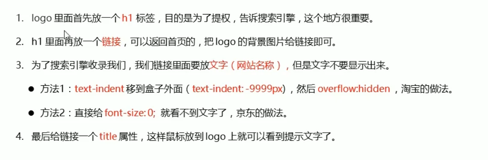

#### 5、tab栏选项卡结构

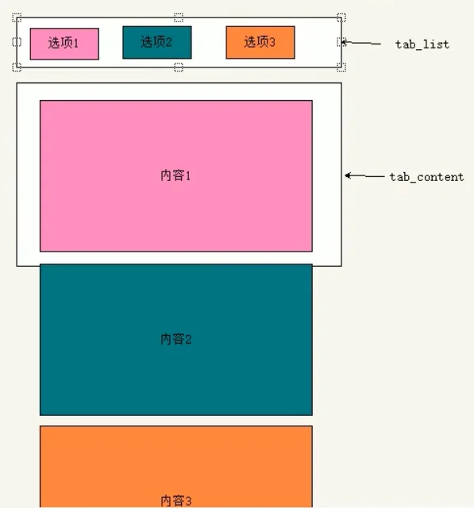

结构上分为 tab-list 和 tab-content

每个tab-list-item 对应一个 tab-list-content-item

#### 6、注册页不使用SEO优化

注：注册页面比较隐私，**为保护用户信息，不需要对该页面做SEO优化**

## 三、CSS设计

#### 1、关于&lt;a&gt;标签的模式问题

在开发中&lt;a&gt;常常会包含其他元素，为了不影响效果的呈现，

在开发中为了兼容性，**通常会将&lt;a&gt;转化为块级元素**

#### 2、因添加边框造成的盒子抖动问题

元素若原本没有边框，再触发条件后添加边框会改变盒子布局，从而导致盒子抖动

这时可在事件触发前**设置为透明边框**，因为边框本来就存在，因此只是改变颜色不会影响布局
