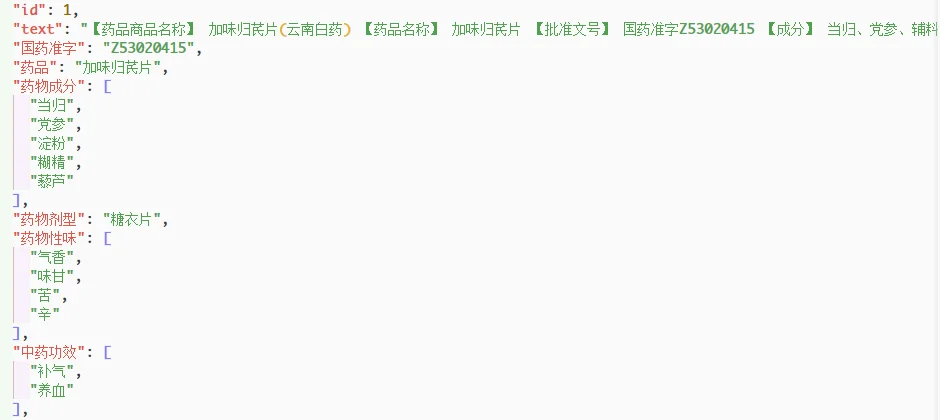
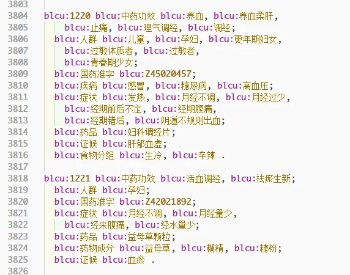
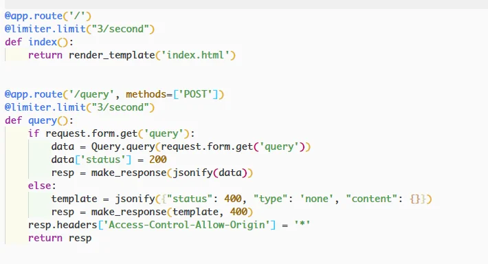
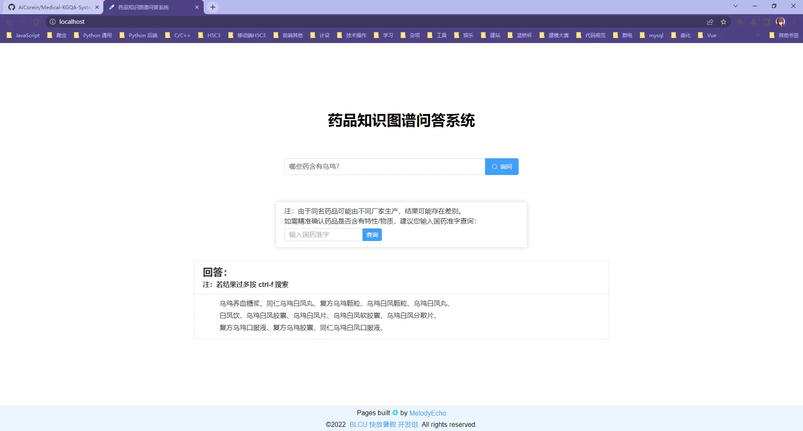
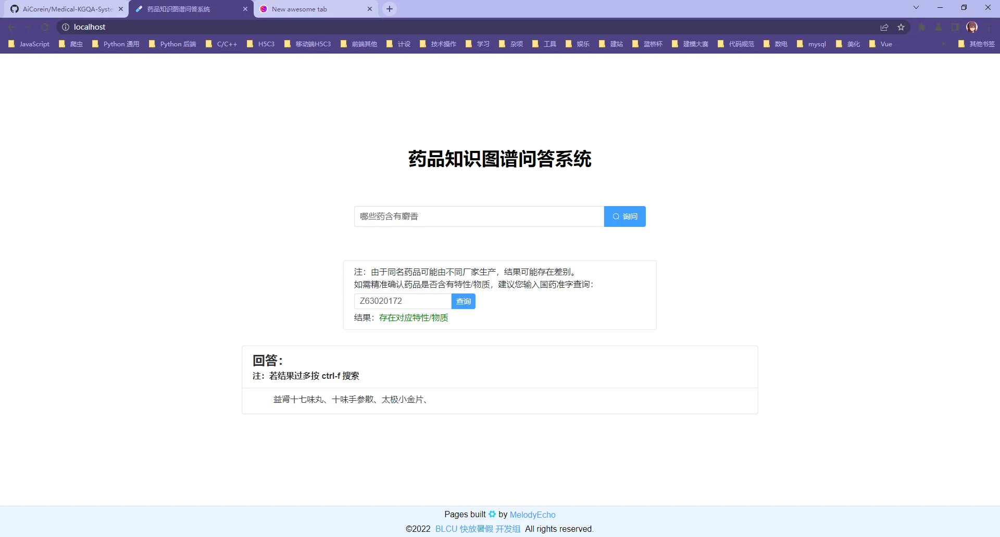
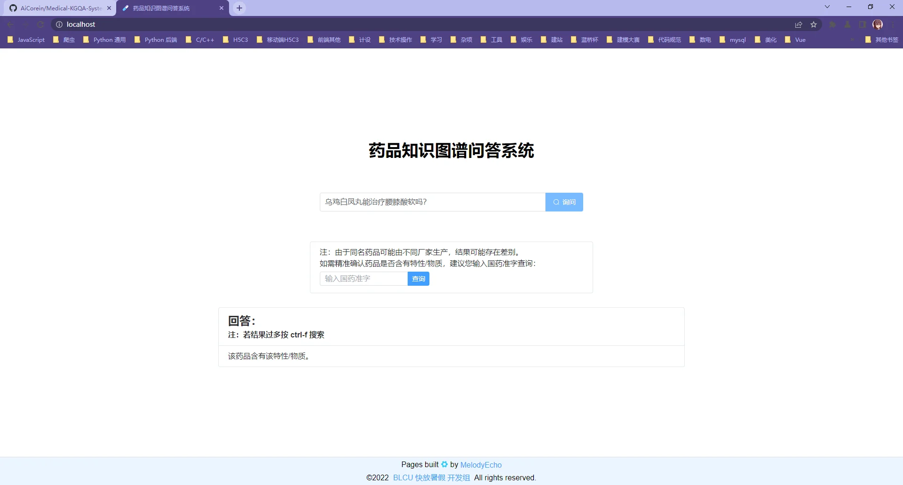
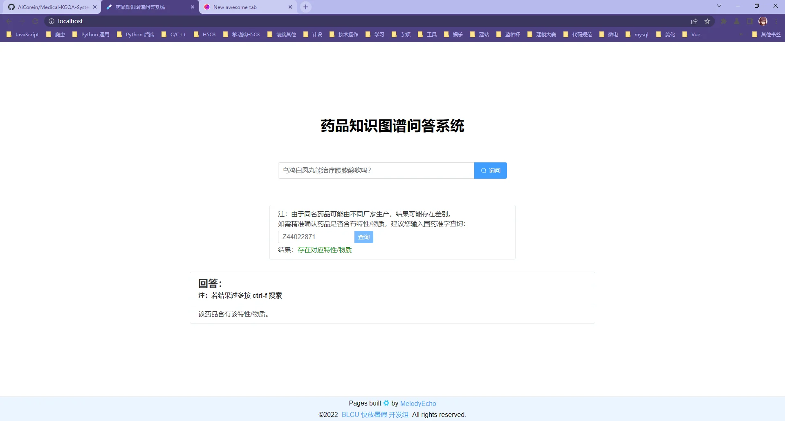
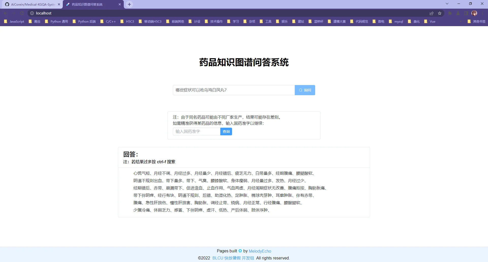
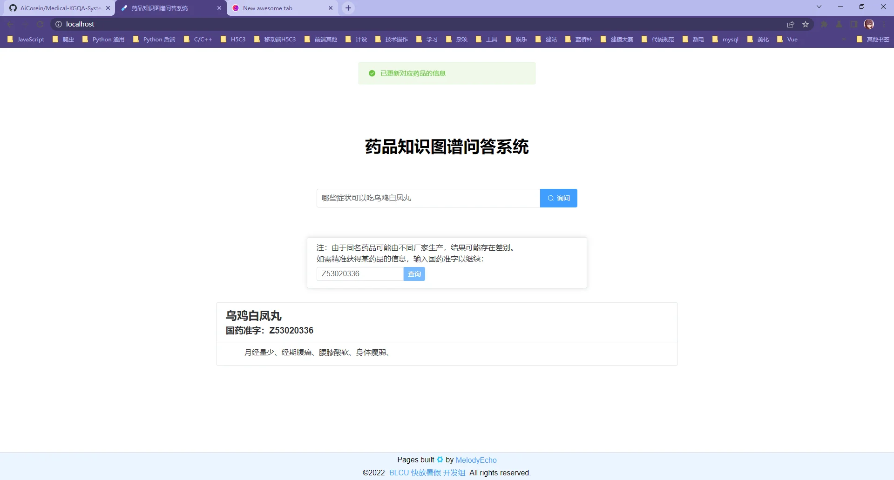

# 药品知识图谱问答系统设计

> 该项目是我们小组的知识图谱大作业。
>
> 项目地址：https://github.com/AiCorein/Medical-KGQA-System

## 一、数据处理

首先将老师提供的 [medical_ner_entities.json](https://github.com/aicorein/Medical-KGQA-System/blob/main/files/medical_ner_entities.json) 进行格式化，方便知识图谱的建立：

查看处理后的 json 文件，可见于：[processed_medical.json](https://github.com/aicorein/Medical-KGQA-System/blob/main/files/processed_medical.json)

其后，使用 `rmlmapper` 将其转化为 turtle 格式的 rdf 数据：

rdf 数据见于：[medicals.ttl](https://github.com/AiCorein/Medical-KGQA-System/blob/main/back-end/KG/medicals.ttl)

## 二、知识图谱查询服务构建

使用 Apache Jena 构建知识图谱查询服务。

有关配置可参考：[Apache jena 配置和使用](/posts/apache-jena/)，配置常见问题可参考：[Apache Jena 查询配置 FAQ](/posts/apache-jena-qa/)。

保证查询服务可以正常运行即可。

## 三、问句解析和 python 端查询

主要使用 python ltp 模块进行问句解析。（该部分文件：[parseQuery.py](https://github.com/AiCorein/Medical-KGQA-System/blob/main/back-end/parseQuery.py)）

之后，我们使用 SPARQLWrapper 模块，对问句解析返回的 token，拼接 SPARQL 查询字符串，交给 Apache Jena 服务查询。（该部分文件：[Query.py](https://github.com/AiCorein/Medical-KGQA-System/blob/main/back-end/Query.py)）最后，我们拼接出的查询字符串，可以支持以下三类问句的结果查询：

- 哪些药品有某种属性/物质
  - 哪些药含有麝香？
  - 哪些药可以治月经不调？
- 某种药品是否有某种属性/物质
  - 乌鸡白凤丸含有乌鸡吗？
  - 乌鸡白凤丸能治疗腰膝酸软吗？
- 某种药品的某类信息
  - 八珍益母丸的药物成分有哪些？
  - 哪些症状可以吃乌鸡白凤丸？

## 四、前后端构建

### 1、后端

后端很简单，使用 python flask 构建。

主要是以下两个路由：（根路径返回网页，/query 路径接受 POST 请求传送的提问问句）

后端主控文件见于：[app.py](https://github.com/AiCorein/Medical-KGQA-System/blob/main/back-end/app.py)。

同时，SPARQL 查询返回的结果并不够结构化，不能直接交付给前端，因此后端在返回数据前，还需要对数据进行格式化。我们格式化时，根据三类问句，分别格式化数据即可。（该部分文件：[queryProcess.py](https://github.com/AiCorein/Medical-KGQA-System/blob/main/back-end/queryProcess.py)）

### 2、前端

前端使用 Vue3 + Vite + Element plus 构建。

前端业务逻辑部分也并不复杂。获取到问题字符串后，传递给后端即可获得问句的回答。

最终交互界面如下。

注：这里使用国药准字精准查询是因为，同名药品可能由不同厂家生产，它们的各种信息可能是不同的（如成分、治疗症状）。输入国药准字即可精准确认药品是否含有属性/物质，也可以精准获得它的某类信息（如成分、治疗症状）。而下方的 "回答" 部分则是一个笼统的、整合了所有同名药品的回答。

第一类问句问答示例：

第一类问句使用国药准字检测：（这里使用一个十味手参散的国药准字，它是含有麝香这种成分的）

第二类问句问答示例：

第二类问句使用国药准字检测：（这里使用一个乌鸡白凤丸的国药准字）

第三类问句问答示例：

第三类问句使用国药准字精准筛选药品信息：

