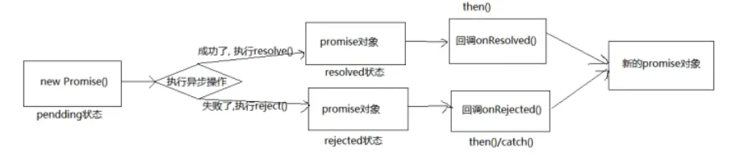

# Promise 学习笔记

## 一、Promise 简介

​	Promise 是 JS 中进行异步编程的新解决方案。（旧方案是单纯使用回调函数）

​	优点：

- 指定回调函数更加灵活
- 支持链式调用，可以解决毁回调地狱问题


---
## 二、Promise 初体验

​	resolve、reject 两者都是函数类型的数据，分别为成功和失败后的回调。

​	在内部封装时可以携带参数。

```js
const p = new Promise((resolve, reject) => {
    setTimeout(() => {
        if (xxx) {
            resolve(arg1);	//将 promise 对象的状态设置为成功
        }
        else {
            reject(arg2);	//将 promise 对象的状态设置为失败
        }
    }, 1000)
})

// 第一个为成功回调，第二个为失败回调
p.then((arg) => {
    alert('success, the arg is ' + arg);
}, (arg) => {
    alert('failed' + arg);
})
```


​	实际使用中也可以这样封装：

```js
function asyncTask(arg) {
    return new Promise((resolve, reject) => {
        if (xxx) {
            resolve();
        }
        else {
            reject();
        }
    })
}

const obj = asyncTask(xxx);
obj.then((arg1) => {
    ...
}, (arg2) => {
    ...
})
```


​	`util.promisify` 方法：

```js
// 可以借助 node.js 的该方法来将函数转化为 promise 风格
const util = require('util');
const fs = require('fs');

let mineReadFile = util.promisify(fs.readFile);
mineReadFile(...).then(...);
```


---
## 三、Promise 状态与值

​	指实例对象中的一个属性：`PromiseState`

​	只有以下两种转变情况：

​		`pending` -> `fulfilled`

​		`pending` ->`rejected`

​	且一个 promise 对象只能改变一次状态。无论变为成功还是失败，都会有一个结果数据。成功的结果数据一般称为 value，失败的结果数据一般称为 reason。


​	Promise 对象的值：

​		实例对象中的另一个属性 `PromiseResult`，保存着对象成功/失败的结果


---
## 四、Promise 的基本流程




---
## 五、Promise API

### 1、构造函数

```js
executor = (resolve, reject) => {};
Promise(excutor) {};
```

​	注：executor 函数会在 Promise 内部立即同步调用，异步操作在执行器中执行。


### 2、Promise.prototype.then()

```js
Promise.prototype.then(onResolved，onRejected) => {};
```

- `onResolved` 函数：成功的回调函数
- `onRejected` 函数：失败的回调函数

​	注：指定用于得到成功 value 的成功回调和用于得到失败 reason 的失败回调，返回一个新的 promise 对象


### 3、Promise.prototype.catch()

```js
Promise.prototype.catch(reason => {});
```

​	只用于指定失败的回调。


### 4、Promise.resolve()

```js
var obj = Promise.resolve(arg);
```

​	如果传入的是非 Promise 对象，则返回结果为成功 Promise 对象。

​	如果传入的是 Promise 对象，参数的结果决定了 resolve 的结果。

​	如下方返回一个成功 Promise 对象：

```js
let p1 = Promise.resolve(new Promise((resolve, reject) => {
    // resolve('It\' OK.');
    reject('Error');
}))
console.log(p1);
// catch
p1.catch(reason => {
    console.log(reason);
})
```


### 5、Promise.reject()

```js
var obj = Promise.reject(arg);
```

​	传入任何类型值，返回都为失败 Promise 对象，而**失败的结果是传递的值或对象**。

​	如下方返回一个**失败 Promise 对象**：

```js
let p2 = Promise.resolve(new Promise((resolve, reject) => {
    resolve('It\' OK.');
}))
console.log(p2);
```


### 6、Promise.all()

```js
Promise.all((promises) => {})
```

​	说明：返回一个新的 promise，只有所有的 promise 都成功才成功，只要有一个失败了就直接失败。

​	成功返回结果是所有 promise 对象返回结果的数组，

​	失败返回结果是失败 promise 对象的返回结果。


### 7、Promise.race()

```js
Promise.race((promises) => {})
```

​	说明：返回一个新的 promise，第一个完成（改变状态）的 promise 的结果状态就是最终的结果状态。


---
## 六、Promise 关键问题

### 1、Promise 状态改变的方法

- resolve（value）：如果当前是 pending 就会变为 resolved
- reject（reason）：如果当前是 pending 就会变为 rejected
- 抛出异常：如果当前是 pending 就会变为 rejected

```js
let p = new Promsie((resolve, reject) => {
    // resolve
    resolve('OK');
    // reject
    reject('error');
    // throw exception
    throw "Exception!";
})
```


---
### 2、指定多个成功/失败回调

​	一个 Promise 指定多个成功/失败回调，当promise改变为对应状态时**都会调用**。

```js
let p = new Promise((resolve, reject) => {
    resolve('OK');
})
p.then(value => {
    console.log(value+'!');
})
p.then(value => {
    console.log(value+'!!');
})
```


---
### 3、改变状态与指定回调谁先谁后

​	都有可能。但一般执行器内是异步任务，因此一般是先指定回调。

​	若要先改变状态：

- 执行器内直接改变状态
- 延迟更长时间再调用 `then()`

​	得到数据的时间：

- 如果先指定的回调，那当状态发生改变时，回调函数就会调用，得到数据。
- 如果先改变的状态，那**当指定回调时，回调函数就会调用，得到数据。**


---
### 4、then() 方法返回结果

​	主要有三种情况：

```js
let res = p.then(value => {
    // 1. throw exception，那么失败，结果是异常
    throw 'An exception!';
    // 2. 返回结果是非 Promise 对象，那么成功，结果是该值
    return 521;
    // 3. 返回结果是 Promise 对象，那么成功和返回值都由该对象决定
    return new Promise((resolve, reject) => {
        // resolve('OK');
        reject('error');
    })
})
```


---
### 5、Promise 串联任务

​	比如串联两个异步任务与一个同步任务：

```js
let p = new Promise((resolve, reject) => {
    // 第一个异步 Promise
    setTimeout(() => {
        resolve('First OK');
    }, 1000);
}).then(value => {
    // 成功后告知第一个异步 Promise 完成，输出 'First OK'
    console.log(value);
    // 回调第二个异步 Promise
    return new Promise((resolve, reject) => {
        setTimeout(() => {
            resolve('Second OK');
        }, 2000);
    })
}).then(value => {
    // 成功后告知第二个异步 Promise 完成，输出 'Second OK'
    console.log(value);
    // 该回调返回成功 Promise
}).then(value => {
    // 第三个 Promise 回调开始，输出 undefined
    console.log(value);
})
```


---
### 6、Promise 异常穿透

​	Promise 链中任意层的失败可以穿透至最后层，而被捕获的现象。

​	如：

```js
// 中间任意层可以不指定失败捕获
new Promise((resolve, reject) => {
    setTimeout(() => {
        resolve('OK');
    }, 1000);
}).then(value => {
    throw 'Second layer exception!';
}).then(value => {
    console.log(3);
}).then(value => {
    console.log(4);
}).catch(reason => {
    console.err(reason);
})
```


---
### 7、中断 Promise 链

​	有且只有一个方法：返回一个 pending 状态的 Promise 对象。

```js
...
.then(value => {
    ...
    return new Promise(() => {});
})
...
```


---
## 七、async 与 await

### 1、async 函数

​	async 函数的返回值为 Promise 对象，且其结果同样由函数执行的返回值决定。


---
### 2、await 表达式

- await 右侧的表达式一般为 promise 对象，但也可以是其它的值
- 如果表达式是 promise 对象，await 返回的是 promise 成功的值
- 如果表达式是其它值，直接将此值作为 await 的返回值

​	注：

- await 必须写在 async 函数中，但 async 函数中可以没有 await
- 如果 await 的 Promise 失败了，就会抛出异常，需要捕获


---
### 3、结合使用的例子

​	异步依次读取文件：

```js
const fs = require('fs');
const util = require('util');
const mineReadFile = util.promisify(fs.readFile)

!async function main() {
    try {
        let data1 = await mineReadFile('./1.txt');
        let data2 = await mineReadFile('./2.txt');
        let data3 = await mineReadFile('./3.txt');
        console.log(data1 + data2 + data3);
    }
    catch(e) {
        console.warn(e);
    }
}();
```
