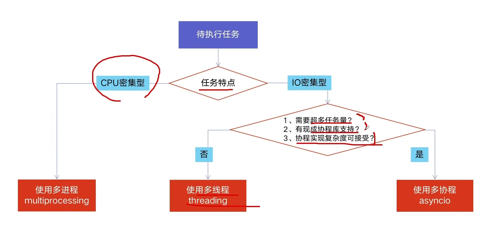
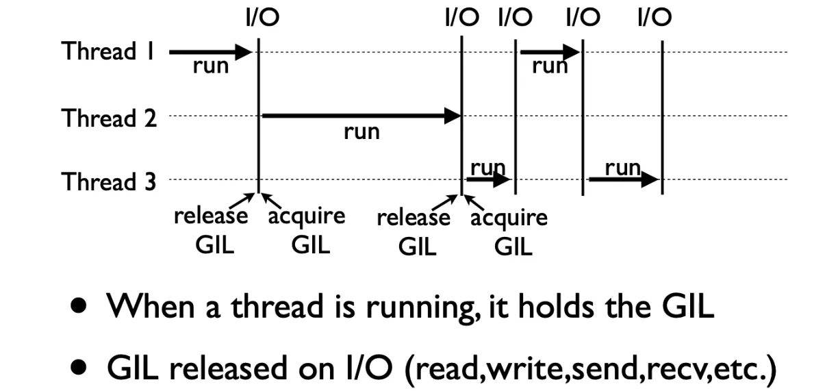
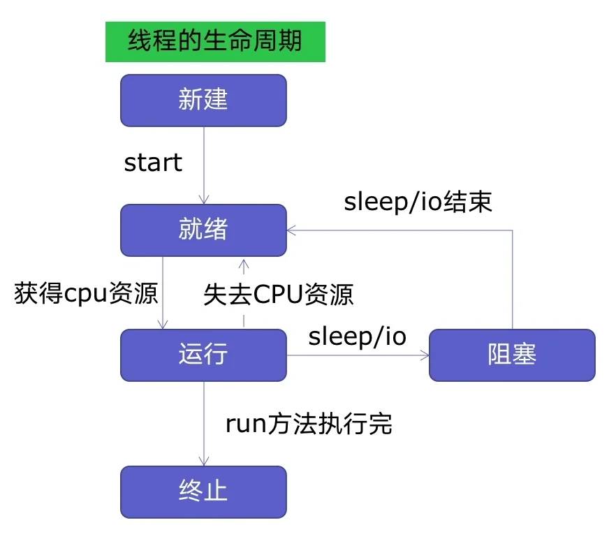
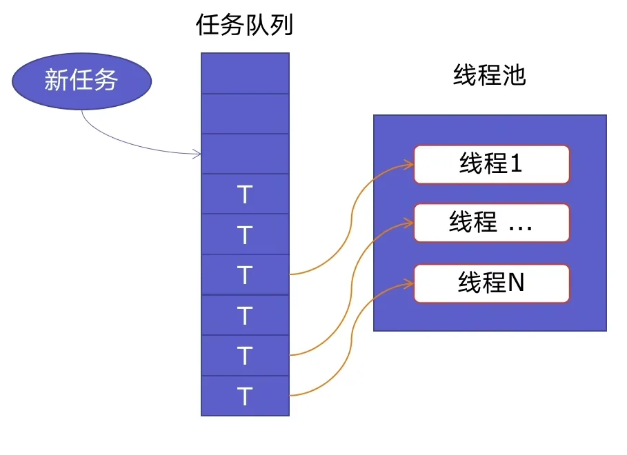

# Python 并发编程

## 一、简述

### 1、多线程、多进程、多协程

​	**CPU 密集计算**：也叫计算密集型，是指 I/O 在很短的时间就可以完成，CPU 需要大量的计算和处理，特点是 CPU 占用率相当高。例如：压缩解压缩、加密解密、正则表达式搜索。

​	**IO 密集型计算**：IO 密集型指的是系统运作大部分的状况是 CPU 在等 I/O（硬盘/内存）的读/写操作，CPU 占用率仍然较低。

​	**多进程（multiprocessing）**：

- 优点：可以利用多核 CPU 进行计算
- 缺点：占用资源最多、可启动数目比线程少
- 适用于：CPU 密集型计算

​	**多线程（threading）**：

- 优点：相比进程，更轻量级、占用资源少
- 缺点：
  - 相比进程：多线程只能并发执行，不能利用多个 CPU（由于 GIL 的存在）
  - 相比协程：启动数目有限制，占用内存资源，有线程切换开销
- 适用于：IO 密集型计算、同时运行的任务数目并不多

​	**多协程（asyncio）**：

- 优点：内存开销最少、启动协程数量最多
- 缺点：支持的库有限制、代码实现复杂
- 适用于：IO 密集型计算、需要超多任务运行，但有现成库支持的情况

​	三者的选择：




### 2、GIL 全局解释锁

​	全局解释器锁（Global Interpreter Lock）是计算机程序设计语言解释器用于同步线程的一种机制，**它使得任何时刻仅有一个线程在执行**。即便在多核心处理器上，使用 GIL 的解释器**也只允许同一时间执行一个线程**。



​	GIL 是 Python 解释器 Cpython 为了规避多线程并发问题，而遗留下来的历史性问题。但是正由于 Python 在 IO 期间会释放 GIL，因此多线程用于 IO 密集计算依然可以大幅提高速度，但用于 CPU 密集计算，只会拖慢速度。 

​	而对于 GIL 的劣势，Python 提供了 multiprocessing 来支持多进程机制。


## 二、多线程

### 1、线程生命周期与基本方法



​	基本方法：

```python
import threading

# 一个需要放入其他线程执行的函数
def func(a, b):
    pass
t = threading.Thread(target=func, args=(100, 200))
# 设置 t 为守护线程
t.daemon = True
# 线程活动方法（不会直接使用，可在子类重载）
t.run()
# 启动线程
t.start()
# 阻塞，等待 t 线程完成
t.join()
```

​	`join()` 方法：主线程 A 中，创建了子线程 B，并且在主线程 A 中调用了 B.join()，那么，主线程 A 会在调用的地方等待，直到子线程 B 完成操作后，才可以接着往下执行，那么在调用这个线程时可以使用被调用线程的 join 方法。

​	`setDaemon()` 方法或设置 `daemon = True`：主线程 A 中，创建了子线程 B，并且在主线程 A 中调用了 B.setDaemon() 或设置 daemon 属性为 True，那么就是把主线程 B 设置为守护线程（后台线程）。此时，如果主线程 A 执行结束，无论子线程 B 是否结束，一并和主线程 A 退出。**注意该操作要先于 start 方法调用**。

​	`run()` 方法：**代表线程活动的方法，而创建线程的 target 是用于该方法的可调用对象**。我们也称 run 方法体为线程体。如果直接去调用 run 方法，**是一次普通函数调用**。程序还是顺序执行，要等待 run 方法体执行完毕后，才可继续执行之后的代码。这样做程序中只有主线程这一个线程， 其程序执行路径还是只有一条， 就没有达成写线程加速的目的。因此一般只会在子类重载，实现某些特殊需求。

​	`start() ` 方法： **它在一个线程里最多只能被调用一次**。一般通过调用 start 方法来启动一个线程， **这时此线程是处于就绪状态， 并没有运行**，调度后会通过 run 方法来完成其运行操作，之后 CPU 再调度其它线程（但注意期间可能发生线程切换）。**start 方法执行时无需等待 run 方法体代码执行完毕，可以直接继续执行下面的代码，但 join 方法设置的阻塞除外**。

​	`start()` 和 `run()` 方法总结：若调用 start，则先执行主线程，后执行子线程（join 引起的阻塞除外）。若调用 run，相当于函数调用，按照程序的顺序执行。

​	更多方法和详细说明：[threading.Thread](https://docs.python.org/zh-cn/3/library/threading.html?highlight=#threading.Thread)


### 2、线程安全

​	**线程安全**：指某个函数、函数库在多线程环境中被调用时，能够正确地处理**多个线程之间的共享变量**，使程序功能正确完成。

​	**线程不安全**：由于线程的执行随时会发生切换，就造成了不可预料的结果，出现线程不安全。

​	线程不安全的示例：

```python
import threading
import time

class Account:
    def __init__(self, balance):
        self.balance = balance

def withdraw(account, amount):
    if account.balance >= amount:
        # 强制线程阻塞，导致线程切换
        time.sleep(0.1)
        print(threading.current_thread().name, "取钱成功")
        account.balance -= amount
        print(threading.current_thread().name, "余额", account.balance)
    else:
        print(threading.current_thread().anme, "余额不足，取钱失败")

account = Account(1000)
ta = threading.Thread(name="ta", target=withdraw, args=(account, 800))
tb = threading.Thread(name="tb", target=withdraw, args=(account, 800))
ta.start()
tb.start()
print('主线程结束~（会优先执行）')
```

​	可以使用 Lock 解决线程安全的问题，也就是将原始的非原子操作块，定义为原子操作，避免了对数据操作过程中的不一致性。

```python
import threading

# try-finally 模式（不推荐）
lock = threading.Lock()
lock.acquire()
try:
    # do something
finally:
    lock.release()
    
# with 上下文管理（推荐）
lock = threading.Lock()
with lock:
    # do something
```


### 3、线程间数据通信

​	多线程数据通信可以使用 queue.Queue 类实现。**Queue 的相关操作是线程安全的**，因此使用时不需要做额外加锁处理。**同时 Queue 默认是阻塞的**，可以保证在队列取元素时，如果没有元素就可以进入等待状态；在队列放元素时，元素不满也可以进入等待状态，而不是直接报异常。

​	基本方法如下：

```python
import queue

# 实例化
q = queue.Queue()
# 添加和获取（这里的获取是 pop 的意思）
q.put(item)
q.get()
# 判长、空和满
q.qsize()
q.empty()
q.full()
```

​	但是：在实现类似"生产者-消费者"模型时，**必须使用 task_done 和 join 方法以保证生产者线程在生产完所有产品后，阻塞以等待消费者线程消费完所有产品**。

​	以下是规范的生产者-消费者模型的多线程实现：

```python
from threading import Thread, Lock
from queue import Queue
import random, time

def producer(q, name, lock):
    for i in range(2):
        # 模拟 IO 操作
        time.sleep(random.random())
        fd = '%s-%s' % (name, i+1)
        q.put(fd)
        with lock:
            print('%s生产了 %s' % (name, fd))
    # 该线程阻塞，直至等到队列计数为 0（本质作用是等待队列消费完毕）
    q.join()

def consumer(q, name, lock):
    while True:
        food = q.get()
        # 模拟 IO 操作
        time.sleep(random.random())
        with lock:
            print('%s吃了%s' % (name, food))
        # 是一个已经消费的信号，让队列计数 -1
        q.task_done()

if __name__ == '__main__':
    q = Queue()
    # 加锁以保证 print 输出不乱序
    lock = Lock()
    p1 = Thread(target=producer, args=(q, 'p1', lock))
    p2 = Thread(target=producer, args=(q, 'p2', lock))
    p3 = Thread(target=producer, args=(q, 'p3', lock))
    p1.start()
    p2.start()
    p3.start()
    c1 = Thread(target=consumer, args=(q, 'c1', lock))
    c2 = Thread(target=consumer, args=(q, 'c2', lock))
    # 设置为守护线程，因为 consumer 内部是死循环
    c1.daemon = True
    c2.daemon = True
    c1.start()
    c2.start()
    # 主线程阻塞等待生产者线程执行完毕
    p1.join()
    p2.join()
    p3.join()
```

​	执行过程为：

- 主线程执行，依次让消费者、生产者线程就绪，并设置消费者线程为守护线程
- 主线程阻塞等待所有生产者线程
- 生产者线程执行并不断生产产品。期间会切换至消费者线程消费产品
- 生产者线程结束，但进入等待队列为空的阻塞状态
- 切换至消费者线程，消费至队列为空
- 生产者线程不再阻塞，生产者线程结束
- 主线程不再阻塞，主线程结束
- 所有非守护线程结束，守护线程（消费者线程）结束


### 4、线程池

​	**线程池基本原理**：新建线程时系统需要分配资源，终止线程时系统需要回收咨源。如果可以重用线程，则可以减去新建/终止的开销。创建线程池，就可以充分地重用线程。



​	优点：

- 提升性能：减去了大量新建、终止线程的开销，重用了线程资源
- 适用场景：适合处理突发性大量请求或需要大量线程完成任务、但实际任务处理时间较短
- 防御功能：能有效避免系统因为创建线程过多，而导致系统负荷过大相应变慢等问题
- 代码优势：使用线程池的语法比自己新建线程、执行线程更加简洁

```python
from concurrent.futures import ThreadPoolExecutor, as_completed

# 第一种写法：结果与参数列表顺序对应
with ThreadPoolExecutor() as pool:
    # 注意这里的 args 是参数列表
    results = pool.map(func, args)
    
    for result in results:
        print(result)

# 第二种写法：可以实现更精细的控制，对每个函数的参数进行指定
with ThreadPoolExecutor() as pool:
    futures = [ pool.submit(func, arg) for arg in args]
    # 结果与提交顺序对应
    for future in futures:
        print(future.result())
    # 使用 as_completed 后，先结束的，先返回结果
    for future in as_completed(futures):
        print(future.result())
```


## 三、多进程

### 1、进程基本方法

```python
from multiprocessing import Process

p = Process(target=f, args=('some arg', ...))
p.daemon = True
p.run()
p.start()
p.join()
```

### 2、进程加锁

```python
from multiprocessing import Lock

lock = Lock()
with lock:
    # do something
```

### 3、进程间数据通信

```python
from multiprocessing import Queue
q = Queue()
q.put()
item = q.get()
```

​	**注意此时不能使用 `queue.Queue`，要使用适用于多进程通信的 `multiprocessing.Queue`**。二者区别见于：https://www.jianshu.com/p/0c07967aa0f7

​	同时，如果需要实现类似"生产者-消费者"模型，不能直接使用 `multiprocessing.Queue`，而应该使用 `multiprocessing.JoinableQueue` ，因为 `multiprocessing.Queue` 不提供 `task_done` 和 `join` 方法。其他细节基本一致，不再赘述。


### 4、进程池

```python
from concurrent.futures import ProcessPoolExecutor

with ProcessPoolExecutor() as executor:
    # 方法一
    results = executor.map(func, args)
    # 方法二
    futures = executor.submit(func, arg)
    result = future.result()
```


## 四、多协程

​	多协程相关内容参见：[Python 并发编程之多协程](/posts/python-coroutine/)
