# Vue 笔记

## 一、Vue 基础

### 1、Vue 简介

#### （1）概述

​	使用 vue 构建用户界面，解决了 jQuery + 模板引擎的诸多痛点，极大的提高了前端开发的效率和体验。

​	官方给 vue 的定位是前端框架，因为它提供了构建用户界面的一整套解决方案（俗称 vue 全家桶）：

- vue（核心库）
- vue-router（路由方案）
- vuex（状态管理方案）
- vue 组件库（快速搭建页面 UI 效果的方案）

​	以及辅助 vue 项目开发的一系列工具：

- vue-cli（ npm 全局包：一键生成工程化的 vue 项目-基于 webpack、大而全）
- vite（ npm 全局包：一键生成工程化的 vue 项目-小而巧）
- vue-devtools（浏览器插件：辅助调试的工具）
- vetur（ vscode 插件：提供语法高亮和智能提示）

​	总结：

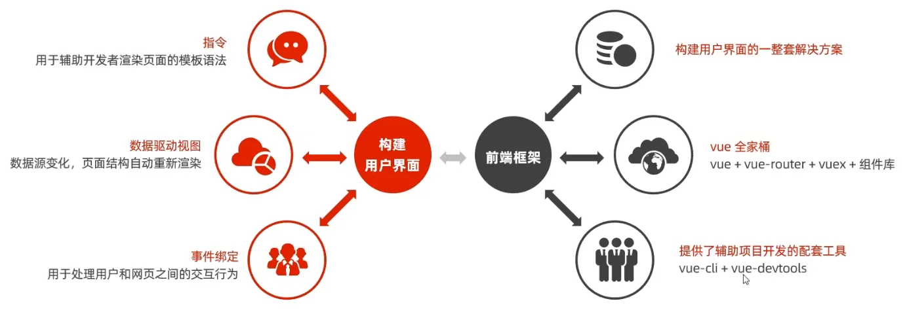


#### （2）Vue 特性

​	**数据驱动**：在使用了vue 的页面中，vue 会监听数据的变化，从而自动重新渲染页面的结构。

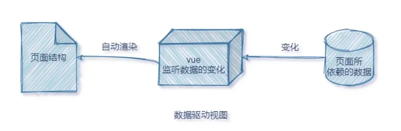


​	**双向数据绑定**：在填写表单时，双向数据绑定可以辅助开发者在不操作 DOM 的前提下，自动把用户填写的内容同步到数据源中。示意图如下：

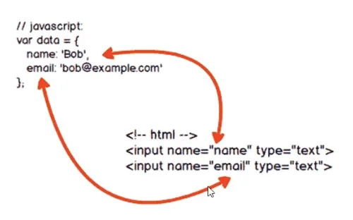

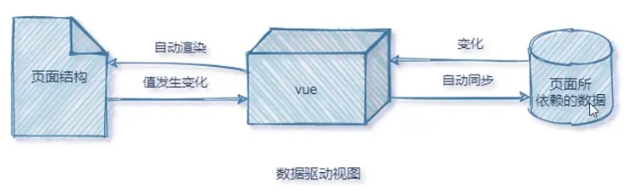

​		意义：开发者不再需要手动操作DOM元素，来获取表单元素最新的值！


​	**MVVM**：MVVM（Model-View-ViewModel） 是 vue 实现数据驱动视图和双向数据绑定的核心原理。它把每个 HTML 页面都拆分成了如下三个部分：

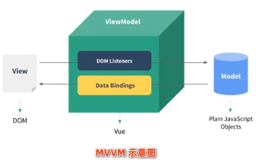

​	在MVVM概念中：

- View 表示当前页面所渲染的 DOM 结构。
- Model 表示当前页面渲染时所依赖的数据源。
- ViewModel 表示 vue 的实例，它是 MVVM 的核心。


#### （3）Vue 版本

​	3.x 版本的 vue 是未来企业级项目开发的趋势，2.x 版本的 vue 在未来（1~2年内）会被逐渐淘汰。

​	**对比**：vue2.x 中绝大多数的 API 与特性，在 vue3.x 中同样支持。同时，vue3.x 中还新增了 3.x 所特有的功能、并废弃了某些 2.x 中的旧功能。


### 2、基本使用（Vue2 为例）

1. 导入 vue.js 的 script 脚本文件
2. 在页面中声明一个将要被 vue 所控制的 DOM 区域
3. 创建 vm 实例对象（vue实例对象）

```html
<!-- 声明 vue 控制的 dom 区域-->
<div id="app">{{ username }}</div>
<!-- 导入 Vue 脚本 -->
<script src="https://cdn.bootcdn.net/ajax/libs/vue/2.6.2/vue.js"></script>
<!-- 创建 Vue 实例 -->
<script>
    const vm = new Vue({
        el: '#app',
        data: {
            username: 'MelodyEcho',
        },
    })
</script>
```

​	代码与 MVVM 的对应关系：

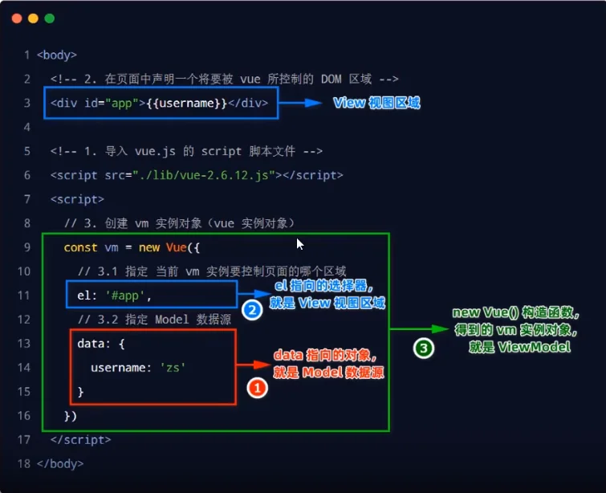


### 3、指令

​	指令（Directives）是 vue 为开发者提供的模板语法，用于辅助开发者渲染页面的基本结构。

​	有以下六类：

- 内容渲染指令
- 属性绑定指令
- 事件绑定指令
- 双向绑定指令
- 条件渲染指令
- 列表渲染指令


#### （1）内容渲染指令

​	常用的有 `v-text`、`{{}}`、`v-html`。

```html
<!-- 把username对应的值，渲染到第一个p标签中 -->
<p v-text="username"></p>
<!-- 把gender对应的值，渲染到第二个p标签中 -->
<!-- 注意：第二个p标签中，默认的文本“性别”会被 gender的值覆盖掉 -->
<p v-text="gender">性别</p>

<script>
	const vm = new Vue({
        el: '#app',
        data: {
            username: 'MelodyEcho',
            gender: 'female'
        }
    })
</script>
```

```html
<!-- 不会覆盖默认的内容 -->
<p>姓名：{{username}}</p>
<p>性别：{{gender}}</p>
```

​	**`v-text` 指令和插值表达式只能渲染纯文本内容**。如果要把包含 HTML 标签的字符串渲染为页面的 HTML 元素，则需要用到 `v-html` 这个指令： 

```html
<!-- description = '<h2>二级标题</h2>' -->
<p v-html="description"></p>
```


#### （2）属性绑定指令

​	如果需要为元素的属性动态绑定属性值，则需要用到 `v-bind` 属性绑定指令。用法示例如下：

```html
<input type="text" v-bind:placeholder="inputValue" />

<script>
	...
    data : {
        inputValue: '输入框提示',
        imgSrc: './img/bg.jpg',
    }
</script>
```

​	**简写形式：`v-bind:xxx` -> `:xxx`**


#### （3）渲染时使用 js 表达式

​	如：

```html
<div id="app">
    <span>{{ string?'True':'False' }}</span>
    <span>{{ msg.split('').reverse().join('') }}</span>
    <span :id="'list-' + id"></span>
</div>
```


#### （4）事件对象绑定指令

​	vue 提供了 `v-on` 事件绑定指令，用来辅助程序员为 DOM 元素绑定事件监听。

```html
<button v-on:click="addCount">+1</button>
<!-- 由于函数简单，也可以直接使用 js 表达式 -->
<!-- <button @click="count += 1">+1</button> -->
<script>
	...
    data : { count = 0 },
    methods: {
        // 事件监听在 method 节点
        addCount() {
            // this 表示当前的 vw 对象
            // 通过 this 可以访问到 data 中的数据
            this.count += 1
        }
    }
</script>
```

​	注意：原生DOM对象有 onclick、oninput、onkeyup 等原生事件，替换为 vue 的事件绑定形式后，分别为：v-on:click、v-oninput、v-on:keyup	

​	**简写形式：`v-on:click` -> `@click`**

​	**事件对象**：（同样可以接收到事件对象）

```js
methods: {
    addCount(e) {
        const color = e.target.style.backgroundColor
        console.log(color)
    }
}
```

​	**绑定传参**：

```html
<button @click="addNewCount(2)">+2</button>
<script>
	...
    methods: {
        addNewCount(step) { this.count += step }
    }
</script>
```

​	**如果同时需要参数和事件对象**：（需要使用 $event 特殊变量）

```html
<button @click="addNewCount(2, $event)">+2</button>
<script>
	...
    methods: {
        addNewCount(step, e) {
            const color = e.target.style.backgroundColor
            console.log(color)
            this.count += step
        }
    }
</script>
```


#### （5）事件、按键修饰符

​	**事件修饰符**：在事件处理函数中调用 `preventDefault()` 或 `stopPropagation()` 是非常常见的需求。因此， vue 提供了事件修饰符的概念，来辅助程序员更方便的对事件的触发进行控制。常用的 5 个事件修饰符如下：

| 时间修饰符 | 说明                                                      |
| ---------- | --------------------------------------------------------- |
| .prevent   | 阻止默认行为（例如：阻止 a 链接的跳转、阻止表单的提交等） |
| .stop      | 阻止事件冒泡                                              |
| .capture   | 以捕获模式触发当前的事件处理函数                          |
| .once      | 绑定的事件只触发 1 次                                     |
| .self      | 只有在 event.target 是当前元素自身时，才触发事件处理函数  |

```html
<a href="https://example.com" @click.prevent="onLinkClick">去往 example.com</a>
```


​	**按键修饰符**：在监听键盘事件时，我们经常需要判断详细的按键。可以为键盘相关的事件添加按键修饰符，例如：

```html
<input @keyup.enter="submit">
<input @keyup.esc="clearInput">
```


#### （6）双向绑定指令

​	vue 提供了 `v-model` 双向数据绑定，用来辅助开发者在不操作 DOM 的前提下，快速获取表单的数据。只能配合表单元素使用！

```html
<p>用户名是：{{username}}</p>
<input type="text" v-model="username"/>

<p>选中的省份是：{{province}}</p>
<select v-model="province">
    <!-- 这里绑定的是 option 的 value -->
    <option value="">请选择</option>
    <option value="1">北京</option>
    <option value="2">河北</option>
    <option value="3">黑龙江</option>
</select>
```

​	有三种修饰符，协助快速格式化数据类型：

| 修饰符  | 作用                           | 示例                              |
| ------- | ------------------------------ | --------------------------------- |
| .number | 自动将用户的输入值转为数值类型 | &lt;input v-model.number="age" /> |
| .trim   | 自动过滤用户输入的首尾空白字符 | &lt;input v-model.trim="msg" />   |
| .lazy   | 在“change"时而非“input”时更新  | &lt;input v-model.lazy="msg" />   |


#### （7）条件渲染指令

​	条件渲染指令用来辅助开发者按需控制 DOM 的显示与隐藏。条件渲染指令有如下两个，分别是：`v-if` 和 `v-show` 。

```html
<span v-if="flag">一个想被隐藏的元素</span>
<span v-show="flag">一个想被隐藏的元素</span>
```

​	**区别**：`v-if` 会操作 DOM 节点来控制显示，`v-show` 则通过样式来控制显示。但是 `v-show` 有很高的初始渲染开销。因此如果**需要频繁切换，则使用 `v-show`** ，如果**运行时条件很少改变，则应该使用 `v-if`** 。

​	**配套的 `v-else` 指令**：（类似于 php）

```html
<div v-if="Math.random() > 0.5">随机数 > 0.5</div>
<div v-else>随机数 &lt;= 0.5</div>
```

​	**当然还有 `v-else-if` 指令** ，用法类似。


#### （8）列表渲染指令

​	 vue 提供了`v-for` 指令，用来辅助开发者基于一个数组来循环渲染相似的 UI 结构。`v-for` 指令需要使用 item in items 的特殊语法，其中：items 是待循环的数组，item 是当前的循环项

```html
<ul>
    <li v-for="person in list">姓名是: {{ person.name }}</li>
</ul>
<script>
	...
    data: {
        list: [
            {id: 1, name: "MelodyEcho"},
            {id: 2, name: "MelodyScend"},
        ]
    }
</script>
```

​	也可以携带索引：

```html
<ul>
    <li v-for="(item, i) in list">索引：{{ i }}, 姓名: {{ item.name }}</li>
</ul>
```


#### （9）使用 key 属性维护列表状态

​	**问题**：当列表的数据变化时，默认情况下，vue 会尽可能的复用已存在的 DOM 元素，从而提升渲染的性能。但这种默认的性能优化策略，会导致有状态的列表无法被正确更新。

​	**因此**：为了给 vue 一个提示，以便它能跟踪每个节点的身份，从而在保证有状态的列表被正确更新的前提下，提升渲染的性能。此时，需要为每个元素提供一个**唯一的 key 属性**：

```html
<ul>
    <li v-for="(user, i) in list" :key="user.id"> 
        <input type="checkbox" /> {{ user.name }}
    </li>
</ul>
<script>
	...
    data: {
        list: [
            {id: 1, name: "MelodyEcho"},
            {id: 2, name: "MelodyScend"},
        ]
    }
</script>
```

​	注意：

- key 只能为字符串或数字类型
- key 必须唯一
- 建议将原数据的 id 特征值作为 key
- **不要使用索引，因为索引会随状态而更新！**
- **建议使用 `v-for` 时，都指定 key 的值**


### 4、过滤器（Vue3 弃用）

​	注：过滤器已经在 Vue3 弃用，建议使用计算属性替代。

#### （1）定义

​	过滤器（Filters）常用于文本的格式化。例如：

​	hello -> Hello

​	过滤器应该被添加在 JavaScript 表达式的尾部，由“管道符”进行调用，示例代码如下：

```html
<!-- 通过“管道符”调用 capitalize 过滤器，对 message 的值进行格式化 -->
<p>{{ message | capitalize }}</p>
<!-- 在 v-bind 中通过“管道符”调用 formatId 过滤器，对 rawId 的值进行格式化 -->
<div v-bind:id="rawId | formatId"></div>
<script>
// 在 filters 节点定义过滤器
...
	filters: {
        capitalize(str) {
            return str.charAt(0).toUpperCase() + str.slice(1)
        }
    }
</script>
```

​	注：过滤器可以用在两个地方：**插值表达式**和 **`v-bind` 属性绑定**


#### （2）私有过滤器和全局过滤器

​	在 filters 节点下定义的过滤器，称为“私有过滤器”，因为它只能在当前 vm 实例所控制的 el 区域内使用。如果希望在多个 vue 实例之间共享过滤器，则可以按照如下的格式定义全局过滤器：

```js
// 全局过滤器-独立于每个 vm 实例之外
// Vue.filter() 方法接收两个参数：
// 第 1 个参数，是全局过滤器的“名字”
// 第 2 个参数，是全局过滤器的“处理函数”
Vue.filter('capitalize', (str)=>{
	return str.charAt(0).toupperCase() + str.slice(1)
})
```

​	当全局和私有过滤器同名，私有过滤器优先。


#### （3）连续调用多个过滤器

```html
<!-- 调用方向为从左到右 -->
<p>{{ text | capitalize | maxLength }}</p>
```


#### （4）过滤器传参

```html
<!-- 第一个参数永远是管道符前待处理的值，第二个参数开始，才是调用传递的参数 -->
<span>{{ message | fillterA(arg1, arg2) }}</span>
<script>
	...
    filters: {
        filterA(msg, arg1, arg2) {}
    }
</script>
```


---

## 二、组件基础（上）

### 1、单页面应用程序

​	单页面应用程序（英文名：Single Page Application）简称 SPA，顾名思义，指的是一个 Web 网站中只有唯一的一个 HTML 页面，所有的功能与交互都在这唯一的一个页面内完成。

​	单页面应用程序将所有的功能局限于一个 web 页面中，仅在该 web页面初始化时加载相应的资源（HTML、JavaScript 和 CSS）。一旦页面加载完成了，SPA 不会因为用户的操作而进行页面的重新加载或跳转。而是利用 JavaScript 动态地变换 HTML 的内容，从而实现页面与用户的交互。


#### （1）优缺点

​	**优点**：

- 良好的交互体验：

  - 单页应用的内容的改变不需要重新加载整个页面

  - 获取数据也是通过 Ajax 异步获取

  - 没有页面之间的跳转，不会出现“白屏现象”

- 良好的前后端工作分离模式
- 减轻服务器压力

​	**缺点**：

- 首屏慢（但可以解决）
- 不利于 SEO（可以使用 SSR 服务器端渲染）


#### （2）快速创建 Vue 的 SPA 项目

​	vue 官方提供了两种快速创建工程化的 SPA 项目的方式：

- 基于 vite 创建 SPA 项目（仅支持 vue3.x，小而巧）
- 基于 vue-cli 创建 SPA 项目（支持 vue3.x 和 vue2.x，大而全）


### 2、Vite 的基本使用

​	按照顺序执行如下的命令，即可基于 vite 创建 vue3.x 的工程化项目：

```bash
npm init vite-app 项目名称
cd 项目名称
npm install
npm run dev
```


#### （1）项目基本结构

- public 是公共的静态资源目录
- src 是项目的源代码目录（程序员写的所有代码都要放在此目录下）
  - assets 目录用来存放项目中所有的静态资源文件（css、fonts等）
  - **components 目录用来存放项目中所有的自定义组件**
  - **App.vue 是项目的根组件**
  - index.css 是项目的全局样式表文件
  - **main.js 是整个项目的打包入口文件**
- index.html 是 SPA 单页面应用程序中唯一的 HTML 页面

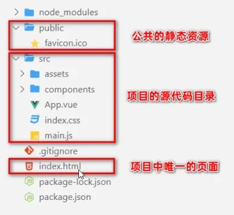


#### （2）vite 项目运行流程

​	在工程化的项目中，vue 要做的事情很单纯：通过 main.js 把 App.vue 渲染到 index.html 的指定区域中。

​	其中：

- App.vue 用来编写待渲染的模板结构
- index.html 中需要预留一个 el 区域
- main.js 把 App.vue 渲染到了 index.html 所预留的区域中


​	main.js 中：

```js
// 1.从 vue 中按需导入 createApp 函数，
// createApp 函数的作用：创建 vue 的“单页面应用程序实例”
import { createApp } from 'vue'
// 2.导入待渲染的 App 组件
import App from './App.vue'
// 3.调用 createApp 函数，返回值是“单页面应用程序的实例”，用常量 spa_app 进行接收，
// 同时把 App 组件作为参数传给 createApp 函数，表示要把 App 渲染到 index.html 页面上 
const spa_app = createApp(App)
// 4.调用spa_app 实例的 mount 方法，用来指定 vue 实际要控制的区域
spa_app.mount('#app')
```


### 3、组件化开发

​	组件化开发指的是：根据封装的思想，把页面上可重用的部分封装为组件，从而方便项目的开发和维护。

​	vue 是一个完全支持组件化开发的框架。vue 中规定组件的后缀名是 .vue。之前接触到的 App.vue 文件本质上就是一个 vue 的组件。


#### （1）vue 组件构成

​	每个 .vue 组件都由 3 部分构成，分别是：

- template -> 组件的模板结构
- script -> 组件的 JavaScript 行为
- style -> 组件的样式

​	注：script 和 style 省略。


#### （2）组件 template 节点

​	vue 规定：每个组件对应的模板结构，需要定义到 &lt;template> 节点中。它是 vue 提供的容器，只起到包裹的作用，不会被真正渲染为 DOM 元素。

​	在 template 中，支持使用指令来渲染 DOM 结构：

```html
<template>
	<button @click="showInfo">按钮</button>
    <span :title="new Date().toLocalTimeString()">只是一个 span 元素</span>
</template>
```

​	注：vue2.x 中 template 只支持单个根节点，但 vue3.x 支持多个根节点。


#### （3）组件 script 节点

​	vue规定：组件内的 &lt;script> 节点是可选的，开发者可以在 &lt;script> 节点中封装组件的 JavaScript 业务逻辑。结构如下：

```html
<script>
// 今后，组件相关的 data 数据、methods 方法等，
// 都需要定义到 export default 所导出的对象中。
export default{
    // name 属性指向的是当前组件的名称（建议每个首字母大写），可以在调试工具看到这个名称
    name: 'MyApp',
    // 渲染期间用到的数据，注意组件中一定要使用函数：
    data() {
        return {
            count: 0,
            username: 'MelodyEcho',
        }
    },
    // 绑定方法
    methods: {
        addCount() {
            this.count++
        }
    }
}
</script>
```


#### （4）组件 style 节点

​	vue 规定：组件内的 &lt;style> 节点是可选的，开发者可以在 &lt;style> 节点中编写样式美化当前组件的 UI 结构。

​	其中 &lt;style> 标签上的 lang="css" 属性是可选的，它表示所使用的样式语言。默认只支持普通的 css 语法，可选值还有 less、scss 等。

```html
<style lang="css">
    h1 {
        font-weight: normal;
    }
</style>
```

​	使用 less 语法前需要先配置：

- 运行 `npm install less -D` 命令安装依赖包，从而提供 less 语法的编译支持
- 在 &lt;style> 标签上添加 lang="less" 属性，即可使用 less 语法编写组件的样式


### 4、组件使用

​	组件之间可以进行相互的引用。引用原则：先注册，再引用。

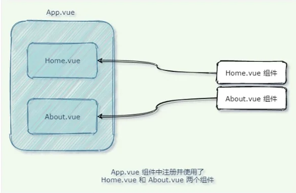


#### （1）注册组件

​	全局注册和局部注册：

- 被全局注册的组件，可以在全局任何一个组件内被使用
- 局部注册的组件，只能在当前注册的组件范围内使用

​	**全局注册**：（在 main.js 中，要在 mount 前注册）

```js
// 导入需要被全局注册的组件
import Swiper from './components/Swiper.vue'
// 使用 app.component() 方法
app.component('my-swiper', Swiper)
```

```vue
<!-- 此时就可以在其他组件中这样导入使用：-->
<my-swiper></my-swiper>
```

​	**局部注册**：

```vue
<template>
    <h1>组件注册测试 </h1>
    <TextBox></TextBox>
</template>
<script>
import TextBox from './components/textBox.vue'
export default {
    // 通过该节点完成私有组件的注册
    components: {
        // 键值对完全一致也可直接省略键，只写值
        TextBox,
    }
}
</script>
```

​	**通过 name 属性注册组件**：

```js
app.component(Swiper.name, Swiper)
```


#### （2）组件命名法

- 使用 kebab-case 命名法（俗称短横线命名法，例如 my-swiper 和 my-search ）
- 使用 PascalCase 命名法（俗称帕斯卡命名法或大驼峰命名法，例如 MySwiper 和 MySearch ）

​	注：短横线命名法必须严格按照短横线使用，但帕斯卡命名法可以兼容短横线写法使用。**因此推荐使用帕斯卡命名法，这样适应性更强**。


#### （3）组件样式冲突问题

​	默认情况下，写在 .vue 组件中的样式会全局生效，因此很容易造成多个组件之间的样式冲突问题。这个问题的根本原因是：

- 单页面应用程序中，所有组件的 DOM 结构，都是基于唯一的 index.html 页面进行呈现的
- 每个组件中的样式，都会影响整个 index.html 页面中的 DOM 元素


​	**解决方案**：（通过为每个组件所有元素分配自定义属性）

```vue
<template>
	<div class="container" data-v-001>
        <span data-v-001></span>
    </div>
</template>
<style>
    .container[data-v-001] {
        font-size: 20px;
    }
</style>
```

​	但是这样太麻烦，因此 vue 提供了对应的自动化的方案：（为 style 添加 scoped 属性即可）

```html
<style scoped>
    /* 会自动分配唯一的“自定义属性” */
    .container {
        font-size: 18px;
    }
</style>
```


#### （4）:deep() 样式穿透

​	如果给当前组件的 style 节点添加了 scoped 属性，则当前组件的样式对其子组件是不生效的。如果想让某些样式对子组件生效，可以使用 :deep() 深度选择器。

```vue
<style scoped>
	/* 不加 /deep/ 时，生成格式为： .title[data-v-001] */
    .title {
    	color: blue;
    }
    /* 加了之后，生成格式为： [data-v-001] .title */
    :deep(title) {
        color: blue;
    }
</style>
```


### 5、组件的 props

​	为了提高组件的复用性，在封装 vue 组件时需要遵守如下的原则：

- 组件的 DOM 结构、Style 样式要**尽量复用**
- 组件中要展示的数据，**尽量由组件的使用者提供**

​	因此为了方便使用者为组件提供要展示的数据，vue 组件提供了 props 的概念。


#### （1）什么是组件的 props

​	props 是组件的自定义属性，组件的使用者可以通过 props 把数据传递到子组件内部，供子组件内部进行使用。如：

```vue
<!-- 通过两个自定义属性传递了数据 -->
<my-article title="面朝大海，春暖花开" author="海子"></my-article>
```

​	注：**props 对于子组件是只读的**。


#### （2）在组件中声明 props 

​	在封装 vue 组件时，可以把动态的数据项声明为 props 自定义属性。**自定义属性可以在当前组件的模板结构中被直接使用**。如：

```vue
<template>
	<span>标题：{{ title }}</span>
	<span>作者：{{ author }}</span>
</template>
<script>
export default {
    // 父组件传递给该组件的数据，必须在 props 节点声明
    props: ['title', 'author']
}
</script>
```

#### （3）动态绑定 props 的值

​	可以使用 `v-bind` 的形式动态指定值：

```vue
<my-article :title="info.title" :author="'post by ' + info.author"></my-article>
```


#### （4）props 命名法

​	组件中如果使用  “camelCase（驼峰命名法）” 声明了 props 属性的名称，则有两种方式为其绑定属性的值：

```vue
<!-- 子组件中 -->
<script>
export default {
    props: ['pubTime'],		// 驼峰命名法
}
</script>

<!-- 父组件中这两种写法都可以 -->
<my-article pubTime="1989"></my-article>
<!-- 或 -->
<my-article pub-time="1989"></my-article>
```

​	**特别注意**：**只是父组件绑定可以用两种方式，子组件中使用数据时不能更改名字！**


### 6、动态样式操作

#### （1）动态绑定 HTML 的 class

```vue
<h3 class="thin" :class="isItalic? 'italic' : ''">字体粗细切换组件</h3>
<button @click="isItalic=!isItalic">切换字体样式</button>
...
data() {
	return { isItalic: true }
}
...
<style scoped>
    .thin {
        font-weight: 200;
    }
    .italic {
        font-style: italic;
    }
</style>
```

​	如果需要同时动态绑定多个 class 类名，可以使用数组的语法格式：

```vue
<h3 class="thin" :class="[isItalic? 'italic': '', isBold ? 'bold' : '']">
    字体粗细切换组件
</h3>
```

​	但这样会过于臃肿，可以使用对象语法绑定：

```vue
<!-- 特别注意，此时 classObj 的键就是类名了，将会根据布尔值决定是否添加该类名 -->
<h3 class="thin" :class="classObj">字体粗细切换组件</h3>
<button @click="classObj.italic=!classObj.italic">切换字体样式</button>
...
data() {
	return {
		classObj: {
			italic: true,
		}
	}
}
```


#### （2）对象语法绑定内联 style

​	语法十分简洁，但注意样式名驼峰命名或使用字符串。

```vue
<div :style="{color: active, fontSize: fsize+'px', 'background-color': bgColor}">测试文本</div>
...
data() {
	return {
		active: 'red',
		fsize: 30,
		bgColor: 'pink',
	}
}
```


---

## 三、组件基础（下）

### 1、props 验证

​	**props 验证**：在封装组件时对外界传递过来的 props 数据进行合法性的校验，从而防止数据不合法的问题。

​	之前我们使用的是数组类型的 props 节点，但存在缺点：**无法为每个prop指定具体的数据类型**。因此现在我们需要使用对象类型的 props 节点，它可以实现对数据类型的校验。

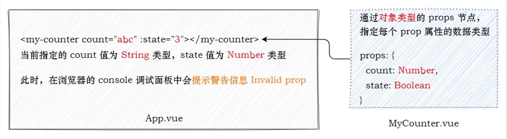

```vue
<p>状态：{{ state }}</p>
<p>数量：{{ count }}</p>
...
props: {
    state: Boolean,
    count: Number,
}
```


#### （1）基础类型校验

```vue
<script>
	props: {
        // 支持的类型如下：
        propA: String,
        propB: Number,
        PropC: Boolean,
        PropD: Array,
        propE: Object,
        propF: Date,
        propG: Function,
        propH: Symbol,
    }
</script>
```


#### （2）多个可能类型

​	如果 prop 属性值不唯一：

```vue
<script>
	props: {
        propA: [Number, String],
    }
</script>
```


#### （3）必填项校验

​	如果某个 prop 属性是必填项：

```vue
<script>
	props: {
        propB: {
            type: String,
            required: true,
        }
    }
</script>
```


#### （4）属性默认值

​	在封装组件时，可以为某个 prop 属性指定默认值：

```vue
<script>
	props: {
        propB: {
            type: Number,
            default: 100
        }
    }
</script>
```


##### （5）自定义验证函数

​	在封装组件时，可以为 prop 属性指定自定义的验证函数，从而对 prop 属性的值进行更加精确的控制：

```vue
<script>
	props: {
        propB: {
            // 利用 validator 函数
            validator(value) {
                // true 验证成功，false 验证失败
                return ['success', 'warning', 'danger'].indexOf(value) !== -1
            }
        }
    }
</script>
```


### 2、计算属性

​	计算属性本质上就是一个 function 函数，它可以实时监听 data 中数据的变化，并 return 一个计算后的新值，供组件渲染 DOM 时使用。

​	**计算属性需要以 function 函数的形式（且只能是 function 函数形式）声明到组件的 computed 选项中，示例：**

```vue
<input type="text" v-model.number="count" />
<p> {{ count }} 乘以 2 的值为：{{ plus }}</p>
...
computed: {
	plus() {
		return this.count * 2
	}
}
```

​	注：计算属性侧重于得到一个计算的结果，因此计算属性中必须**有 return 返回值**！

​	相对于方法来说，**计算属性会缓存计算的结果**，只有计算属性的依赖项发生变化时，才会重新进行运算。因此计算属性的性能更好。


### 3、自定义事件

​	在封装组件时，为了让**组件的使用者**可以监听到**组件内状态的变化**，此时需要用到组件的自定义事件。

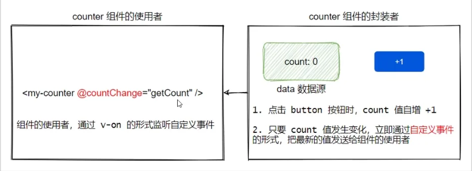


#### （1）使用

​	**声明自定义事件**：开发者为自定义组件封装的自定义事件，必须事先在 emits 节点中声明，如：

```vue
...
<script>
export default {
    // 组件声明的自定义事件，必须先定义在 emits 节点中
    emits: ['change'],
}
</script>
```

​	**触发自定义事件**：在 emits 节点下声明的自定义事件，可以通过 `this.$emit(自定义事件名称)` 方法进行触发，示例代码如下：

```vue
...
<script>
export default {
    // 组件声明的自定义事件，必须先定义在 emits 节点中
    emits: ['change'],
    methods: {
        onBtnClick() {
            // 当点击了按钮，调用该方法，触发事件
            this.$emit('change')
        }
    }
}
</script>
```

​	**监听自定义事件**：在使用自定义的组件时，可以通过 `v-on` 的形式监听自定义事件：

```vue
<my-counter @change="getCount"></my-counter>
...
methods: {
	getCount() {
		console.log('监听到了 count 值的变化')
	}
}
```


#### （2）传参

​	在调用 `this.$emit(自定义事件名称)` 方法触发自定义事件时，可以通过第 2 个参数为自定义事件传参，如：

```js
// 子组件 script:
this.$emit('change', this.count)
```

```vue
<!-- 父组件 -->
<my-counter @change="getCount"></my-counter>
...
methods: {
	getCount(num) {
		console.log('监听到了 count 值的变化', num)
	}
}
```


### 4、组件上的 v-model

​	v-model 是双向数据绑定指令，除表单元素数据绑定外，当需要维护组件内外数据的同步时，**可以在组件上使用 v-model 指令。如使用 v-model 实现父子的双向数据绑定**：

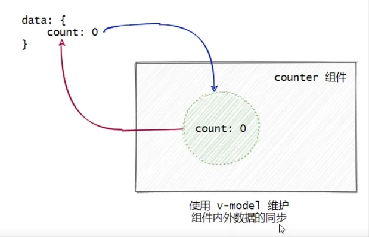


#### （2）具体实现

1. **父组件向子组件传递数据**：

- 父组件通过 `v-bind` 属性绑定的形式，把数据传递给子组件

- 子组件中通过 props 接收父组件传递过来的数据

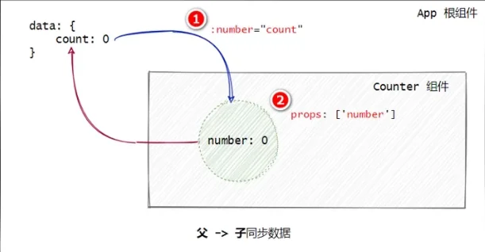

2. **子组件向父组件传递数据**：
   - 在 `v-bind` 指令之前添加 `v-model` 指令
   - 在子组件中声明 `emit` 自定义事件，格式为 `update:xxx`
   - 调用 `$emit()` 触发自定义事件，更新父组件中的数据

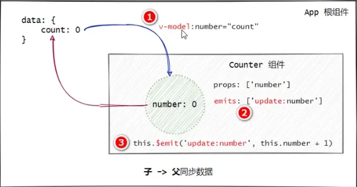

​	第二部分代码：

```vue
<template>
  <p>子组件计数：{{ number }}</p>
  <button @click="add">+1</button>
</template>

<script>
export default {
  ...
  props: {
    number: Number,
  },
  emits: ['update:number'],
  methods: {
    add() {
      // 这里不能给 this.number 加 1，事件传递给父组件后，由父组件接受并设置加 1 后的值，然后再将值传递给子组件（因为 props 是只读的）
      this.$emit('update:number', this.number + 1)
    }
  },
}
</script>
```


---

## 四、组件高级（上）

### 1、watch 监听器

#### （1）基础

​	watch 侦听器允许开发者监视数据的变化，从而针对数据的变化做特定的操作。例如，监视用户名的变化并发起请求，判断用户名是否可用。

​	基本语法，在 watch 节点下：

```vue
<template>
	<input type="text" class="form-control" v-model.trim="username">
</template>
<script>
export default {
	data() {
        return {
            username: '',
        }
    },
	watch: {
		async username(newVal, oldVal) {
             // 解构 axios 响应对象
			const {data:res} = await axios.get('https://localhost/api/user');
             console.log(res);
		}
	}
}
</script>
```


#### （2）immediate 选项

​	默认情况下，组件在初次加载完毕后不会调用  watch 侦听器。如果想让 watch 侦听器立即被调用，则需要使用 immediate 选项。实例代码如下：

```vue
<script>
watch: {
    username: {
         // 注意 handler 属性是默认写法
         async handler(newVal, oldVal) {
             const {data:res} = await axios.get(`https://localhost/api/user/${newVal}`);
             console.log(res);
         },
         // 组件加载完毕后立即调用当前 watch 监听器
         immediate: true,
    },
}
</script>
```


#### （3）deep 选项

​	当 watch 侦听的是一个对象，如果**对象中的属性值发生了变化，则无法被监听到**。此时需要使用 deep 选项，代码示例如下：

```vue
<script>
watch: {
    info: {
         // 注意 handler 属性是默认写法
         async handler(newVal, oldVal) {
             const {data:res} = await axios.get(`https://localhost/api/user/${newVal.username}`);
             console.log(res);
         },
         // 使用 deep 选项
         deep: true,
    },
}
</script>
```


#### （4）监听对象单个属性

​	代码示例：

```vue
<script>
watch: {
    // 只监听 info.username
    'info.username': {
         async handler(newVal) {
             const {data:res} = await axios.get(`https://localhost/api/user/${newVal}`);
             console.log(res);
         },
    },
}
</script>
```


#### （5）计算属性和监听器

​	计算属性和侦听器侧重的应用场景不同：

- 计算属性侧重于监听多个值的变化，最终计算并**返回一个新值**
- 侦听器侧重于监听单个数据的变化，最终执行特定的业务处理，**不需要有任何返回值**


### 2、组件生命周期

#### （1）组件运行过程

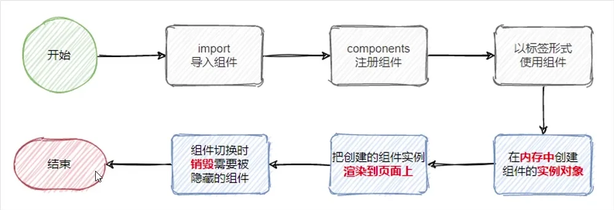

​	组件的生命周期指的是：组件从创建->运行（渲染）->销毁的整个过程，强调的是一个时间段。


#### （2）监听组件的不同时刻

​	vue 框架为组件内置了不同时刻的生命周期函数，生命周期函数会**伴随着组件的运行而自动调用**。

- 当组件在内存中被创建完毕之后，会自动调用 created 函数
  - 适用于发 ajax 初次请求
- 当组件第一次被成功地渲染到页面上之后，会自动调用 mounted 函数
  - 适用于最早操作 dom 元素（此时刚好渲染完成）
- 当组件被销毁完毕之后，会自动调用 unmounted 函数

```vue
<script>
export default {
    ...
    created() {...},
    mounted() {...},
    unmounted() {...},
}
</script>
```


#### （3）监听组件的更新

​	当组件的 data 数据更新之后，vue 会自动重新渲染组件的 DOM 结构，从而保证 View 视图展示的数据和 Model 数据源保持一致。
​	当组件被**重新渲染完毕**之后，会自动调用 updated 生命周期函数。

```vue
<script>
export default {
    ...
    updated() {...},
}
</script>
```


#### （4）全部生命周期函数

​	beforeCreate、created、

​	beforeMount、mounted、

​	beforeUpdate、updated、

​	beforeUnmount、Unmounted

​	注：不在 beforeCreate 中发起 ajax 请求是因为此时组件还没创建好，请求到的数据是无法挂载到组件上的。 


### 3、组件间的数据共享

#### （1）组件关系

- 父子关系
- 兄弟关系
- 后代关系


#### （2）父子数据共享

​	父->子：参见笔记前面部分

​	子->父：参见笔记前面部分

​	子父数据同步：参见笔记前面部分


#### （3）兄弟间的数据共享

​	兄弟组件之间实现数据共享的方案是 EventBus。可以借助于第三方的包 mitt 来创建 eventBus 对象，从而实现兄弟组件之间的数据共享。示意图如下：

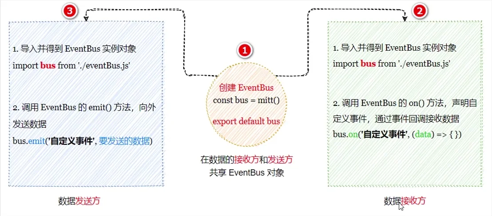

​	安装：

```bash
npm i mitt@2.1.0
```

​	创建 eventBus.js：

```js
import mitt from 'mitt'
const bus = mitt()
export default bus
```

​	在数据接收方：

```vue
<script>
import bus from '../eventBus.js'

export default {
    ...
    created() {
    	bus.on('countChange', count => {
        	this.count = count;
    	})
	}
}
</script>
```

​	在数据发送方：

```vue
<script>
import bus from '../eventBus.js'
    
export default {
    ...
    methods: {
        add() {
            this.count++;
            bus.emit('countChange', this.count);
        }
    }
}
</script>
```


#### （3）后代关系组件的数据共享

##### a. 非响应数据共享

​	后代关系组件之间共享数据，指的是**父节点的组件向其子孙组件共享数据**。此时组件之间的嵌套关系比较复杂，可以使用 provide 和 inject 实现后代关系组件之间的数据共享。

​	父节点通过 provide 共享数据 color：

```vue
<script>
export default {
    ...
    provide() {
        return {
            color: this.color,
        }
    }
</script>
```

​	子孙节点使用 Inject 数组接收数据：

```vue
<template>
	<span>{{ color }}</span>
</template>
<script>
export default {
    ...
    inject: ['color'],
}
</script>
```

##### b. 响应数据共享

​	思路：结合 computed 函数向下共享：

```vue
<script>
import { computed } from 'vue'
    
export default {
    ...,
    provide() {
        return {
            color: computed(() => this.color);
        }
    }
}
</script>
```

```vue
<template>
	<span>{{ color.value }}</span>
</template>
```


#### （4）全局数据共享 vuex

​	vuex 是终极的组件之间的数据共享方案。在企业级的 vue 项目开发中，vuex 可以让组件之间的数据共享变得高效、清晰、且易于维护。

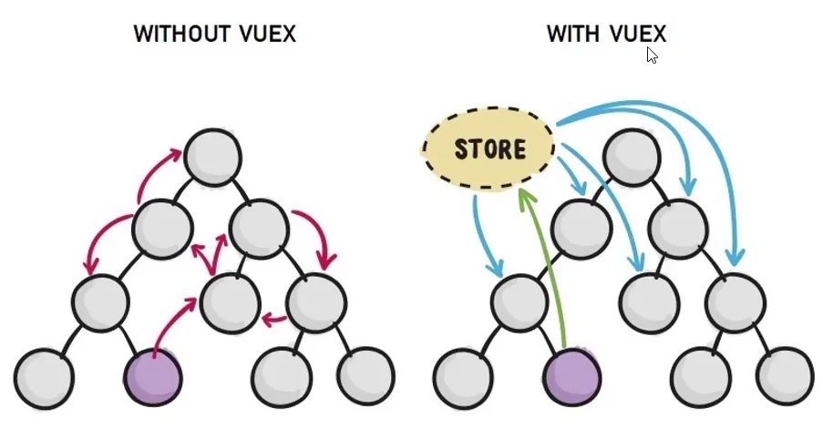

​	此处暂不提及，后文有专门的章节记录。


### 4、vue3.x 全局配置 axios

​	在实际项目开发中，几乎每个组件中都会用到 axios 发起数据请求。此时会遇到如下两个问题：

- 每个组件中都需要导入 axios（代码臃肿）
- 每次发请求都需要填写完整的请求路径（不利于后期的维护）

​	main.js 中：

```js
// 配置根路径
axios.defaults.baseURL = 'https://example.com/api';
// 挂载为 app 全局自定义属性
app.config.globalProperties.$axios = axios;
```

​	任意组件：

```js
const {data:usersRes} = await this.$axios.get('/users');
const {data:newsRes} = await this.$axios.post('/news', {type: 'tech'});
```


---

## 五、组件高级（下）

### 1、ref 引用和 $nextTick 函数

​	ref 用来辅助开发者在不依赖于 jQuery 的情况下，获取 DOM 元素或组件的引用。

​	每个 vue 的组件实例上，都包含一个 \$refs 对象，里面存储着对应的 DOM 元素或组件的引用。默认情况下，组件的 $refs 指向一个空对象。

​	使用 DOM 或 组件的 ref 引用：

```vue
<template>
	<span ref="spanRef"></span>
	<my-comp ref="compRef"></my-comp>
</template>
<script>
    ...
	getRef() {
        console.log(this.$refs.spanRef);
        console.log(this.$refs.compRef);
        // 引用到组件的实例后，可以直接调用其上的 methods 方法
        this.$refs.compRef.action();
    }
</script>
```

​	注意：由于组件是异步执行 DOM 更新的，所以操作 ref 引用时要注意等到 DOM 元素渲染后再获取。

​	可以使用 \$nextTick() 函数解决这个问题。组件的 $nextTick(cb) 方法，会把 cb 回调推迟到下一个 DOM 更新周期之后执行。通俗的理解是：等组件的 DOM 异步地重新渲染完成后，再执行 cb 回调函数。从而能保证 cb 回调函数可以操作到最新的 DOM 元素。

```vue
<script>
...
showInput() {
    this.inputVisible = true;
    this.$nextTick(() => {
        // 更新后再获取 DOM 元素
        this.$refs.ipt.focus();
    })
}
</script>
```


### 2、动态组件

​	动态组件指的是动态切换组件的显示与隐藏。vue 提供了一个内置的 \<component> 组件，专门用来实现组件的动态渲染。

- \<component> 是组件的占位符
- 通过 is 属性动态指定要渲染的组件名称
- \<companent is="要渲染的组件的名称">\</component>

```vue
<template>
	<component :is="compName"></component>
</template>
<script>
...
data() {
    return {
        compName: 'HomeComp',
    }
}
</script>
```

​	注：默认情况下，切换动态组件时无法保持组件的状态。此时可以使用vue内置的 \<keep-alive> 组件保持动态组件的状态。示例代码如下：

```vue
<template>
	<keep-alive>
    	<component :is="compName"></component>
    </keep-alive>
</template>
```


### 3、插槽

​	插槽（Slot）是 vue 为组件的封装者提供的能力。允许开发者在封装组件时，把不确定的、希望由用户指定的部分定义为插槽。如图：

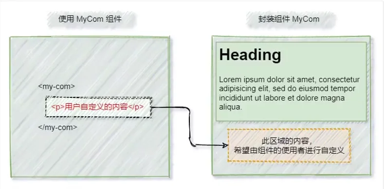

​	可以把插槽认为是组件封装期间，为用户预留的内容的占位符。


#### （1）插槽基本用法

​	在封装组件时，可以通过 \<slot> 元素定义插槽，从而为用户预留内容占位符。示例代码如下：

​	组件：

```vue
<template>
	<p>这是前一个 p 标签</p>
	<slot></slot>
	<p>这是后一个 p 标签</p>
</template>
```

​	使用组件时：

```vue
<template>
	<my-comp>
    	<p>这是自定义的内容</p>
    </my-comp>
</template>
```

​	注：如果封装时没有预留任何的 slot 插槽，则任何提供的自定义内容都会被丢弃


#### （2）插槽默认内容

​	封装组件时，可以为预留的 \<slot> 插槽提供后备内容（默认内容）。如果组件的使用者没有为插槽提供任何内容，则后备内容会生效。示例代码如下：

```vue
<template>
	<p>这是前一个 p 标签</p>
	<slot>这是备用默认内容</slot>
	<p>这是后一个 p 标签</p>
</template>
```


#### （3）具名插槽

​	如果在封装组件时需要预留多个插槽节点，则需要为每个 \<slot> 插槽指定具体的 name 名称。这种带有具体名称的插槽叫做“具名插槽”。示例代码如下：

​	组件：

```vue
<div class="container">
    <header>
    	<slot name="header"></slot>
    </header>
    <main>
    	<slot></slot>
    </main>
    <footer>
    	<slot name="footer"></slot>
    </footer>
</div>
```

​	注：没有指定 name 名称的插槽，会有隐含的名称叫做“default"。

​	使用：

```vue
<my-comp>
	<template v-slot:header>
    	<h1>诗歌标题</h1>
    </template>
    <template v-slot:default>
    	<h1>诗歌内容</h1>
    </template>
    <template v-slot:footer>
    	<h1>诗歌作者</h1>
    </template>
</my-comp>
```

​	实际上，就是说，只有默认插槽在使用时可以省略 \<template> 标签。但具名插槽也有其简写形式：

```vue
<my-comp>
	<template #header>
    	<h1>诗歌标题</h1>
    </template>
    ...
</my-comp>
```


#### （4）作用域插槽

​	在封装组件的过程中，可以为预留的 \<slot> 插槽绑定数据，这种带有数据的 \<slot> 叫做“作用域插槽”。示例代码如下：

​	组件：

```vue
<div>
    <h3>这是 TEST 组件</h3>
    <slot :info="information" :msg="message"></slot>
</div>
```

​	使用：（接受插槽给的数据）

 ```vue
<my-test>
	<template v-slot:default="scope">
    	info: {{ scope.info }}
		msg: {{ scope.msg }}
    </template>
</my-test>
 ```

​	或解构使用：

```vue
<my-test>
	<template v-slot:default="{ msg, info }">
    	info: {{ msg }}
		msg: {{ info }}
    </template>
</my-test>
```


### 4、自定义指令

#### （1）私有自定义指令

​	vue 官方提供了 v-for、v-model、v-if 等常用的内置指令。除此之外 vue 还允许开发者自定义指令。

​	vue 中的自定义指令分为两类，分别是：

- 私有自定义指令
- 全局自定义指令

​	在每个 vue 组件中，可以在 directives 节点下声明私有自定义指令。示例代码如下：

```vue
<template>
	<input type="text" class="form-control" v-focus>
</template>
<script>
...
directive: {
    // 自定义一个私有指令
    focus: {
        // el 指向绑定的元素。当被绑定的元素插入到 DOM 中时，自动触发 mounted 函数
        mounted(el) {
            el.focus();	// 让元素自动获得焦点
        }
    }
}
</script>
```


#### （2）全局自定义指令

​	main.js 中：

```js
const app = Vue.createApp()

app.directive('focus', {
    mounted(el) {
        el.focus();
    }
})
```


#### （3）updaeted 函数

​	mounted 函数只在元素第一次插入 DOM 时被调用，当 DOM 更新时 mounted 函数不会被触发。updated 函数会在每次 DOM 更新完成后被调用。示例代码如下：

```js
app.directive('focus', {
    mounted(el) {
        el.focus();
    },
    updated(el) {
        el.focus();
    }
})
```

​	注：如果 mounted 和 update 中的逻辑完全相同，可以简写为：

```js
app.directive('focus', el => {
    el.focus();
})
```


#### （4）指令的参数值

​	在绑定指令时，可以通过“等号”的形式为指令绑定具体的参数值，示例代码如下：

```vue
<template>
    <input type="text" v-color="'red'">
    <p v-color="'cyan'">一段文本</p>
</template>
```

​	main.js 中：

```js
app.directive('color', (el, binding) => {
    el.style.color = binding.value;
})
```


---

## 六、路由

### 1、前端路由概念与原理

​	路由（英文：router）就是对应关系。路由分为两大类：

- 后端路由
- 前端路由

​	后端路由：指的是请求方式、请求地址与 function 处理函数之间的对应关系。

​	前端路由：通俗易懂的概念：Hash 地址与组件之间的对应关系。如：

```text
https://xxx.com/spa#/index
https://xxx.com/spa#/info
```


#### （1）SPA 与前端路由

​	SPA 指的是一个 web 网站只有唯一的一个 HTML 页面，所有组件的展示与切换都在这唯一的一个页面内完成。
​	此时，不同组件之间的切换需要通过前端路由来实现。
​	结论：在 SPA 项目中，不同功能之间的切换，要依赖于前端路由来完成！


#### （2）前端路由的工作方式

- 用户点击了页面上的路由链接
- 导致了 URL 地址栏中的 Hash 值发生了变化
- 前端路由监听了到 Hash 地址的变化
- 前端路由把当前 Hash 地址对应的组件渲染都浏览器中

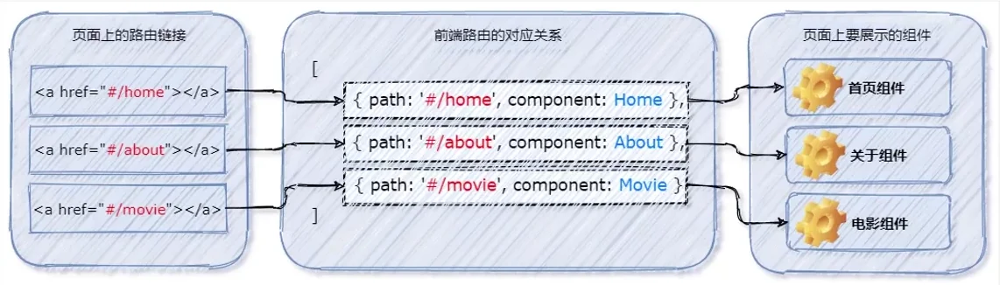

​	结论：前端路由，指的是 Hash 地址与组件之间的对应关系！

​	注：我们可以手动实现简单的前端路由，但实际开发中我们一般使用一些集成的路由解决方案。


### 2、vue-router4.x 基本用法

​	vue-router 是 vue.js 官方给出的路由解决方案。它只能结合 vue 项目进行使用，能够轻松的管理 SPA 项目中组件的切换。vue-router 3.x 只能结合 vue2 进行使用 vue-router 4.x 只能结合 vue3 进行使用。

#### （1）安装

```bash
npm i vue-router@4.0.3
```


#### （2）声明路由连接和占位符

​	可以使用 \<router-link> 标签来声明路由链接，并使用 \<router-view> 标签来声明路由占位符。示例代码如下：

```vue
<template>
	<h1>App 根组件</h1>
	<!-- 路由连接 -->
	<router-link to="/home">首页</router-link>
	<router-link to="/detail">详情页</router-link>
	<!-- 路由组件占位符 -->
	<router-view></router-view>
</template>
```


#### （3）创建 router.js 并挂载

​	router.js：

```js
// createRouter 方法用于创建路由的实例对象
// createwebHashHistory 用于指定路由的工作模式（hash模式）
import { createRouter，createWebHashHistory } from 'vue-router'
import Home from './component/Home.vue'
import Movie from './component/Movie.vue'
import About from './component/About.vue'

// 创建路由实例对象
const router = createRouter({
// history 属性指定路由的工作模式
    history: createWebHistory(),
// routes 数组，指定路由规则
    routes: [
// path 是 hash 地址，component 是要展示的组件
		{ path:'/home', component:Home },
		{ path:'/movie', component:Movie },
		{ path:'/about', component:About },
	],
})

export default router;
```

​	main.js 中：

```js
import router from './router.js'
app.use(router);
```


### 3、路由重定向

​	路由重定向指的是：用户在访问地址 A 的时候，强制用户跳转到地址 C，从而展示特定的组件页面。通过路由规则的 redirect 属性，指定一个新的路由地址，可以很方便地设置路由的重定向：

```js
const router = createRouter({
    history: createWebHistory(),
    routes: [
		{ path:'/', redirect:'/home' },
		{ path:'/home', component:Home },
		{ path:'/movie', component:Movie },
		{ path:'/about', component:About },
	],
})
```


### 4、路由高亮

方法：

- 写 `.router-link-active` 类的样式
- 通过 linkActiveClass 属性自定义 路由高亮的 class 类

```js
const router = createRouter({
    ...
    // 默认的类样式会被覆盖
    linkActiveClass: 'router-active',
})
```


### 5、嵌套路由

​	通过路由实现组件的嵌套展示，叫做嵌套路由。

​	方法：

- 声明子路由链接和子路由占位符
- 在父路由规则中，通过 children 属性嵌套声明子路由规则

​	在组件中声明子路由链接和占位符：

```vue
<template>
	<router-link to="/about/tab1">tab1</router-link>
	<router-link to="/about/tab2">tab2</router-link>
	<router-view></router-view>
</template>
```

​	在 router.js 中导入子组件，然后使用 children 属性声明子路由规则。

```js
import Tab1 from './component/tabs/Tab1.vue'
import Tab2 from './component/tabs/Tab2.vue'

const router = create Router({
    ...
    routes: [
        {// about 页面的路由规则
            path: '/about',
            component: About,
            children: [// 通过 children 属性子级嵌套路由规则，注意这里不要加'/'
                { path: 'tab1', component: Tab1 },
                { path: 'tab2', component: Tab2 },
            ]
        },
        { path:'/home', component:Home },
        ...
    ]
})
```

​	此时的路由重定向：

```js
...
{// about 页面的路由规则
	path: '/about',
    component: About,
    redirect: '/about/tab1',
    children: [
    	{ path: 'tab1', component: Tab1 },
    	{ path: 'tab2', component: Tab2 },
	]
},
```


### 6、动态路由

​	动态路由指的是：把 Hash 地址中可变的部分定义为参数项，从而提高路由规则的复用性。在 vue-router 中使用英文的冒号 : 来定义路由的参数项。示例代码如下：

```js
{ path: '/movie/:id', component: Movie },
```

​	通过 $route.params 获取动态路由的参数：

```vue
<template>
	<h3>参数：{{ $route.params.id }}</h3>
</template>
```

​	同时，为了简化路由参数的获取形式，vue-router 允许在路由规则中开启 props 传参：

```js
{ path: '/movie/:id', component: Movie, props: true },
```

```vue
<template>
	<h3>参数：{{ id }}</h3>
</template>
<script>
export default {
    ...
    props: ['id'],
}
</script>
```

​	关于参数传递，更详细的说明，见于：https://blog.csdn.net/hyk521/article/details/105479333/


### 7、编程式导航

​	通过调用 API 实现导航的方式，叫做编程式导航。与之对应的，通过点击链接实现导航的方式，叫做声明式导航。例如：

- 普通网页中点击 \<a> 链接、vue 项目中点击 \<router-link>都属于声明式导航
- 普通网页中调用 location.href 跳转到新页面的方式，属于编程式导航

​	vue-router 提供的编程式导航的 api 有：

- this.$router.push('/movie/3')
- this.$router.go(-1)


### 8、命名路由

​	通过 name 属性为路由规则定义名称的方式，叫做命名路由。示例代码如下：

```js
{
	path: '/movie/:id',
	name: 'mov',
	component: Movie,
	props: true,
}
```

​	注：命名路由的 name 不能重复。

​	作用：

​	实现声明式导航：为 \<router-link> 标签动态绑定 to 属性的值，并通过 name 属性指定要跳转到的路由规则。期间还可以用 params 属性指定跳转期间要携带的路由参数。示例代码如下：

```vue
<router-link :to="{ name: 'mov', params: { id: 2 } }"></router-link>
```

​	实现编程式导航：调用 push 函数期间指定一个配置对象，name 是要跳转到的路由规则、params 是携带的路由参数：

```js
this.$router.push({ name: 'mov', params: { id: 2 } })
```


### 9、导航守卫

​	导航守卫可以控制路由的访问权限。示意图如下：

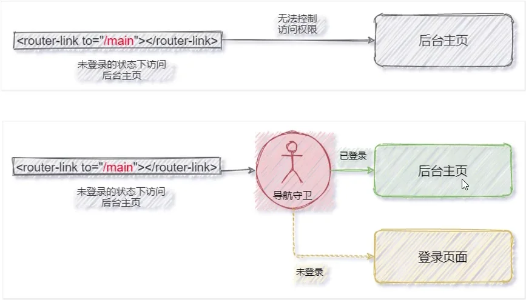

​	全局导航守卫会拦截每个路由规则，从而对每个路由进行访问权限的控制。可以按照如下的方式定义全局导航守卫：

```js
const router = createRouter({...,});

// 调用路由实例对象的 beforeEach 函数，声明”全局前置守卫"
// fn 必须是一个函数，每次拦截到路由的请求，都会调用 fn 进行处理
// 因此fn叫做”守卫方法"
router.beforeEach(fn);
```


#### （1）守卫方法的 3 个形参

​	全局导航守卫的守卫方法中接收 3 个形参，格式为：

```js
router.beforeEach((to, from, next) => {
    // to 目标路由对象，from 当前导航正要离开的路由对象，next 为表示放行的函数
});
```

​	注：

- 如果不声明 next 形参，则默认允许用户访问每一个路由！
- 在守卫方法中如果声明了 next 形参，**则必须调用 next() 函数**，否则不允许用户访问任何一个路由！

​	next 函数的三种调用方式：

```js
next()				// 直接放行
next(false)			// 强制停留在当前页面
next('/login')		// 强制跳转到指定页面
```


#### （2）结合 token 控制后台主页的访问权限

```js
router.beforeEach((to, from, next) => {
    // 这里只是演示，实际使用时要做 token 值的校验
    const token = localStorage.getItem('token');
    if (to.path === '/main' && !token) {
        next('/login');
    }
    else {
        next();
    }
})
```


---

## 七、综合案例

###  1、vue-cli

​	vue-cli（俗称：vue 脚手架）是 vue 官方提供的、快速生成 vue工程化项目的工具。

​	特点：开箱即用、基于 webpack。

​	注：在 vue-cli 中 '@' 代表项目 src 路径。


#### （1）创建项目

​	命令行：

```bash
vue create ProjectName
```

​	vue ui 创建：

```bash
vue ui
```

​	注：

- vue ui 创建项目时建议手动选择配置，勾选以下配置项：choose vue version、Babel、CSS 预处理器、使用配置文件（新手不建议开启 Linter/Formatter）


### 2、vue 组件库

​	在实际开发中，前端开发者可以把自己封装的 .vue 组件整理、打包、并发布为 npm 的包，从而供其他人下载和使用。这种可以直接下载并在项目中使用的现成组件，就叫做 vue 组件库。

​	这里以 element ui 为例。


#### （1）element ui 引入

​	分为全局引入和按需引入，参照官方文档。


### 3、Proxy 跨域代理

​	通过 vue-cli 创建的项目在遇到接口跨域问题时，可以通过代理的方式来解决：

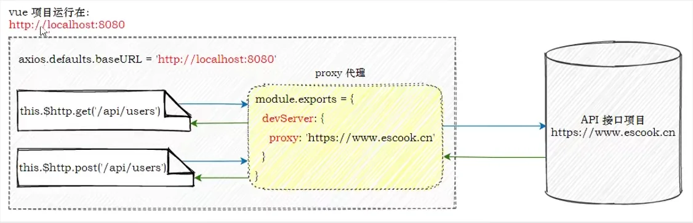

- 把 axios 的请求根路径设置为 vue 项目的运行地址（接口请求不再跨域）
- vue 项目发现请求的接口不存在，把请求转交给 proxy 代理
- 代理把请求根路径替换为 devServer.proxy 属性的值，发起真正的数据请求
- 代理把请求到的数据，转发给 axios

​	注：devServer.proxy 提供的代理功能，仅在开发调试阶段生效。项目上线发布时，依旧需要 API 接口服务器开启 CORS 跨域资源共享