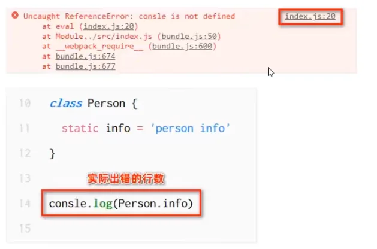
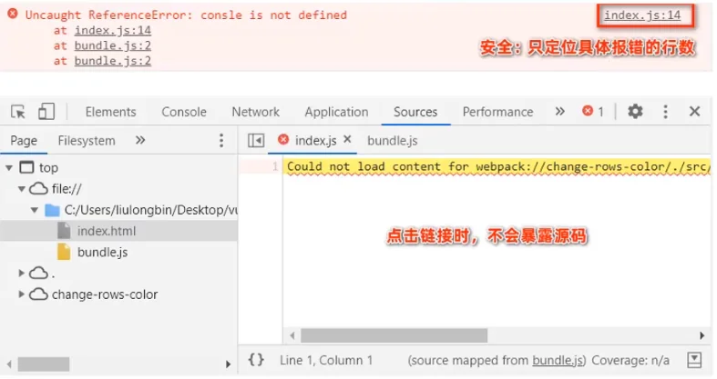

# Webpack 笔记


## 一、前端工程化

- 模块化（js 的模块化、Css 的模块化、资源的模块化）
- 组件化（复用现有的 UI 结构、样式、行为）
- 规范化（目录结构的划分、编码规范化、接口规范化、文档规范化、Git 分支管理）
- 自动化（自动化构建、自动部署、自动化测试）

---

## 二、webpack 基本使用

​	webpack 是前端项目工程化的具体解决方案。

​	主要功能：它提供了友好的前端模块化开发支持，以及代码压缩混淆、处理浏览器端 JavaScript 的兼容性、性能优化等强大的功能。


​	**安装**：（记得先初始化 node.js 项目）

```bash
npm install webpack@5.42.1 webpack-cli@4.9.0 -D
```

​	**配置**：

​	在项目根目录中，创建名为 webpack.config.js 的 webpack 配置文件，并初始化如下的基本配置：

```js
module.exports = {
    mode: 'development'		// 也可以选择 production，此时体积小，有压缩混淆，且有性能优化
}
```

​	在 package.json 的 scripts 节点下，增加脚本：

```js
"script": {
    "dev": "webpack"	// 通过 npm run dev 即可执行命令
}
```

​	**使用**：

```bash
# 运行以下命令进行打包构建：
npm run dev
```


---
## 三、自定义打包入口和出口

​	注：在 webpack 4.x 和 5.x 的版本中，有如下的默认约定：

- 默认的打包入口文件为 `src` -> `index.js`
- 默认的输出文件路径为 `dist` -> `main.js`

​	也可以通过配置来修改。


​	在 webpack.config.js 配置文件中，通过 entry 节点指定打包的入口。通过 output 节点指定打包的出口。如：

```js
const path = require('path')
module.exports = {
    entry: path.join(__dirname, './src/index.js'),	// 打包入口
    output: {
        path: path.join(__dirname, './dist'),	    // 出口
        filename: 'bundle.js'		// 输出文件名称
    }
    devtool: 'inline-source-map'
}
```


---
## 四、webpack 插件

### 1、webpack-dev-server 插件

​	安装 webpack-dev-server，可自动打包代码。

```bash
npm install webpack-dev-server@3.11.2 -D
```

​	然后更改在 package.json 的 scripts 节点：

```js
"script": {
    "dev": "webpack serve"	// 通过 npm run dev 即可执行命令
}
```

​	但是注意：编译后的 js 文件是不会在本地的，而是在内存中，但可以通过 dev-server 提供的路径访问到。（默认路径是项目的根目录）


### 2、html-webpack-plugin 插件

​	html-webpack-plugin 是 webpack 中的 HTML 插件，可以通过此插件自定制 index.html 页面的内容。（实现 html 文件复制到根目录下，方便访问）

```bash
npm install html-webpack-plugin@5.1.0 -D
```

​	配置 webpack.config.js ：

```js
// 导入 html 插件，得到一个构造函数
const HtmlPlugin = require('html-webpack-plugin')

const htmlPlugin = new HtmlPlugin({
    template: './src/index.html',	// 指定原文件存放路径
    filename: './index.html'		// 指定生成文件存放路径
})

module.exports = {
    ...
    plugins: [htmlPlugin]	// 通过该节点，挂载 htmlPlugin 插件
}
```

​	注：

- 通过该插件复制到项目根目录中的 index.html，**也被放到了内存中**
- 该插件在生成的 index.html 页面的底部，**自动注入了打包的 js 文件**


### 3、devServer 节点

​	在 webpack.config.js 配置文件中，可以通过 devServer 节点对 webpack-dev-server 插件进行更多的配置，如：

```js
devServer: {
    open: true,		// 初次打包完成后自动打开浏览器
    host: '127.0.0.1',
   	port: 80,
}
```


---
## 五、webpack 中的 loader

​	在实际开发过程中，webpack 默认只能打包处理以 .js 后缀名结尾的模块。其他非 .js 后缀名结尾的模块，webpack 默认处理不了，需要**调用 loader 加载器**才可以正常打包，否则会报错！

​	loader加载器的作用：协助 webpack 打包处理特定的文件模块。比如：

- css-loader 可以打包处理 .css 相关的文件
- less-loader可以打包处理 .less 相关的文件
- babel-loader 可以打包处理 webpack 无法处理的高级 JS 语法


### 1、打包处理 css 文件

​	**安装**：

```bash
npm i style-loader@2.0.0 css-loader@5.0.1 -D
```

​	**配置**：（在 webpack.config.js 的 module->rules 数组中，添加 loader 规则如下）

```js
module: {	// 所有第三方模块的配置规则
    rules: [	// 匹配规则
        { test: /\.css$/, use:['style-loader', 'css-loader']}
    ]
}
```

​	注：其中，test 表示匹配的文件类型，use 表示对应要调用的 loader。

​	**使用**：（在 js 中 import 对应的 css 即可）

```js
import './css/index.css'
```


### 2、打包处理 less 文件

​	**安装**：

```bash
npm i less-loader@7.1.0 less@3.12.2 -D
```

​	**配置**：（在 webpack.config.js 的 module->rules 数组中，添加 loader 规则如下）

```js
module: {
    rules: [
        { test: /\.less$/, use:['style-loader', 'css-loader', 'less-loader']}
    ]
}
```

​	注：其中，test 表示匹配的文件类型，use 表示对应要调用的 loader。


### 3、打包处理样式表中与 url 路径相关的文件

​	**安装**：

```bash
npm i url-loader@4.1.1 file-loader@6.2.0 -D
```

​	配置：（在 webpack.config.js 的 module->rules 数组中，添加 loader 规则如下）

```js
module: {
    rules: [
        { test: /\.jpg|jpeg|png|gif$/, use: 'url-loader?limit=22229'}
    ]
}
```

​	**参数 limit 含义**： 图片大小 <= 22229 bytes，则转化为 base64 直接内嵌。

​	参数配置也可以采用以下的写法：

```js
module: {
    rules: [
        {
		test: /\.jpg|jpeg|png|gif$/,
		use: { loader: 'url-loader', options: { limit: 22229 } }
        },
    ]
}
```


### 4、打包处理 js 文件中的高级语法

​	webpack 只能打包处理一部分高级的 JavaScript 语法。对于那些 webpack 无法处理的高级 js 语法，需要借助于 babel-loader 进行打包处理。例如 webpack 无法处理下面的 JavaScript 代码：

```js
class Person {
    static info = 'person info'
}
console.log(Person.info)
```

​	因此需要安装下面这些包：

```bash
npm i babel-loader@8.2.1 @babel/core@7.12.3 @babel/plugin-proposal-class-properties@7.12.1 -D
```

​	添加规则：

```js
{
    test: /\.js$/,
    // exclude 为排除项，表示只需要处理开发者编写的 js 文件，不需要处理 node_modules 中的
    exclude: /node_modules/,
    use: {
        loader: 'babel-loader',
        options: {
            // 声明一个 babel 插件，用来转化
            plugins: ['@babel/plugin-proposal-class-properties'],
        }
    }
}
```


---
## 六、打包发布

​	**配置**：（在package.json文件的scripts节点下，新增build命令如下：）

```js
"script": {
    ...
    "build": "webpack --mode production"
}
```

​	运行命令 `npm run build` 即可，完成在 dist 文件夹。


### 1、指定 js 文件和图片文件生成到目录

```js
output: {
    path: path.join(__dirname, 'dist'),
    // 明确存放到 dist/js 中
    filename: 'js/bundle.js',
}
```

```js
{
    test: /\.jpg|jpeg|png|gif$/,
    use: {
        loader: 'url-loader',
        options: {
            limit: 22228,
            outputPath: 'image',
        }
    }
}
```


### 2、自动清理 dist 目录

​	安装：

```bash
npm install clean-webpack-plugin@3.0.0 -D
```

​	配置：

```js
// 2.按需导入插件、得到插件的构造函数之后，创建插件的实例对象
const { CleanWebpackPlugin } = require('clean-webpack-plugin')
const cleanPlugin = new CleanWebpackPlugin()

//3.把创建的cleanPlughn 插件实例对象，挂载到plugins节点中
plugins: [htmlPlugin，cleanPlugin]，//挂载插件
```


---
## 七、Source Map

​	Source Map 就是一个信息文件，里面储存着位置信息。也就是说，Source Map 文件中存储着代码压缩混淆前后的对应关系。在开发环境下，webpack 默认启用了 Source Map 功能。当程序运行出错时，可以直接在控制台提示错误行的位置，并定位到具体的源代码。

​	但是：开发环境下默认生成的 Source Map ，记录的是生成后的代码的位置。会导致运行时报错的行数与源代码的行数不一致的问题。示意图如下：



​	**解决方案**：添加以下配置即可。

```js
module.exports = {
    mode: 'development',
    // eval-source-map 仅限在"开发模式"下使用，不建议在"生产模式"下使用。
    // 此选项生成的 Source Map 能够保证"运行时报错的行数"与"源代码的行数"保持一致
    devtool: 'eval-source-map'
    ...
}
```

​	在生产环境下，如果只想定位报错的具体行数，且不想暴露源码。此时可以将 devtool 的值设置为 nosources-source-map。实际效果如图所示：




---
## 八、注意

​	实际应用中我们不会直接自己从零书写 webpack 配置，可以使用一些现成的 CLI 工具。但我们需要了解这些配置的作用。